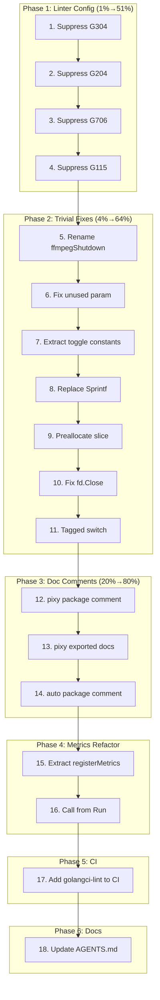

# emeet-pixyd — Quality & Architecture Improvement Plan

**Date:** 2026-04-30 20:37
**Scope:** Linter compliance, production code quality, architecture cleanup
**Constraint:** DO NOT BREAK BUILD. Tests must pass after every change.

---

## Pareto Analysis

### 1% effort → 51% result

**Suppress gosec false-positives in `.golangci.yml`** — 21 of 42 production linter issues are gosec G304/G204/G706 warnings that are inherent to a hardware daemon. Suppressing these rules (which will never be "fixed") eliminates half the linter noise in one edit.

### 4% effort → 64% result

**Fix all trivial linter issues** — goconst (2), staticcheck (2), perfsprint (2), prealloc (1), errcheck (1), revive unused-param (1), revive package-comments (2). That's 11 issues fixed in ~15 minutes of editing. Combined with the gosec suppression, this takes us from 42 → ~8 remaining issues.

### 20% effort → 80% result

**Add doc comments to `internal/pixy`** (12 revive issues), **refactor `extractJPEGFrame` nested ifs**, **add `golangci-lint` to CI**, and **move metrics out of `init()`**. This gets the production codebase to near-zero linter warnings and makes CI actually enforce quality.

---

## Phase 1: Linter Configuration (1% → 51%)

These tasks suppress false-positive warnings that are inherent to a hardware control daemon.

| #   | Task                             | File(s)         | Effort |
| --- | -------------------------------- | --------------- | ------ |
| 1   | Suppress G304 in `.golangci.yml` | `.golangci.yml` | 2min   |
| 2   | Suppress G204 in `.golangci.yml` | `.golangci.yml` | 1min   |
| 3   | Suppress G706 in `.golangci.yml` | `.golangci.yml` | 1min   |
| 4   | Suppress G115 in `.golangci.yml` | `.golangci.yml` | 1min   |

## Phase 2: Trivial Linter Fixes (4% → 64%)

Each task is a single targeted edit.

| #   | Task                                                      | File(s)           | Effort |
| --- | --------------------------------------------------------- | ----------------- | ------ |
| 5   | Rename `ffmpegShutdownSecs` → `ffmpegShutdown`            | `handlers.go:39`  | 1min   |
| 6   | Rename unused `request` → `_` in `handleSnapshot`         | `handlers.go:315` | 1min   |
| 7   | Extract `cmdToggleGesture` and `cmdToggleAuto` constants  | `commands.go`     | 2min   |
| 8   | Replace `fmt.Sprintf("/dev/%s", name)` with concatenation | `probe.go:29,94`  | 1min   |
| 9   | Preallocate `v4l2.go` args slice                          | `v4l2.go:38`      | 1min   |
| 10  | Fix unchecked `fd.Close()` in uevent.go                   | `uevent.go:66`    | 1min   |
| 11  | Use tagged switch in `extractJPEGFrame`                   | `handlers.go:480` | 2min   |

## Phase 3: Doc Comments & Package Comments (20% → 80%)

| #   | Task                                                        | File(s)                   | Effort |
| --- | ----------------------------------------------------------- | ------------------------- | ------ |
| 12  | Add package comment to `internal/pixy/pixy.go`              | `internal/pixy/pixy.go:1` | 2min   |
| 13  | Add doc comments to exported types/funcs in `internal/pixy` | `internal/pixy/pixy.go`   | 8min   |
| 14  | Add package comment to `auto.go`                            | `auto.go:3`               | 1min   |

## Phase 4: Metrics Registration Refactor

| #   | Task                                      | File(s)       | Effort |
| --- | ----------------------------------------- | ------------- | ------ |
| 15  | Extract `registerMetrics()` from `init()` | `handlers.go` | 5min   |
| 16  | Call `registerMetrics()` from `Run()`     | `main.go`     | 2min   |

## Phase 5: CI Enforcement

| #   | Task                                    | File(s)                         | Effort |
| --- | --------------------------------------- | ------------------------------- | ------ |
| 17  | Add `golangci-lint` step to CI workflow | `.github/workflows/go-test.yml` | 3min   |

## Phase 6: AGENTS.md Final Update

| #   | Task                                                  | File(s)     | Effort |
| --- | ----------------------------------------------------- | ----------- | ------ |
| 18  | Update AGENTS.md with lint commands and gosec context | `AGENTS.md` | 3min   |

---

## Execution Graph

---

## Fine-Grained Task Breakdown (≤15min each)

| #   | Task                                                                                                     | File(s)                         | Est  | Priority |
| --- | -------------------------------------------------------------------------------------------------------- | ------------------------------- | ---- | -------- |
| 1   | Add G304 to linter exclusions in `.golangci.yml`                                                         | `.golangci.yml`                 | 2min | P0       |
| 2   | Add G204 to linter exclusions in `.golangci.yml`                                                         | `.golangci.yml`                 | 1min | P0       |
| 3   | Add G706 to linter exclusions in `.golangci.yml`                                                         | `.golangci.yml`                 | 1min | P0       |
| 4   | Add G115 to linter exclusions in `.golangci.yml`                                                         | `.golangci.yml`                 | 1min | P0       |
| 5   | Rename `ffmpegShutdownSecs` → `ffmpegShutdown` in `handlers.go`                                          | `handlers.go`                   | 1min | P1       |
| 6   | Rename unused `request` → `_` in `handleSnapshot`                                                        | `handlers.go`                   | 1min | P1       |
| 7   | Add `cmdToggleGesture` const in `commands.go` and replace 3 occurrences                                  | `commands.go`                   | 2min | P1       |
| 8   | Add `cmdToggleAuto` const in `commands.go` and replace 3 occurrences                                     | `commands.go`                   | 2min | P1       |
| 9   | Replace `fmt.Sprintf("/dev/%s", name)` → `"/dev/" + name` at line 29                                     | `probe.go`                      | 1min | P1       |
| 10  | Replace `fmt.Sprintf("/dev/%s", name)` → `"/dev/" + name` at line 94                                     | `probe.go`                      | 1min | P1       |
| 11  | Preallocate `v4l2.go` args slice: `make([]string, 0, 2+len(controls))`                                   | `v4l2.go`                       | 1min | P1       |
| 12  | Fix unchecked `fd.Close()` → `defer func() { _ = fd.Close() }()`                                         | `uevent.go`                     | 1min | P1       |
| 13  | Refactor `extractJPEGFrame` if/else → tagged switch for `next` byte                                      | `handlers.go`                   | 3min | P1       |
| 14  | Add `// Package pixy provides ...` doc to `internal/pixy/pixy.go`                                        | `internal/pixy/pixy.go`         | 2min | P2       |
| 15  | Add doc comment to `DefaultStateDir` const block                                                         | `internal/pixy/pixy.go`         | 1min | P2       |
| 16  | Add doc comments to `ErrInvalidAudioMode`, `ErrInvalidCameraState` vars                                  | `internal/pixy/pixy.go`         | 1min | P2       |
| 17  | Add doc comments to `StateIdle`, `StateTracking`, `StatePrivacy`, `StateOffline` const block             | `internal/pixy/pixy.go`         | 1min | P2       |
| 18  | Add doc comment to `CameraState.Valid()`                                                                 | `internal/pixy/pixy.go`         | 1min | P2       |
| 19  | Add doc comments to `AudioNC`, `AudioLive`, `AudioOriginal` const block                                  | `internal/pixy/pixy.go`         | 1min | P2       |
| 20  | Add doc comment to `AudioMode.Valid()`                                                                   | `internal/pixy/pixy.go`         | 1min | P2       |
| 21  | Add doc comment to `AudioMode.Next()`                                                                    | `internal/pixy/pixy.go`         | 1min | P2       |
| 22  | Add doc comment to `ParseAudioMode()`                                                                    | `internal/pixy/pixy.go`         | 1min | P2       |
| 23  | Add doc comment to `ParseCameraState()`                                                                  | `internal/pixy/pixy.go`         | 1min | P2       |
| 24  | Add doc comments to `ErrStateDirEmpty`, `ErrPollIntervalZero`, `ErrDebounceCountZero`, `ErrWebAddrEmpty` | `internal/pixy/pixy.go`         | 2min | P2       |
| 25  | Add doc comment to `Config.Validate()`                                                                   | `internal/pixy/pixy.go`         | 1min | P2       |
| 26  | Add `// Package main` doc to `auto.go`                                                                   | `auto.go`                       | 1min | P2       |
| 27  | Extract `registerMetrics()` func, remove `init()`                                                        | `handlers.go`                   | 5min | P2       |
| 28  | Call `registerMetrics()` from `NewDaemon` or `Run`                                                       | `main.go`                       | 2min | P2       |
| 29  | Add `golangci-lint run` step to CI after vet                                                             | `.github/workflows/go-test.yml` | 3min | P2       |
| 30  | Update AGENTS.md with lint section, gosec context, current file structure                                | `AGENTS.md`                     | 5min | P3       |
| 31  | Run full test suite to verify nothing broke                                                              | —                               | 2min | P0       |
| 32  | Run linter to verify issue count dropped                                                                 | —                               | 1min | P0       |

**Total estimated time: ~55 minutes**

---

## Success Criteria

- [ ] `GOWORK=off go test -race -count=1 ./...` passes
- [ ] `GOWORK=off golangci-lint run --timeout 2m ./...` shows 0 issues in production code (excluding gosec false-positives suppressed in config)
- [ ] CI workflow includes lint step
- [ ] All commits pushed to master
