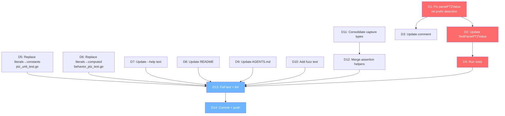

# PTZ parsePTZValue Fix + Test Infrastructure Improvement Plan

**Date:** 2026-06-20 15:10
**Status:** Planning → Execution

---

## Problem Statement

`parsePTZValue` in `ptz.go:188` treats ANY value with a leading `+`/`-` as **relative mode**. This means `emeet-pixyd tilt -90` means "go -90° from current position" instead of "set tilt to -90°". **Absolute negative pan/tilt is impossible via CLI.** The web UI and keyboard arrows are unaffected (they compute absolute targets before sending).

Additionally, test infrastructure has gaps: hardcoded PTZ literals instead of constants, no fuzz test for the parser, and inconsistent V4L2 assertion helpers.

---

## Pareto Breakdown

### 1% effort → 51% impact

| Task                                                                  | Why                                    |
| --------------------------------------------------------------------- | -------------------------------------- |
| Fix `parsePTZValue`: bare numbers = absolute, `rel` prefix = relative | Directly solves the core usability bug |
| Update `TestParsePTZValue` test case `{"-30", ...}`                   | Keeps CI green after the fix           |

### 4% effort → 64% impact

| Task                                                                 | Why                        |
| -------------------------------------------------------------------- | -------------------------- |
| Add `parsePTZValue` edge-case tests (rel prefix, large values, zero) | Prevents regression        |
| Replace hardcoded test literals with `pixy.*` constants              | Eliminates split brain     |
| Update `--help` text to document `rel` syntax                        | Users discover the feature |

### 20% effort → 80% impact

| Task                                            | Why                             |
| ----------------------------------------------- | ------------------------------- |
| Add fuzz test for `parsePTZValue`               | Catches malformed input crashes |
| Consolidate V4L2 assertion helpers (3 → 1)      | Reduces test code duplication   |
| Update README + AGENTS.md                       | Docs honesty                    |
| Update `socket_test.go` for new relative syntax | Regression guard                |

---

## Comprehensive Task List (30-100 min tasks)

| #  | Task                                           | Impact   | Effort | Files                                  |
| -- | ---------------------------------------------- | -------- | ------ | -------------------------------------- |
| C1 | Fix `parsePTZValue` + update direct tests      | Critical | 30m    | ptz.go, ptz_cmd_test.go                |
| C2 | Replace hardcoded test literals with constants | High     | 30m    | ptz_unit_test.go, behavior_ptz_test.go |
| C3 | Update docs (--help, README, AGENTS.md)        | Medium   | 30m    | main.go, README.md, AGENTS.md          |
| C4 | Add fuzz test for parsePTZValue                | Medium   | 30m    | ptz_fuzz_test.go                       |
| C5 | Consolidate V4L2 assertion helpers             | Low      | 30m    | \*\_test.go                            |

---

## Detailed Breakdown (max 15 min tasks)

| #   | Task                                                                          | Est | Priority |
| --- | ----------------------------------------------------------------------------- | --- | -------- |
| D1  | Change `parsePTZValue`: detect `rel` prefix for relative mode                 | 10m | P0       |
| D2  | Update `TestParsePTZValue` table: `-30` → absolute, add `rel-30` cases        | 10m | P0       |
| D3  | Update `handlePTZCommand` comment about relative detection                    | 5m  | P0       |
| D4  | Run tests to verify parsePTZValue fix                                         | 5m  | P0       |
| D5  | Replace `ptz_unit_test.go` literals with `pixy.PanMin/Max/ZoomMin/Max`        | 10m | P1       |
| D6  | Replace `behavior_ptz_test.go` V4L2 expected values with computed expressions | 10m | P1       |
| D7  | Update `--help` text: document `rel` prefix syntax                            | 5m  | P1       |
| D8  | Update README: add relative mode documentation                                | 5m  | P1       |
| D9  | Update AGENTS.md: reflect new parsePTZValue behavior                          | 5m  | P1       |
| D10 | Add fuzz test `FuzzParsePTZValue` in `ptz_fuzz_test.go`                       | 10m | P2       |
| D11 | Consolidate V4L2 capture types: `newPTZCaptureDaemon` → use `v4l2Call`        | 10m | P2       |
| D12 | Merge `assertV4L2Call` + `assertV4L2CallFull` into one helper                 | 10m | P2       |
| D13 | Run full test suite + lint                                                    | 5m  | P0       |
| D14 | Commit and push                                                               | 5m  | P0       |

---

## Mermaid Execution Graph

---

## Design Decision: Breaking Change

**Old behavior:** `tilt -90` = relative (current - 90)
**New behavior:** `tilt -90` = absolute -90°, `tilt rel-90` = relative

Rationale: Pre-1.0 software, `--help` never documented relative mode, web UI always sends absolute. Breaking change is correct.
