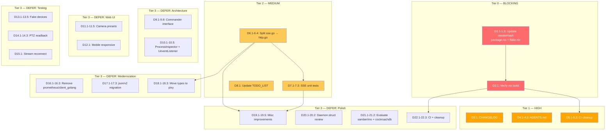

# Comprehensive Execution Plan — Post-cqrs-htmx-Removal Hardening

**Created:** 2026-06-21 08:34
**Session focus:** Fix nix build, document cqrs-htmx removal, harden CI/tests, modernize codebase

---

## Context

The `cqrs-htmx/v2` dependency was removed entirely (commits `1c112a8`, `54007aa`) and its 8 used features reimplemented locally in `sse.go` (~315 lines). This eliminated ~30 transitive deps including the private `go-cqrs-lite` repo that broke `nix build`. However, several loose ends remain: stale `vendorHash`, outdated docs, CI carrying now-unnecessary private-module config, and missing test coverage for the new SSE code.

**Verified state at plan creation:**

| Check                                  | Status                                                                    |
| -------------------------------------- | ------------------------------------------------------------------------- |
| `go test -race -count=1 ./...`         | ✅ Pass (72.5% coverage)                                                  |
| `golangci-lint run --timeout 2m ./...` | ✅ 0 issues                                                               |
| `gofumpt -l .`                         | ✅ Clean (LSP diagnostic on `ptz_fuzz_test.go:22` is stale cache)         |
| `git status`                           | ✅ Clean working tree                                                     |
| `nix build`                            | ❌ **BROKEN** — stale `vendorHash` in `package.nix:25` + `flake.nix:123`  |
| `sse_test.go` exists                   | ✅ 2 integration tests (status report's "zero SSE tests" claim was wrong) |
| `go-branded-id` on public proxy        | ✅ Confirmed — `GOPRIVATE` in CI is unnecessary                           |

---

## Step 2: Pareto Breakdown

### 1% effort → 51% impact (BLOCKING)

Update `vendorHash` in two files (`package.nix`, `flake.nix`) and verify `nix build` passes. This unblocks the entire nix build pipeline — the #1 customer-facing blocker. Without this, `nix build`, `nix run`, and the NixOS module all fail.

### 4% effort → 64% impact (HIGH)

Document the cqrs-htmx removal accurately (CHANGELOG + AGENTS.md), clean up CI (remove unnecessary `GOPRIVATE`/git-config, add missing fuzz target, add `nix flake check`). These ensure future sessions and CI have correct context and catch regressions.

### 20% effort → 80% impact (MEDIUM)

Split `sse.go` for cohesion, add unit tests for SSE internals (`writeSSEEvent`, `Broadcaster`, `splitSSELines`), update `TODO_LIST.md`, and add `nix flake check` to CI. These harden the reimplemented code and prevent future breakage.

### Remaining 80% effort → 20% impact (DEFER)

Architecture interfaces (`Commander`, `ProcessInspector`, `UeventListener`), web UI features (mobile, presets), fake device test infrastructure, PTZ readback fix, dependency modernization (json/v2, remove `prometheus/client_golang`), and miscellaneous improvements. Valuable but not blocking.

---

## Step 3: Comprehensive Plan (medium granularity — 30-100min tasks)

Sorted by impact/effort/customer-value within priority tiers.

| ID      | Task                                                                                             | Impact      | Effort | Customer Value                     | Deps |
| ------- | ------------------------------------------------------------------------------------------------ | ----------- | ------ | ---------------------------------- | ---- |
| **C1**  | Fix nix build: update `vendorHash` in `package.nix` + `flake.nix`, remove stale NOTE             | 🔴 Critical | 15min  | Unblocks ALL nix builds            | —    |
| **C2**  | Verify `nix build` passes end-to-end (iterate hash via fakeHash trick if needed)                 | 🔴 Critical | 10min  | Confidence build works             | C1   |
| **C3**  | Update CHANGELOG `[Unreleased]` with cqrs-htmx removal (breaking change)                         | 🟠 High     | 10min  | Accurate release notes             | —    |
| **C4**  | Update AGENTS.md: file responsibilities, external libraries, SSE architecture, code patterns     | 🟠 High     | 40min  | Correct dev context                | —    |
| **C5**  | Clean up CI: remove `GOPRIVATE`/git-config, add `FuzzParsePTZValue`, add `nix flake check`       | 🟠 High     | 30min  | CI hygiene + regression prevention | C1   |
| **C6**  | Split `sse.go` → `http.go` (move `writeJSON`, `chain`, `statusRecorder`, middleware)             | 🟡 Medium   | 30min  | File cohesion                      | —    |
| **C7**  | Add unit tests for SSE internals (`writeSSEEvent`, `Broadcaster`, `splitSSELines`)               | 🟡 Medium   | 30min  | Correctness on edge cases          | C6   |
| **C8**  | Update `TODO_LIST.md` — mark completed items, add new findings                                   | 🟡 Medium   | 20min  | Accurate task tracking             | —    |
| **C9**  | Define + wire `Commander` interface (wraps `exec.Command` for all subprocess calls)              | 🟡 Medium   | 60min  | Testability of subprocess code     | —    |
| **C10** | Define + wire `ProcessInspector` + `UeventListener` interfaces                                   | 🟡 Medium   | 60min  | Testability of /proc + netlink     | —    |
| **C11** | Camera preset feature (types + state + CLI + web UI + tests)                                     | 🟡 Medium   | 100min | UX feature                         | —    |
| **C12** | Mobile-responsive layout (media queries, touch-friendly controls)                                | 🟢 Low      | 40min  | Mobile usability                   | —    |
| **C13** | Fake device test infrastructure (fake HID + fake video, wire into test daemon)                   | 🟡 Medium   | 90min  | Hardware-free integration tests    | —    |
| **C14** | PTZ readback accuracy (in-memory last-set value instead of v4l2-ctl readback)                    | 🟡 Medium   | 30min  | Correctness                        | —    |
| **C15** | MJPEG stream reconnection (exponential backoff in `app.js`)                                      | 🟢 Low      | 30min  | Resilience                         | —    |
| **C16** | Remove `prometheus/client_golang` (replace `promhttp.Handler` with OTel equivalent)              | 🟢 Low      | 40min  | Leaner dependency tree             | —    |
| **C17** | Evaluate + migrate `encoding/json/v2` (4 files use json)                                         | 🟢 Low      | 30min  | Modern stdlib                      | —    |
| **C18** | Move `SSEEvent` + `toastType` to `internal/pixy` (domain types)                                  | 🟡 Medium   | 30min  | Proper layering                    | C6   |
| **C19** | Misc improvements (HTMX version const, broadcast context, fuzz/bench for SSE, middleware rename) | 🟢 Low      | 40min  | Polish                             | C6   |
| **C20** | Review Daemon struct (17 fields) — evaluate splitting broadcaster/cache                          | 🟢 Low      | 40min  | Maintainability                    | —    |
| **C21** | Evaluate `samber/mo` `Result[T]` + `cockroachdb/errors` for error handling                       | 🟢 Low      | 30min  | Type safety evaluation             | —    |
| **C22** | CI: add `nix run .#test`, cleanup dead docs, evaluate `otter/v2` for ptzCache                    | 🟢 Low      | 30min  | CI reproducibility + hygiene       | C2   |

**Totals:** 22 tasks, ~810min (~13.5h)

---

## Step 4: Detailed Breakdown (fine granularity — max 12min tasks)

Sorted by priority tier, then impact/effort within tier.

### Tier 0 — BLOCKING (nix build fix)

| ID       | Task                                                                                            | Impact      | Effort | Deps      |
| -------- | ----------------------------------------------------------------------------------------------- | ----------- | ------ | --------- |
| **D1.1** | Remove stale NOTE comment (lines 14-24) from `package.nix`                                      | 🔴 Critical | 3min   | —         |
| **D1.2** | Update `vendorHash` in `package.nix:25` → `sha256-A4gq0MuixfDRyf2NVwhp/xFCaIPGvJ3/OCB1HZIOusQ=` | 🔴 Critical | 2min   | —         |
| **D1.3** | Update `vendorHash` in `flake.nix:123` to match                                                 | 🔴 Critical | 2min   | —         |
| **D2.1** | Run `nix build .#default` — if hash mismatch, use `lib.fakeHash` trick to get correct hash      | 🔴 Critical | 10min  | D1.1-D1.3 |

### Tier 1 — HIGH (documentation + CI)

| ID       | Task                                                                                                                                                     | Impact    | Effort | Deps |
| -------- | -------------------------------------------------------------------------------------------------------------------------------------------------------- | --------- | ------ | ---- |
| **D3.1** | Add cqrs-htmx removal + SSE reimplementation entries to CHANGELOG `[Unreleased]`                                                                         | 🟠 High   | 5min   | —    |
| **D4.1** | Update AGENTS.md File Responsibilities table: add `sse.go`, update `middleware.go` (28 lines), add `static/htmx.js`                                      | 🟠 High   | 8min   | —    |
| **D4.2** | Update AGENTS.md External Libraries: remove "cqrs-htmx considered" + "templ-components considered" entries (no longer relevant)                          | 🟠 High   | 5min   | —    |
| **D4.3** | Add SSE architecture section to AGENTS.md (Broadcaster → sseStream → client, non-blocking fan-out, buffered channel)                                     | 🟠 High   | 10min  | —    |
| **D4.4** | Update AGENTS.md Code Patterns: middleware var names (`securityHeaderMiddleware`, `requestIDMiddleware`), local `chain()`, `statusRecorder` with Flusher | 🟠 High   | 8min   | —    |
| **D4.5** | Update AGENTS.md Concurrency Model: `broadcaster` field type changed to `*Broadcaster`, SSE channel buffering                                            | 🟠 High   | 5min   | —    |
| **D5.1** | Remove `GOPRIVATE` + git-config from `go-test.yml` (all deps now on public proxy)                                                                        | 🟠 High   | 5min   | —    |
| **D5.2** | Add `FuzzParsePTZValue` to CI fuzz targets list in `go-test.yml`                                                                                         | 🟠 High   | 3min   | —    |
| **D5.3** | Add `nix flake check` step to CI workflow (catches vendorHash drift)                                                                                     | 🟡 Medium | 5min   | D1.3 |

### Tier 2 — MEDIUM (code quality + tests)

| ID       | Task                                                                                                                                 | Impact    | Effort | Deps |
| -------- | ------------------------------------------------------------------------------------------------------------------------------------ | --------- | ------ | ---- |
| **D6.1** | Create `http.go`, move `writeJSON` + `chain` from `sse.go`                                                                           | 🟡 Medium | 8min   | —    |
| **D6.2** | Move `statusRecorder` + `loggingMiddlewareFactory` + `securityHeadersMiddleware` + `requestIDMiddleware` to `http.go`                | 🟡 Medium | 10min  | D6.1 |
| **D6.3** | Verify `sse.go` contains only SSE types/funcs (`SSEEvent`, `Broadcaster`, `sseStream`, `writeSSEEvent`, `splitSSELines`, `contains`) | 🟡 Medium | 5min   | D6.2 |
| **D6.4** | Run `go test` + `golangci-lint` after split — fix any import issues                                                                  | 🟡 Medium | 5min   | D6.3 |
| **D7.1** | `TestWriteSSEEvent`: multiline data, empty data, special chars, CRLF injection prevention                                            | 🟡 Medium | 10min  | D6.4 |
| **D7.2** | `TestBroadcaster`: subscribe → broadcast → receive, unsubscribe cleanup, non-blocking drop on full channel                           | 🟡 Medium | 10min  | D6.4 |
| **D7.3** | `TestSplitSSELines`: embedded `\n`, CRLF (`\r\n`), empty string, single line                                                         | 🟢 Low    | 8min   | D6.4 |
| **D8.1** | Update `TODO_LIST.md`: mark SSE/presets/interface items, add cqrs-htmx removal + new findings                                        | 🟡 Medium | 10min  | —    |

### Tier 3 — DEFER: Architecture Interfaces

| ID        | Task                                                                                                 | Impact    | Effort | Deps         |
| --------- | ---------------------------------------------------------------------------------------------------- | --------- | ------ | ------------ |
| **D9.1**  | Define `Commander` interface in `deps.go` (`Run(name string, args ...string) ([]byte, error)`)       | 🟡 Medium | 8min   | —            |
| **D9.2**  | Implement real `Commander` wrapping `exec.Command`                                                   | 🟡 Medium | 8min   | D9.1         |
| **D9.3**  | Wire `Commander` into `Dependencies` struct + `noopDependencies()`                                   | 🟡 Medium | 5min   | D9.2         |
| **D9.4**  | Refactor `v4l2-ctl` callers (`v4l2Set`, `v4l2Get`) to use `Commander`                                | 🟡 Medium | 10min  | D9.3         |
| **D9.5**  | Refactor `wpctl` callers (`findPixySource`, `setDefaultSource`) to use `Commander`                   | 🟡 Medium | 10min  | D9.3         |
| **D9.6**  | Refactor `ffmpeg` caller (`setupStream`) to use `Commander`                                          | 🟡 Medium | 8min   | D9.3         |
| **D9.7**  | Refactor `notify-send` caller (`notify`) to use `Commander`                                          | 🟡 Medium | 5min   | D9.3         |
| **D9.8**  | Update tests for Commander DI + verify build/lint                                                    | 🟡 Medium | 10min  | D9.4-D9.7    |
| **D10.1** | Define `ProcessInspector` interface (`IsCameraInUse(videoDev string) bool`, `PpidOf(pid) int`, etc.) | 🟢 Low    | 8min   | —            |
| **D10.2** | Implement + wire `ProcessInspector` into `Dependencies`                                              | 🟢 Low    | 10min  | D10.1        |
| **D10.3** | Define `UeventListener` interface (`Listen(ctx) (<-chan struct{}, error)`)                           | 🟢 Low    | 8min   | —            |
| **D10.4** | Implement + wire `UeventListener` into `Daemon`                                                      | 🟢 Low    | 10min  | D10.3        |
| **D10.5** | Update tests for both interfaces + verify build                                                      | 🟢 Low    | 10min  | D10.2, D10.4 |

### Tier 3 — DEFER: Web UI Features

| ID        | Task                                                                                                | Impact    | Effort | Deps         |
| --------- | --------------------------------------------------------------------------------------------------- | --------- | ------ | ------------ |
| **D11.1** | Define `Preset` type (`Name string`, `PTZ PTZValues`) + add `Presets []Preset` to `State`           | 🟡 Medium | 10min  | —            |
| **D11.2** | Add preset save/load/delete to `state.json` persistence                                             | 🟡 Medium | 8min   | D11.1        |
| **D11.3** | Add CLI commands: `preset save <name>`, `preset load <name>`, `preset list`, `preset delete <name>` | 🟡 Medium | 12min  | D11.2        |
| **D11.4** | Add web UI preset buttons + HTMX wiring (`POST /api/preset/save`, `/api/preset/load`)               | 🟡 Medium | 12min  | D11.2        |
| **D11.5** | Add tests for preset save/load/recall/delete                                                        | 🟡 Medium | 10min  | D11.3, D11.4 |
| **D12.1** | Add responsive CSS: media queries for mobile, touch-friendly PTZ sliders, stacked card layout       | 🟢 Low    | 12min  | —            |

### Tier 3 — DEFER: Test Infrastructure

| ID        | Task                                                                                                     | Impact    | Effort | Deps         |
| --------- | -------------------------------------------------------------------------------------------------------- | --------- | ------ | ------------ |
| **D13.1** | Design fake `HIDDevice` implementation (implements `Send`/`SendRecv`/`String`, returns canned responses) | 🟡 Medium | 10min  | —            |
| **D13.2** | Implement fake `HIDDevice` with configurable response map                                                | 🟡 Medium | 12min  | D13.1        |
| **D13.3** | Design fake video device (mock MJPEG stream or stub for `checkDevice`)                                   | 🟡 Medium | 10min  | —            |
| **D13.4** | Wire fake devices into `newTestDaemon` via DI options                                                    | 🟡 Medium | 10min  | D13.2, D13.3 |
| **D13.5** | Write integration tests using fakes (HID round-trip, stream lifecycle)                                   | 🟡 Medium | 12min  | D13.4        |
| **D14.1** | Add in-memory `lastPTZ PTZValues` field to `Daemon`, updated on every PTZ set                            | 🟡 Medium | 8min   | —            |
| **D14.2** | Update `getStatus()`/`getWebStatusWithPTZ()` to prefer in-memory value over v4l2-ctl readback            | 🟡 Medium | 10min  | D14.1        |
| **D14.3** | Add/update tests for readback accuracy (verify no v4l2-ctl call needed)                                  | 🟡 Medium | 8min   | D14.2        |
| **D15.1** | Add exponential backoff to MJPEG `` reconnection in `app.js` (onerror → retry with delay)           | 🟢 Low    | 10min  | —            |

### Tier 3 — DEFER: Dependency Modernization

| ID        | Task                                                                               | Impact    | Effort | Deps         |
| --------- | ---------------------------------------------------------------------------------- | --------- | ------ | ------------ |
| **D16.1** | Evaluate OTel Prometheus HTTP handler as replacement for `promhttp.Handler()`      | 🟢 Low    | 10min  | —            |
| **D16.2** | Replace `promhttp.Handler` with OTel equivalent if viable                          | 🟢 Low    | 10min  | D16.1        |
| **D16.3** | Remove `prometheus/client_golang` from `go.mod`, update vendorHash, verify build   | 🟢 Low    | 10min  | D16.2        |
| **D17.1** | Evaluate `encoding/json/v2` availability + API differences in Go 1.26              | 🟢 Low    | 8min   | —            |
| **D17.2** | Migrate `json.Marshal`/`Unmarshal` calls to `json/v2` if available (4 files)       | 🟢 Low    | 10min  | D17.1        |
| **D17.3** | Verify tests + lint after migration                                                | 🟢 Low    | 5min   | D17.2        |
| **D18.1** | Move `SSEEvent` struct to `internal/pixy/sse.go` (domain type)                     | 🟡 Medium | 8min   | D6.4         |
| **D18.2** | Move `toastType` + constants to `internal/pixy`                                    | 🟡 Medium | 5min   | —            |
| **D18.3** | Update all consumers (`sse.go`, `handlers.go`, `web_types.go`, templates) + verify | 🟡 Medium | 10min  | D18.1, D18.2 |

### Tier 3 — DEFER: Polish & Misc

| ID        | Task                                                                                                                                      | Impact | Effort | Deps  |
| --------- | ----------------------------------------------------------------------------------------------------------------------------------------- | ------ | ------ | ----- |
| **D19.1** | Add `htmxVersion` constant + document in AGENTS.md (traceability for `static/htmx.js`)                                                    | 🟢 Low | 5min   | —     |
| **D19.2** | Add `context.Context` parameter to `Broadcaster.Broadcast` for cancellation                                                               | 🟢 Low | 8min   | —     |
| **D19.3** | Add `FuzzWriteSSEEvent` fuzz test (arbitrary event names/data)                                                                            | 🟢 Low | 10min  | D6.4  |
| **D19.4** | Add `BenchmarkWriteSSEEvent` + `BenchmarkBroadcasterBroadcast`                                                                            | 🟢 Low | 10min  | D6.4  |
| **D19.5** | Evaluate renaming `securityHeaderMiddleware` → `securityHeadersMiddleware` for consistency (plural matches `requestIDMiddleware` pattern) | 🟢 Low | 5min   | —     |
| **D20.1** | Review `Daemon` struct (17 fields) — evaluate extracting `broadcaster` + `cache` into sub-structs                                         | 🟢 Low | 12min  | —     |
| **D20.2** | Implement struct split if warranted by review                                                                                             | 🟢 Low | 12min  | D20.1 |
| **D21.1** | Evaluate `samber/mo` `Result[T]` for `CommandResult` (type-safe success/error)                                                            | 🟢 Low | 10min  | —     |
| **D21.2** | Evaluate `cockroachdb/errors` for structured error wrapping vs `fmt.Errorf` chains                                                        | 🟢 Low | 10min  | —     |
| **D22.1** | Evaluate `otter/v2` for `ptzCache` (currently single-entry hand-rolled)                                                                   | 🟢 Low | 10min  | —     |
| **D22.2** | Remove dead docs in `docs/status/archive/` older than 3 months                                                                            | 🟢 Low | 5min   | —     |
| **D22.3** | Add `nix run .#test` step to CI for reproducible test runs                                                                                | 🟢 Low | 8min   | D2.1  |

---

## Step 5: Execution Graph

---

## Summary Statistics

| Tier                   | Tasks        | Est. Effort        | Impact                     |
| ---------------------- | ------------ | ------------------ | -------------------------- |
| Tier 0 — Blocking      | 4            | ~17min             | Unblocks nix build (51%)   |
| Tier 1 — High          | 9            | ~54min             | Docs + CI accuracy (64%)   |
| Tier 2 — Medium        | 8            | ~61min             | Code quality + tests (80%) |
| Tier 3 — Architecture  | 13           | ~117min            | Testability                |
| Tier 3 — Web UI        | 6            | ~64min             | UX features                |
| Tier 3 — Testing       | 9            | ~92min             | Test infrastructure        |
| Tier 3 — Modernization | 9            | ~71min             | Leaner deps                |
| Tier 3 — Polish        | 12           | ~105min            | Polish                     |
| **TOTAL**              | **70 tasks** | **~581min (~10h)** |                            |

---

## Verification Checklist (per task)

- [ ] `GOWORK=off go test -race -count=1 ./...` passes
- [ ] `GOWORK=off golangci-lint run --timeout 2m ./...` reports 0 issues
- [ ] `GOWORK=off gofumpt -l .` reports clean
- [ ] `GOWORK=off templ generate` succeeds (if templates touched)
- [ ] `nix build` passes (after Tier 0)
- [ ] No new dependencies added without evaluation
