# Adopt go-error-family for HTTP classification + CLI exit codes

**Date**: 2026-07-23 18:12
**Status**: ✅ DONE — fully implemented 2026-07-23 (`f91de17`); bumped to `go-error-family` v0.10.0 in `ca41926`. See [Resolution](#resolution-2026-07-28) below.
**Author**: Crush + Lars

---

## Context

`emeet-pixyd` has a web interface with 15 `http.Error()` sites using manually hardcoded status codes. Three of those are **genuinely wrong** (500 where 503 is correct for infrastructure failures). The daemon also has 2 CLI exit points that hardcode `os.Exit(1)` regardless of error type.

`go-error-family` (same author, `github.com/larsartmann/go-error-family`) provides behavioral error classification (Rejection/Conflict/Transient/Corruption/Infrastructure) that maps to HTTP status codes and BSD sysexits exit codes. Zero third-party deps. Go 1.26+ (uses `errors.AsType`).

**The value proposition for this project:**

1. **Fix 3 genuine HTTP status bugs** — stream.go lines 150, 164, 187 return 500 (Internal Server Error) for infrastructure failures that should be 503 (Service Unavailable). Classification as Infrastructure → 503 fixes this automatically.
2. **Derive status codes from error semantics** — instead of guessing HTTP codes at each call site, `errorfamily.HTTPStatus(err)` derives them from the error's family. Intent becomes explicit.
3. **Correct CLI exit codes** — `errorfamily.ExitCode(err)` replaces hardcoded `os.Exit(1)` with BSD sysexits codes (Rejection→1, Transient→75, Infrastructure→69). Socket-not-found gets EX_TEMPFAIL (75) instead of generic 1.
4. **Self-documenting error intent** — `NewInfrastructure("stream.not_supported", "streaming not supported")` says exactly what the error IS, not just what string to show.

---

## Anti-Verschlimmbessern Guardrails

**What we explicitly do NOT touch:**

| Guardrail                                                                      | Why                                                                                                                                                                              |
| ------------------------------------------------------------------------------ | -------------------------------------------------------------------------------------------------------------------------------------------------------------------------------- |
| HTMX action handlers (`action()`, `handleAudio`, `handlePTZ`, `handlePreset*`) | These return HTTP 200 + HTML toast. This is correct HTMX — `outerHTML` swap needs 200 to render errors in-panel. Changing to 4xx/5xx + JSON would break the UI.                  |
| Inline validation strings ("missing axis", "invalid value") in handlers.go     | These are already correct 400s. Creating sentinel errors just for classification adds ceremony without behavior change. The strings are self-documenting.                        |
| Circuit breaker logic in device.go                                             | `hidCircuitBreakerThreshold = 3` with re-probe is MORE sophisticated than binary `IsRetryable()`. The library's retry flag is less nuanced.                                      |
| `slog` logging calls                                                           | `LogError()` from go-error-family offers marginal gain over existing structured `slog.Error/Warn/Debug` calls. Replacing them adds churn.                                        |
| `fmt.Errorf("%w")` wrapping pattern                                            | The existing 50+ wrapped errors are already correct. Wrapping them in `NewRejection`/`WrapTransient` constructors adds noise for errors that never reach a status-code boundary. |
| `HTTPHandler` middleware (JSON error responses)                                | The HTMX UI needs HTML responses, not JSON. This middleware is for REST APIs, not HTMX daemons.                                                                                  |
| Exit codes for the systemd-managed daemon lifecycle                            | systemd manages restarts. Exit codes only matter for the CLI client path (`emeet-pixyd status` when daemon isn't running).                                                       |

---

## Pareto Breakdown

### The 1% that delivers 51% of the result

**Register existing sentinel errors with families + register stdlib defaults.**

This single change makes `Classify(err)`, `HTTPStatus(err)`, and `ExitCode(err)` work automatically for every error that propagates through the existing `fmt.Errorf("%w")` chain. No call site changes needed — the classification "just works" because `errors.Is` chain walking finds the registered sentinels.

### The 4% that delivers 64% of the result

Above + **typed stream errors using constructors.**

Replace 7 inline `http.Error(w, "string", hardcodedCode)` calls in stream.go with typed `errorfamily.NewInfrastructure(...)` errors. This:

- Fixes 3 genuine bugs (500→503 for infrastructure failures)
- Makes all 7 stream error sites self-documenting
- Status codes are derived, not guessed

### The 20% that delivers 80% of the result

Above + **CLI boundary exit codes.**

Replace `os.Exit(1)` in `exitWithDaemonError` and daemon init failure with `os.Exit(errorfamily.ExitCode(err))`. Custom messages stay (they're better than generic templates); only the exit code is derived.

Also: use `HTTPStatus(err)` for preset name validation in handlers.go (the one site that already has an error value from `pixy.ValidatePresetName`).

### The remaining 20% for 100%

- Tests for classification correctness
- AGENTS.md documentation update
- Nix build verification (vendorHash sync in flake.nix + package.nix)
- Lint verification (golangci-lint clean)

---

## Sentinel Classification Map

### Existing sentinels → RegisterClassification

| Sentinel                        | File                      | Family         | Rationale                               |
| ------------------------------- | ------------------------- | -------------- | --------------------------------------- |
| `pixy.ErrPIXYNotConnected`      | `internal/pixy/pixy.go`   | Infrastructure | Device gone, system cannot serve        |
| `pixy.ErrHIDDeviceNotAvailable` | `internal/pixy/pixy.go`   | Infrastructure | No HID device path                      |
| `errDeviceNotFound`             | `errors.go`               | Infrastructure | Video device path empty                 |
| `ErrAudioSourceNotFound`        | `errors.go`               | Infrastructure | PipeWire source missing (system config) |
| `ErrInvalidValue`               | `errors.go`               | Rejection      | PTZ value out of range (bad input)      |
| `pixy.ErrInvalidCameraState`    | `internal/pixy/pixy.go`   | Rejection      | Invalid camera state string             |
| `pixy.ErrInvalidAudioMode`      | `internal/pixy/pixy.go`   | Rejection      | Invalid audio mode string               |
| `pixy.ErrInvalidPresetName`     | `internal/pixy/pixy.go`   | Rejection      | Preset name failed validation           |
| `pixy.ErrStateDirEmpty`         | `internal/pixy/config.go` | Rejection      | Bad config                              |
| `pixy.ErrPollIntervalZero`      | `internal/pixy/config.go` | Rejection      | Bad config                              |
| `pixy.ErrDebounceCountZero`     | `internal/pixy/config.go` | Rejection      | Bad config                              |
| `pixy.ErrWebAddrEmpty`          | `internal/pixy/config.go` | Rejection      | Bad config                              |
| `pixy.ErrInvalidAutoMode`       | `internal/pixy/config.go` | Rejection      | Bad config                              |
| `pixy.ErrInvalidDefaultAudio`   | `internal/pixy/config.go` | Rejection      | Bad config                              |
| `errJPEGMaxIterations`          | `stream.go`               | Transient      | Corrupt frame, next might be fine       |
| `errNoHIDResponse`              | `hid.go`                  | Transient      | Device didn't respond, might on retry   |
| `errHIDWriteZero`               | `hid.go`                  | Transient      | Write failed transiently                |
| `errUnrecognizedHID`            | `hid.go`                  | Transient      | Unexpected response, firmware glitch    |

### New typed stream errors (constructors)

All Infrastructure (system cannot serve → HTTP 503):

| Variable                | Code                    | Message                   | Was     | Now             |
| ----------------------- | ----------------------- | ------------------------- | ------- | --------------- |
| `streamErrNoFrame`      | `stream.no_frame`       | "no frame available"      | 503     | 503 (same)      |
| `streamErrInUse`        | `stream.in_use`         | "stream already in use"   | 503     | 503 (same)      |
| `streamErrNoDevice`     | `stream.no_device`      | "no camera device"        | 503     | 503 (same)      |
| `streamErrFFmpeg`       | `stream.ffmpeg_missing` | "ffmpeg not available"    | 503     | 503 (same)      |
| `streamErrNotSupported` | `stream.not_supported`  | "streaming not supported" | **500** | **503** (fixed) |
| `streamErrPipe`         | `stream.pipe_error`     | "stream pipe error"       | **500** | **503** (fixed) |
| `streamErrStart`        | `stream.start_error`    | "stream start error"      | **500** | **503** (fixed) |

### Stdlib defaults

Call `errorfamily.RegisterStdlibDefaults(errorfamily.DefaultRegistry)` for:

- `context.DeadlineExceeded` → Transient
- `context.Canceled` → Rejection
- `os.ErrNotExist` → Rejection
- `os.ErrPermission` → Rejection

---

## Comprehensive Plan (30–100min tasks)

Sorted by impact (highest first), then effort (lowest first).

| #  | Task                                                                 | Impact   | Effort | Customer Value                                                        | Depends On |
| -- | -------------------------------------------------------------------- | -------- | ------ | --------------------------------------------------------------------- | ---------- |
| C1 | Add go-error-family dependency + sync vendorHash                     | Critical | 30min  | Foundation — nothing works without this                               | —          |
| C2 | Create `errorfamily.go` — register sentinels + stdlib defaults       | Critical | 45min  | Core value: Classify/HTTPStatus/ExitCode work for all existing errors | C1         |
| C3 | Wire typed stream errors in stream.go (fix 3x 500→503)               | High     | 30min  | Correctness: 3 genuine HTTP status bugs fixed                         | C2         |
| C4 | CLI exit codes: `ExitCode(err)` in exitWithDaemonError + daemon init | Medium   | 20min  | UX: correct sysexits codes for CLI failures                           | C2         |
| C5 | Use `HTTPStatus(err)` for preset validation in handlers.go           | Low      | 15min  | Consistency: status derived from error family                         | C2         |
| C6 | Tests: classification, HTTP status mapping, stream handler codes     | High     | 60min  | Confidence: verifies all classifications are correct                  | C2, C3     |
| C7 | AGENTS.md update + lint + nix flake check                            | Medium   | 30min  | Maintenance: docs current, build/lint clean                           | C1–C6      |

**Total estimated effort: ~3.5h**

---

## Micro-Breakdown (max 12min tasks)

Sorted by dependency order, then impact.

| #   | Micro-Task                                                                                                                   | Parent | Est  | Verified By                                       |
| --- | ---------------------------------------------------------------------------------------------------------------------------- | ------ | ---- | ------------------------------------------------- |
| M1  | `GOEXPERIMENT=jsonv2 GOWORK=off go get github.com/larsartmann/go-error-family`                                               | C1     | 2min | `go.mod` has dependency                           |
| M2  | `GOEXPERIMENT=jsonv2 GOWORK=off go build .` — verify compilation                                                             | C1     | 2min | Build succeeds                                    |
| M3  | `nix build` — get new vendorHash from FOD failure                                                                            | C1     | 8min | FOD error gives hash                              |
| M4  | Update `vendorHash` in `flake.nix`                                                                                           | C1     | 2min | Hash matches                                      |
| M5  | Update `vendorHash` in `package.nix` (keep in sync)                                                                          | C1     | 2min | Hash matches                                      |
| M6  | `nix build` — verify full build passes                                                                                       | C1     | 5min | Build succeeds                                    |
| M7  | Create `errorfamily.go`: package, build tag, `sync.Once` var                                                                 | C2     | 3min | File exists, compiles                             |
| M8  | Register Infrastructure sentinels (ErrPIXYNotConnected, ErrHIDDeviceNotAvailable, errDeviceNotFound, ErrAudioSourceNotFound) | C2     | 4min | `Classify(ErrPIXYNotConnected) == Infrastructure` |
| M9  | Register Rejection sentinels (ErrInvalidValue + pixy validation errors + config errors)                                      | C2     | 4min | `Classify(ErrInvalidValue) == Rejection`          |
| M10 | Register Transient sentinels (errJPEGMaxIterations, errNoHIDResponse, errHIDWriteZero, errUnrecognizedHID)                   | C2     | 3min | `Classify(errJPEGMaxIterations) == Transient`     |
| M11 | Call `errorfamily.RegisterStdlibDefaults(errorfamily.DefaultRegistry)`                                                       | C2     | 2min | `Classify(context.Canceled) == Rejection`         |
| M12 | Call `registerErrorFamilies()` from `NewDaemon()`                                                                            | C2     | 2min | Registration runs at startup                      |
| M13 | `go build .` — verify compilation after registration                                                                         | C2     | 2min | Build succeeds                                    |
| M14 | Define 7 typed stream errors as package-level vars in stream.go                                                              | C3     | 5min | Vars compile with NewInfrastructure               |
| M15 | Replace 7 `http.Error()` calls in stream.go with `errorfamily.HTTPStatus()`                                                  | C3     | 5min | All 7 sites use derived status                    |
| M16 | Verify 3 former 500 sites now return 503 via `HTTPStatus()`                                                                  | C3     | 3min | Code review confirms 503                          |
| M17 | Replace `os.Exit(1)` in `exitWithDaemonError` with `os.Exit(errorfamily.ExitCode(err))`                                      | C4     | 3min | Exit code derived                                 |
| M18 | Replace `os.Exit(1)` in daemon init failure with `os.Exit(errorfamily.ExitCode(err))`                                        | C4     | 3min | Exit code derived                                 |
| M19 | Replace `http.StatusBadRequest` in handlePresetSave with `errorfamily.HTTPStatus(err)`                                       | C5     | 3min | Status derived from error                         |
| M20 | Write classification tests: assert all 18 sentinels classify correctly                                                       | C6     | 8min | Tests pass                                        |
| M21 | Write HTTP status tests: assert stream errors map to 503, validation to 400                                                  | C6     | 8min | Tests pass                                        |
| M22 | Write stdlib classification tests: context.Canceled→Rejection, etc.                                                          | C6     | 4min | Tests pass                                        |
| M23 | Run full test suite: `GOEXPERIMENT=jsonv2 GOWORK=off go test -race -count=1 ./...`                                           | C6     | 5min | All tests pass                                    |
| M24 | Update AGENTS.md: add go-error-family to deps, document classification                                                       | C7     | 8min | Docs accurate                                     |
| M25 | Run lint: `GOEXPERIMENT=jsonv2 GOWORK=off golangci-lint run --timeout 2m ./...`                                              | C7     | 5min | 0 issues                                          |
| M26 | Run `nix flake check` — final verification                                                                                   | C7     | 5min | Passes                                            |

**Total: 26 micro-tasks, ~105min estimated**

---

## File Change Inventory

| File                            | Change                                                              | Lines Changed     |
| ------------------------------- | ------------------------------------------------------------------- | ----------------- |
| `go.mod`                        | Add `github.com/larsartmann/go-error-family` dependency             | +1                |
| `go.sum`                        | Auto-generated checksums                                            | auto              |
| `flake.nix`                     | Update `vendorHash`                                                 | 1 line            |
| `package.nix`                   | Update `vendorHash`                                                 | 1 line            |
| `errorfamily.go` (**NEW**)      | Sentinel registration with `sync.Once`, stdlib defaults             | ~60 lines         |
| `stream.go`                     | 7 typed stream errors + 7 `http.Error()` calls using `HTTPStatus()` | ~20 lines changed |
| `main.go`                       | 2 × `os.Exit(1)` → `os.Exit(errorfamily.ExitCode(err))`             | 2 lines           |
| `handlers.go`                   | 1 × `http.StatusBadRequest` → `errorfamily.HTTPStatus(err)`         | 1 line            |
| `errorfamily_test.go` (**NEW**) | Classification + HTTP status + stdlib tests                         | ~120 lines        |
| `AGENTS.md`                     | Document go-error-family adoption                                   | ~15 lines         |

---

## Mermaid Execution Graph

```mermaid
graph TD
    subgraph "Phase 1: Foundation (C1)"
        M1[M1: go get dependency]
        M2[M2: go build verify]
        M3[M3: nix build → get vendorHash]
        M4[M4: update flake.nix vendorHash]
        M5[M5: update package.nix vendorHash]
        M6[M6: nix build verify]
        M1 --> M2 --> M3 --> M4 --> M5 --> M6
    end

    subgraph "Phase 2: Classification Core (C2)"
        M7[M7: create errorfamily.go]
        M8[M8: register Infrastructure sentinels]
        M9[M9: register Rejection sentinels]
        M10[M10: register Transient sentinels]
        M11[M11: register stdlib defaults]
        M12[M12: call from NewDaemon]
        M13[M13: go build verify]
        M7 --> M8 & M9 & M10 & M11 --> M12 --> M13
    end

    subgraph "Phase 3: Stream Error Fix (C3)"
        M14[M14: define 7 typed stream errors]
        M15[M15: wire HTTPStatus into 7 call sites]
        M16[M16: verify 500→503 fix]
        M14 --> M15 --> M16
    end

    subgraph "Phase 4: CLI + Handler (C4+C5)"
        M17[M17: exitWithDaemonError ExitCode]
        M18[M18: daemon init ExitCode]
        M19[M19: preset validation HTTPStatus]
    end

    subgraph "Phase 5: Tests (C6)"
        M20[M20: sentinel classification tests]
        M21[M21: HTTP status mapping tests]
        M22[M22: stdlib classification tests]
        M23[M23: full test suite]
        M20 & M21 & M22 --> M23
    end

    subgraph "Phase 6: Docs + Verify (C7)"
        M24[M24: AGENTS.md update]
        M25[M25: golangci-lint]
        M26[M26: nix flake check]
        M24 --> M25 --> M26
    end

    Phase1 --> Phase2
    Phase2 --> Phase3
    Phase2 --> Phase4
    Phase3 & Phase4 --> Phase5
    Phase5 --> Phase6
```

---

## Verification Checklist

All items below shipped green in `f91de17` / `a2dce73` / `cd80e46` / `464de0f` (2026-07-23); the dependency has since been bumped to `go-error-family` v0.10.0 (`ca41926`).

- [x] `go build .` passes
- [x] `go test -race -count=1 ./...` passes
- [x] `golangci-lint run --timeout 2m ./...` has 0 issues
- [x] `nix build` succeeds
- [x] `nix flake check` passes
- [x] 3 stream errors that were 500 now return 503
- [x] All 18 sentinels classify to correct families
- [x] CLI exit codes derived from classification
- [x] HTMX handlers still return 200 + HTML toast (unchanged)
- [x] AGENTS.md documents the adoption

---

## Resolution (2026-07-28)

This plan was **fully delivered**. Every task C1–C7 (and all 26 micro-tasks M1–M26) shipped across the two 2026-07-23 sessions; the comprehensive result is recorded in `docs/status/2026-07-23_21-27_go-error-family-comprehensive-status.md`.

- `errorfamily.go` + `errorfamily_test.go` exist and register all 18 sentinels + stdlib defaults.
- 3 genuine 500→503 stream bugs fixed; CLI exit codes derived via `errorfamily.ExitCode(err)`.
- Dependency has since advanced to `go-error-family` **v0.10.0** (`go.mod`; was v0.8.0 at adoption).

**Nothing in this plan remains open.** The forward-looking expansion ideas (broader `LogError()` coverage, `MessageTemplate`s, `HTTPHandler()` for JSON endpoints) live in the report's `§f` lists and have been routed to `TODO_LIST.md` / `ROADMAP.md` — they are enhancements, not part of this plan's scope.
