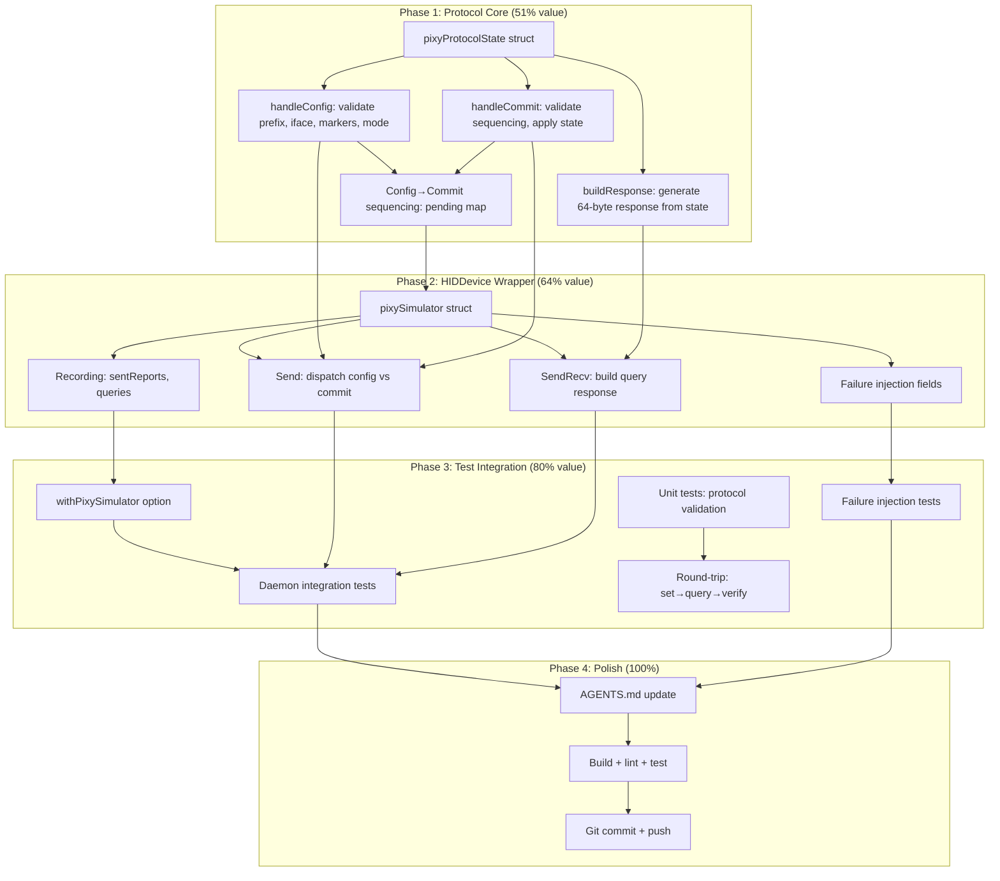

# PIXY HID Protocol Simulator

**Date:** 2026-08-03
**Goal:** Build a protocol-faithful PIXY HID simulator that validates byte-level correctness, replacing the blind `fakeHIDDevice` stub for integration testing.

---

## Problem

The current `fakeHIDDevice` is a **recording stub** — it captures bytes and returns canned responses but never validates protocol correctness. This means:

- Wrong byte positions in outgoing reports go undetected
- Missing config→commit sequencing is invisible
- Incorrect mode bytes for a given state pass silently
- No round-trip validation (set tracking → query → get tracking back)
- Protocol encoding bugs only surface on real hardware

The simulator closes this gap by understanding the full HID wire protocol and enforcing it.

---

## The PIXY HID Protocol (Reference)

### Write Path: `setDeviceState` (config + commit)

```
1. Send config report (9 bytes, padded to 32):
   [0x09, iface, 0x01, 0x00, 0x00, 0x01, 0x00, 0x01, modeByte, ...zeros]

2. Sleep 200ms (hidCommandSleepMs)

3. Send commit report (4 bytes, padded to 32):
   [0x09, iface, 0x01, iface, ...zeros]
```

### Query Path: `SendRecv` (write + read)

```
Write query payload (padded to 32 bytes):
  Tracking: [0x09, 0x01, 0x01, 0x01]
  Audio:    [0x09, 0x05, 0x00, 0x04]
  Gesture:  [0x09, 0x04, 0x02, 0x01, 0x00, 0x01, 0x00, 0x01, 0x02]

Read 64-byte response (parseHIDResponse):
  [0] = 0x09 (prefix)
  [1] = interface
  [2..7] = markers/padding
  [8] = mode byte (tracking/audio)
  last byte = gesture on/off (interface 0x04 only)
```

### Interfaces & Mode Bytes

| Interface | Byte | Valid Modes |
|-----------|------|-------------|
| Tracking | `0x01` | `0x00`=idle, `0x01`=tracking, `0x02`=privacy |
| Gesture | `0x04` | `0x00`=off, `0x01`=on |
| Audio | `0x05` | `0x01`=NC, `0x02`=live, `0x03`=original |

### Config vs Commit Detection

Both are sent via `Send()`. Distinguished by `report[3]`:
- **Commit:** `report[3] == report[1]` (interface byte repeated at position 3)
- **Config:** `report[3] == 0x00` (always zero)

This heuristic is reliable for all three interfaces (0x01, 0x04, 0x05 — none equal 0x00).

---

## Pareto Breakdown

### The 20% that delivers 80% of the result

| Component | Why it matters |
|-----------|----------------|
| Protocol state machine | Validates every byte, enforces config→commit sequencing |
| HIDDevice implementation | Drop-in replacement for fakeHIDDevice in existing tests |
| Round-trip tests | Proves encode→send→receive→decode consistency |

### The 4% that delivers 64% of the result

| Component | Why it matters |
|-----------|----------------|
| `pixyProtocolState.handleConfig` | Validates config report byte layout + mode byte |
| `pixyProtocolState.handleCommit` | Enforces config→commit protocol sequencing |
| `pixyProtocolState.buildResponse` | Generates protocol-valid query responses |

### The 1% that delivers 51% of the result

| Component | Why it matters |
|-----------|----------------|
| Config→commit state transition | The core invariant: state only changes after commit, not after config alone |

### The remaining 20%

| Component | Why it matters |
|-----------|----------------|
| Failure injection (timeout, corrupt, disconnect) | Tests error paths without real hardware |
| Daemon integration tests | Exercises full setTracking → simulator → query → verify |
| `withPixySimulator()` test option | Easy adoption in existing test infrastructure |
| AGENTS.md documentation | Future sessions understand the simulator |

---

## Execution Graph



---

## Task Breakdown: Phase 1 (30-100 min tasks)

| # | Task | Impact | Effort | Priority |
|---|------|--------|--------|----------|
| 1.1 | Write planning doc (this file) | High | 30min | DONE |
| 1.2 | Implement `pixyProtocolState` struct + state fields | Critical | 15min | P0 |
| 1.3 | Implement `handleConfig` — validate prefix, interface, markers, mode byte | Critical | 30min | P0 |
| 1.4 | Implement `handleCommit` — validate sequencing, apply pending config | Critical | 30min | P0 |
| 1.5 | Implement `buildResponse` — generate 64-byte protocol-valid response | Critical | 30min | P0 |
| 1.6 | Implement reverse byte mappings (hidByte→CameraState, hidByte→AudioMode) | High | 15min | P0 |
| 1.7 | Implement validation helpers (isValidInterface, validateModeByte) | High | 15min | P0 |

## Task Breakdown: Phase 2 (30-100 min tasks)

| # | Task | Impact | Effort | Priority |
|---|------|--------|--------|----------|
| 2.1 | Implement `pixySimulator` struct implementing `HIDDevice` | Critical | 20min | P0 |
| 2.2 | Implement `Send()` — dispatch config vs commit via isCommitReport heuristic | Critical | 20min | P0 |
| 2.3 | Implement `SendRecv()` — route to buildResponse | Critical | 15min | P0 |
| 2.4 | Implement failure injection fields (sendErr, sendRecvErr, nilResponse, corruptResponse) | High | 20min | P1 |
| 2.5 | Implement recording (sentReports, queries) + accessors | High | 15min | P1 |
| 2.6 | Implement state accessors (Tracking, Audio, Gesture) | High | 10min | P1 |

## Task Breakdown: Phase 3 (30-100 min tasks)

| # | Task | Impact | Effort | Priority |
|---|------|--------|--------|----------|
| 3.1 | Implement `withPixySimulator()` test option | High | 20min | P1 |
| 3.2 | Write simulator unit tests: config validation | Critical | 30min | P0 |
| 3.3 | Write simulator unit tests: commit validation + sequencing | Critical | 30min | P0 |
| 3.4 | Write simulator unit tests: query response round-trip | Critical | 30min | P0 |
| 3.5 | Write simulator unit tests: failure injection | High | 20min | P1 |
| 3.6 | Write daemon integration tests: setTracking → simulator → verify | High | 30min | P1 |
| 3.7 | Write daemon integration tests: sync round-trip | High | 30min | P1 |

## Task Breakdown: Phase 4 (30-100 min tasks)

| # | Task | Impact | Effort | Priority |
|---|------|--------|--------|----------|
| 4.1 | Update AGENTS.md with simulator documentation | Medium | 20min | P2 |
| 4.2 | Build + lint + test — fix all issues | Critical | 30min | P0 |
| 4.3 | Git commit + push | Medium | 10min | P2 |

---

## Detailed Task Breakdown (max 12 min each)

### Phase 1: Protocol Core

| # | Micro-task | Est |
|---|-----------|-----|
| 1.2a | Define `pixyProtocolState` struct (mu, tracking, audio, gesture, pending map) | 5min |
| 1.2b | Define `pendingConfig` struct (iface, modeByte, setTime) | 3min |
| 1.2c | Implement `newPixyProtocolState()` constructor | 3min |
| 1.3a | Implement prefix check (report[0] == 0x09) | 3min |
| 1.3b | Implement interface validation (isValidInterface) | 5min |
| 1.3c | Implement mode byte validation (validateModeByte per interface) | 8min |
| 1.3d | Implement marker validation (positions 2, 5, 7) | 5min |
| 1.3e | Wire handleConfig: store pending config | 5min |
| 1.4a | Implement commit prefix + interface validation | 5min |
| 1.4b | Implement commit interface-mismatch check (report[3] == report[1]) | 5min |
| 1.4c | Implement no-pending-config error | 3min |
| 1.4d | Implement applyConfig: update state from pending | 5min |
| 1.5a | Implement response builder for tracking queries | 8min |
| 1.5b | Implement response builder for audio queries | 5min |
| 1.5c | Implement response builder for gesture queries | 8min |
| 1.6a | Implement cameraStateFromHIDByte | 5min |
| 1.6b | Implement audioModeFromHIDByte | 5min |
| 1.7 | (covered by 1.3b, 1.3c) | — |

### Phase 2: HIDDevice Wrapper

| # | Micro-task | Est |
|---|-----------|-----|
| 2.1a | Define `pixySimulator` struct (state, failure fields, recording fields, mu) | 5min |
| 2.1b | Implement `newPixySimulator()` constructor | 3min |
| 2.1c | Implement `String()` method | 2min |
| 2.2a | Implement `isCommitReport` heuristic | 5min |
| 2.2b | Implement `Send()`: record + dispatch config/commit | 8min |
| 2.3a | Implement `SendRecv()`: record + build response | 8min |
| 2.4a | Add sendErr/sendRecvErr fields + guard logic | 5min |
| 2.4b | Add nilResponse field (simulates timeout) | 3min |
| 2.4c | Add corruptResponse field (returns garbage) | 5min |
| 2.5a | Add sentReports/queries recording + SentReports() accessor | 5min |
| 2.6a | Implement Tracking(), Audio(), Gesture() accessors | 5min |

### Phase 3: Tests

| # | Micro-task | Est |
|---|-----------|-----|
| 3.1 | Implement `withPixySimulator()` option | 10min |
| 3.2a | Test: valid config for each interface accepted | 8min |
| 3.2b | Test: invalid prefix rejected | 5min |
| 3.2c | Test: unknown interface rejected | 5min |
| 3.2d | Test: invalid mode byte rejected | 8min |
| 3.2e | Test: too-short report rejected | 5min |
| 3.3a | Test: commit without config rejected | 8min |
| 3.3b | Test: commit applies pending config | 8min |
| 3.3c | Test: query before commit returns OLD state | 8min |
| 3.4a | Test: tracking query round-trip | 8min |
| 3.4b | Test: audio query round-trip | 8min |
| 3.4c | Test: gesture query round-trip | 8min |
| 3.4d | Test: response parseable by parseHIDResponse | 8min |
| 3.5a | Test: sendErr failure injection | 5min |
| 3.5b | Test: sendRecvErr failure injection | 5min |
| 3.5c | Test: nil response (timeout) injection | 5min |
| 3.6a | Test: setTracking via daemon → simulator state changes | 10min |
| 3.6b | Test: setAudio via daemon → simulator state changes | 10min |
| 3.7a | Test: syncState reads from simulator | 10min |

### Phase 4: Polish

| # | Micro-task | Est |
|---|-----------|-----|
| 4.1 | Update AGENTS.md | 10min |
| 4.2 | Build + lint + test | 10min |
| 4.3 | Git commit + push | 5min |

---

## File Structure

| File | Purpose |
|------|---------|
| `pixy_simulator_test.go` | Simulator implementation: `pixyProtocolState` + `pixySimulator` + helpers + `withPixySimulator` option |
| `pixy_simulator_impl_test.go` | Unit tests for the simulator (protocol validation, round-trips, failure injection) |
| `pixy_simulator_daemon_test.go` | Integration tests: daemon + simulator end-to-end |

---

## Design Decisions

1. **Test-only code** (`_test.go`): Follows existing pattern (`fake_device_test.go`). No new packages.
2. **State machine separate from HIDDevice**: Protocol logic is pure, testable independently.
3. **Config→commit sequencing enforced**: Pending config stored, applied only on commit. Query before commit returns old state (matches hardware).
4. **Failure injection via struct fields**: Simple, explicit, no builder pattern overhead.
5. **Recording for assertions**: All sent reports captured for test verification.
6. **`withPixySimulator` keeps real HID methods**: Exercises full `setDeviceState` → `Send` → simulator path. Only V4L2/proc stubbed.
7. **No changes to existing tests**: Simulator is opt-in. `fakeHIDDevice` and `withFakeDevices` remain untouched.

## What This Is NOT

- Not a uhid/kernel-level simulator (Layer 2 future work)
- Not a V4L2 simulator (PTZ is well-covered by DI stubs)
- Not a replacement for `fakeHIDDevice` (it coexists — different fidelity levels)
- Not a NixOS VM test (Layer 3 future work)
