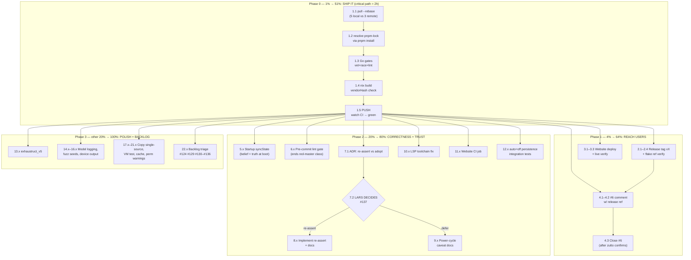

# Execution Plan — Ship issue #6 (PIXY 2K + Manual Mode) & Restore Repo Trust

**Created:** 2026-09-17 13:52 by Crush (glm-5.3)
**Input:** `docs/status/2026-09-17_13-46_issue-6-pixy-2k-proc-monitor-toggle.md` (session status) + `TODO_LIST.md` (#124, #129–#137) + live git state.
**Scope:** everything surfaced by the issue #6 session. No unrelated research.
**Resolution:** executed 2026-09-17 by the v0.4.0 session — ~~zero of it has reached users~~ pushed, tagged v0.4.0 (`02f769c`), website deployed, CI all green. T1–T3, T5–T17, T19–T22 done (see `2026-09-17_17-34`); still open: T4.3 close #6 (TODO #154). ~~T18 vmTest (TODO #157)~~ fixed 2026-09-19 — `nix build .#checks.vmTest` green.

---

## 0. Situation (why this plan exists)

Issue #6 is **functionally fixed and locally verified** (2K probe support, `/proc`-monitor toggle guarantee + docs, CI lint repair) — but **zero of it has reached users**:

1. **Local `master` and `origin/master` have diverged: 5 local vs 3 remote commits.**
   - Local (5): this session's work, auto-committed by the daemon (`0288e65`…`dc48a92`).
   - Remote (3): dependabot bumps — GitHub Actions versions, **Go module bumps (`go.mod`/`go.sum`, 5 updates)**, and an npm bump that rewrote `website/pnpm-lock.yaml` (−1439 lines; this is why my earlier website build dirtied the workspace).
   - A plain `git push` will be **rejected** (non-fast-forward). Integration first.
2. **`origin/master` CI is RED** on the `Lint` job (9 findings from the auto-committed `ratelimit.go`) — the fix for that is in the local commits.
3. **Risk introduced by the remote Go bumps:** `nix build` uses `proxyVendor = true` with a shared `vendorHash` (`flake.nix` + `package.nix`). New `go.sum` entries can invalidate the hash → nix CI job may fail even after lint is fixed. Must verify locally before pushing.
4. Website docs (2K + Manual Mode) are built-and-verified locally but **not deployed**.
5. Issue #6 reply is posted; the issue stays open pending @zutto's confirmation on real 2K hardware.

**Goal:** deliver the session's value to users (push → release → deploy), close the loop with zutto, and permanently fix the two systemic holes this session exposed (ungated auto-commits → red master; startup/hotplug state semantics).

---

## 1. Pareto Breakdown

### 1% → 51% of the result

**Integrate remote + push local master (verified green).** One rebase, one conflict resolution (pnpm-lock via package-manager regeneration), one gate run, one push. This single step: turns origin CI red→green, makes 2K support + manual-mode docs reachable for every user, and unblocks every other task (release tag, website deploy, issue closure all reference pushed refs). _Nothing else matters until this is done._

### 4% → 64% of the result

Add three small, independent shipments on top of the push:

1. **Cut a release tag** (`v` bump from CHANGELOG) — 2K users get an installable/pinnable ref (`github:LarsArtmann/emeet-pixyd/vX`); search-engine visitors get a versioned entry point. The repo has an `auto-tag.yml` workflow — verify what it does before manual tagging.
2. **Deploy the website** (firebase) — the Manual Mode docs that answer issue #6's actual question go live on `emeet-pixyd.lars.software`.
3. **Close the loop on #6** — follow-up comment pointing at the release; issue closes cleanly once zutto confirms.

### 20% → 80% of the result

Add the correctness + trust work:

1. **Startup `syncState`** — fresh installs believe `privacy` while the hardware lens is open; a boot-time sync makes belief = truth.
2. **Pre-commit lint gate** — the "daemon commits unchecked → master goes red" failure class happened twice now (go-paperless, this repo). A staged-files golangci-lint hook ends it.
3. **#137 decision + implementation** (device-reappear: re-assert persisted mode vs adopt hardware state) — the deepest gap the issue exposed; weakens both the privacy promise and the documented persistence.
4. **Power-cycle caveat docs** (honest docs until #137 lands).
5. **LSP toolchain fix** (1.26.5 vs go.mod 1.26.7) — every future session pays this tax.
6. **Website CI build job** — MDX breakage currently only caught by manual builds.

### The other 20% → 100%

Polish and long tail: model-aware logging, `device`/status model output, fuzz seeds for `0118`, auto=off persistence integration tests, exhaustruct_v5 migration, auto-mode copy single-sourcing, NixOS VM test, buildcache warnings, DOMAIN_LANGUAGE alignment, startup permission warnings — plus the standing backlog (#124 blocked on go-branded-id publish; #129 blocked on camera; #130–#136 website/CI items; #18-class ROADMAP ideas like a product-ID env override).

---

## 2. Comprehensive Plan — medium granularity (30–100 min per task)

Sorted by importance → impact → effort → customer value. `P` = Pareto tier.

| ID  | P    | Task                                                                                                                                                                                                                                                                                                                                                                     | Why (customer value)                                                      | Imp      | Eff | Est   |
| --- | ---- | ------------------------------------------------------------------------------------------------------------------------------------------------------------------------------------------------------------------------------------------------------------------------------------------------------------------------------------------------------------------------ | ------------------------------------------------------------------------- | -------- | --- | ----- |
| T1  | 1%   | ~~**Integrate remote + push master green**: `git pull --rebase`, resolve `website/pnpm-lock.yaml` via `pnpm install` regeneration (never hand-edit), run full gates (`go vet`/`test -race`/`lint`, `nix build`), fix `vendorHash` in `flake.nix`+`package.nix` if the Go bumps invalidated it, push, watch CI to green~~ done `2026-09-17_14-26` + `2026-09-17_17-34` a1 | Everything else is unreachable until users can pull a green master        | Critical | S   | 45m   |
| T2  | 4%   | ~~**Cut release**: finalize CHANGELOG (`Unreleased` → version section), annotated tag, push tag, verify flake ref resolves (`nix run github:…/vX`)~~ done v0.4.0 at `02f769c` (a11)                                                                                                                                                                                      | 2K users + README/nix users need a pinnable version with 2K support       | High     | S   | 45m   |
| T3  | 4%   | ~~**Deploy website**: rebuild post-rebase (lockfile changed), `firebase deploy --only hosting:emeet-pixyd`, verify live pages contain 2K + Manual Mode~~ done (a12, live fetches verified)                                                                                                                                                                               | The docs answering issue #6's question go live for search-engine visitors | High     | S   | 30m   |
| T4  | 4%   | **#6 close loop**: follow-up comment with release ref; close with closing formula once zutto confirms on real 2K hardware                                                                                                                                                                                                                                                | Reporter closure + public proof the project responds                      | High     | S   | 20m   |
| T5  | 20%  | **Startup `syncState`**: sync belief from hardware at boot when device present (test-first: fresh state + device → belief matches hardware)                                                                                                                                                                                                                              | Correctness: today a fresh install claims privacy with the lens open      | High     | S   | 40m   |
| T6  | 20%  | **Pre-commit lint gate**: staged-`.go` golangci-lint hook, provided via devShell, tested with an intentional violation                                                                                                                                                                                                                                                   | Ends the "ungated daemon commit → red master" class (2nd occurrence)      | High     | M   | 60m   |
| T7  | 20%  | **#137 decision**: ADR-style proposal (re-assert vs adopt on device re-appear, privacy analysis, migration risk) + Lars decides                                                                                                                                                                                                                                          | Product decision gating T8; documented tradeoff                           | High     | S   | 30m   |
| T8  | 20%  | **#137 implementation** (assuming decision = re-assert): replace uevent-path adopt with re-assert of persisted mode when hardware differs; failure-tolerant (log + keep belief); docs update                                                                                                                                                                             | Privacy guarantee survives reboot/replug; docs claim becomes fully true   | High     | M   | 90m   |
| T9  | 20%  | **Power-cycle caveat docs** (only if T8 deferred): README Manual Control + website auto-modes note that hardware resets on power loss and the daemon adopts                                                                                                                                                                                                              | Honest docs now instead of later                                          | Med      | S   | 20m   |
| T10 | 20%  | **LSP toolchain fix**: pin go 1.26.7 for gopls/golangci-lint-LS (or `GOTOOLCHAIN=auto` for the LSP env); verify clean diagnostics                                                                                                                                                                                                                                        | Every future AI session stops paying the broken-diagnostics tax           | Med      | S   | 30m   |
| T11 | 20%  | **Website CI build job**: pnpm frozen install + `astro build` + `fix-csp.mjs` on PRs (groundwork for TODO #133)                                                                                                                                                                                                                                                          | MDX breakage caught before deploy, not after                              | Med      | M   | 60m   |
| T12 | 20%  | **`auto=off` persistence integration test**: manual `track` survives 3 `autoManage` ticks + daemon restart (state.json round-trip)                                                                                                                                                                                                                                       | Pins the exact guarantee zutto asked for, end-to-end                      | Med      | S   | 40m   |
| T13 | 20%  | **exhaustruct → exhaustruct_v5 migration** in `.golangci.yml` + fix findings                                                                                                                                                                                                                                                                                             | Removes deprecated linter before it disappears and reds CI again          | Low      | S   | 30m   |
| T14 | tail | **Model-aware probing**: `probeResult` carries model ("PIXY" / "PIXY 2K"), logged in `probeDevices()`                                                                                                                                                                                                                                                                    | Support debuggability ("which model did it find?")                        | Low      | S   | 30m   |
| T15 | tail | **Fuzz seeds + uppercase 2K test**: `0118` uevent seeds; uppercase product test case                                                                                                                                                                                                                                                                                     | Cheap coverage symmetry                                                   | Low      | S   | 15m   |
| T16 | tail | **`device`/status model output**: include detected model in `device` cmd + `webStatus`                                                                                                                                                                                                                                                                                   | Better issue reports from users                                           | Low      | S   | 30m   |
| T17 | tail | **Single-source auto-mode copy**: README ↔ website ↔ NixOS description cross-linking/aliasing                                                                                                                                                                                                                                                                            | Stops 3-way copy drift (same class as TODO #135)                          | Low      | M   | 60m   |
| T18 | tail | **NixOS module VM test**: `runVMTest` with fake sysfs asserting both udev product IDs land                                                                                                                                                                                                                                                                               | Module correctness beyond `nix flake check` eval                          | Low      | M   | 100m  |
| T19 | tail | **Buildcache warning investigation**: reproduce golangci fact-persist failures in `/mnt/buildcache`                                                                                                                                                                                                                                                                      | Tooling hygiene                                                           | Low      | S   | 30m   |
| T20 | tail | **DOMAIN_LANGUAGE alignment**: check for USB-ID claims, align with 2-model reality                                                                                                                                                                                                                                                                                       | Doc consistency                                                           | Low      | S   | 10m   |
| T21 | tail | **Startup permission warning**: detect present-but-inaccessible hidraw/video nodes, warn with udev fix hint                                                                                                                                                                                                                                                              | Turns "Permission denied" confusion into a self-serve fix                 | Low      | M   | 60m   |
| T22 | tail | **Standing backlog triage**: #124 (blocked: go-branded-id publish), #129 (blocked: camera connected), #130–#136 (website/CI/GitHub-metadata items)                                                                                                                                                                                                                       | Keeps TODO_LIST honest; none blocked by this plan                         | as filed | M   | track |

---

## 3. Fine Breakdown — max 12 min per task (ALL TODOs)

Sorted by importance → impact → effort → customer value. `↳` = parent from §2.

| ID   | Task                                                                                                                                                        | Imp      | Eff | Est | Depends     |
| ---- | ----------------------------------------------------------------------------------------------------------------------------------------------------------- | -------- | --- | --- | ----------- |
| 1.1  | ↳T1: `git status` (daemon-race check), then `git pull --rebase origin master`                                                                               | Critical | S   | 10m | —           |
| 1.2  | ↳T1: resolve `website/pnpm-lock.yaml` conflict by regenerating via `pnpm install` (package-manager truth, never hand-edit); `git add` + `rebase --continue` | Critical | S   | 12m | 1.1         |
| 1.3  | ↳T1: run gates — `go vet`, `go test -race -count=1`, `golangci-lint` (new Go deps must pass)                                                                | Critical | S   | 12m | 1.2         |
| 1.4  | ↳T1: `nix build`; if `vendorHash` mismatch → compute new hash, update BOTH `flake.nix` + `package.nix`                                                      | Critical | S   | 12m | 1.3         |
| 1.5  | ↳T1: `git push origin master`; watch the CI run to green (Lint + Nix + Test jobs)                                                                           | Critical | S   | 12m | 1.4         |
| 2.1  | ↳T2: convert CHANGELOG `Unreleased` → `[vX.Y.Z] — 2026-09-17` (2K + manual-mode + lint fix)                                                                 | High     | S   | 12m | 1.5         |
| 2.2  | ↳T2: inspect `.github/workflows/auto-tag.yml` semantics; choose manual annotated tag if needed                                                              | High     | S   | 10m | 2.1         |
| 2.3  | ↳T2: create + push tag; verify tag CI workflow passes                                                                                                       | High     | S   | 10m | 2.2         |
| 2.4  | ↳T2: verify `nix run github:LarsArtmann/emeet-pixyd/vX` resolves + `--version` prints                                                                       | High     | S   | 12m | 2.3         |
| 3.1  | ↳T3: rebuild website post-rebase (fresh lockfile); confirm 19 pages + CSP 19/19                                                                             | High     | S   | 12m | 1.5         |
| 3.2  | ↳T3: `firebase deploy --only hosting:emeet-pixyd --project lars-software`                                                                                   | High     | S   | 10m | 3.1         |
| 3.3  | ↳T3: verify live URLs: installation + auto-modes + troubleshooting show 2K & Manual Mode                                                                    | High     | S   | 10m | 3.2         |
| 4.1  | ↳T4: draft #6 follow-up (release ref + ask zutto to confirm on 2K); voice-check it                                                                          | High     | S   | 10m | 2.4         |
| 4.2  | ↳T4: post comment                                                                                                                                           | High     | S   | 5m  | 4.1         |
| 4.3  | ↳T4: (on confirmation) close #6 with closing formula referencing the release                                                                                | High     | S   | 5m  | 4.2 + zutto |
| 5.1  | ↳T5: failing test — daemon constructed with device present + fresh state syncs camera belief from hardware                                                  | High     | S   | 12m | 1.5         |
| 5.2  | ↳T5: implement boot-time `syncState` when `videoDev != ""` (goroutine after `Run()` starts; lock-safe)                                                      | High     | S   | 12m | 5.1         |
| 5.3  | ↳T5: no-device boot path unchanged; full suite + race green                                                                                                 | High     | S   | 12m | 5.2         |
| 6.1  | ↳T6: choose hook mechanism (plain `.git/hooks/pre-commit` generated by devShell vs pre-commit framework — prefer zero-extra-deps)                           | High     | M   | 12m | 1.5         |
| 6.2  | ↳T6: implement staged-`.go` golangci-lint hook (`--timeout 2m`, GOWORK=off, GOEXPERIMENT=jsonv2)                                                            | High     | M   | 12m | 6.1         |
| 6.3  | ↳T6: test with intentional violation (must block commit); wire install into `flake.nix` devShell                                                            | High     | M   | 12m | 6.2         |
| 7.1  | ↳T7: write ADR proposal — re-assert vs adopt (privacy, surprise factor, failure modes)                                                                      | High     | S   | 12m | 1.5         |
| 7.2  | ↳T7: **Lars decides** (gate)                                                                                                                                | High     | S   | 5m  | 7.1         |
| 8.1  | ↳T8: failing test — device re-appears, believed `privacy`, hw reports idle → daemon re-asserts privacy                                                      | High     | M   | 12m | 7.2         |
| 8.2  | ↳T8: implement re-assert in uevent device-appear path (keep sync for audio/gesture)                                                                         | High     | M   | 12m | 8.1         |
| 8.3  | ↳T8: re-assert failure path: log, keep belief, no crash; suite + race green                                                                                 | High     | M   | 12m | 8.2         |
| 8.4  | ↳T8: update Manual Control docs to state the re-assert guarantee                                                                                            | High     | M   | 12m | 8.3         |
| 9.1  | ↳T9 _(only if T8 deferred)_: add power-cycle caveat to README Manual Control                                                                                | Med      | S   | 10m | 7.2         |
| 9.2  | ↳T9: mirror caveat in website auto-modes page                                                                                                               | Med      | S   | 10m | 9.1         |
| 10.1 | ↳T10: reproduce LSP failure (gopls 1.26.5 vs go.mod 1.26.7, `GOTOOLCHAIN=local`)                                                                            | Med      | S   | 10m | 1.5         |
| 10.2 | ↳T10: fix pinning (devShell go 1.26.7 on LSP PATH or `GOTOOLCHAIN=auto` for LSP env)                                                                        | Med      | S   | 12m | 10.1        |
| 10.3 | ↳T10: verify fresh-session diagnostics are clean                                                                                                            | Med      | S   | 10m | 10.2        |
| 11.1 | ↳T11: add website build job to CI (pnpm frozen install → astro build → fix-csp)                                                                             | Med      | M   | 12m | 1.5         |
| 11.2 | ↳T11: pnpm store cache + verify job runs green on a PR                                                                                                      | Med      | M   | 12m | 11.1        |
| 12.1 | ↳T12: test manual `track` + `auto=off` across 3 `autoManage` ticks (no transitions)                                                                         | Med      | S   | 12m | 1.5         |
| 12.2 | ↳T12: test state.json round-trip preserves camera mode across daemon restart                                                                                | Med      | S   | 12m | 12.1        |
| 13.1 | ↳T13: swap `exhaustruct` → `exhaustruct_v5` in `.golangci.yml`; run lint                                                                                    | Low      | S   | 12m | 1.5         |
| 13.2 | ↳T13: fix/suppress new findings (expected: `ratelimit.go` mu field) → 0 issues                                                                              | Low      | S   | 12m | 13.1        |
| 14.1 | ↳T14: extend `probeResult` with model name; log "found PIXY 2K" in `probeDevices()`                                                                         | Low      | S   | 12m | 1.5         |
| 14.2 | ↳T14: tests for both models' probe+log path                                                                                                                 | Low      | S   | 12m | 14.1        |
| 15.1 | ↳T15: add `0118` uevent seeds to fuzz corpus                                                                                                                | Low      | S   | 10m | 1.5         |
| 15.2 | ↳T15: uppercase 2K case in `TestHasPixyProduct`                                                                                                             | Low      | S   | 5m  | 15.1        |
| 16.1 | ↳T16: include model in `device` command + `webStatus`; tests                                                                                                | Low      | S   | 12m | 14.1        |
| 17.1 | ↳T17: audit the 3 auto-mode copies; design cross-link strategy                                                                                              | Low      | M   | 12m | 1.5         |
| 17.2 | ↳T17: implement links/aliases; verify no copy drift remains                                                                                                 | Low      | M   | 12m | 17.1        |
| 18.1 | ↳T18: scaffold `runVMTest` with module enabled + fake sysfs                                                                                                 | Low      | M   | 12m | 1.5         |
| 18.2 | ↳T18: assert both udev product IDs present in the VM                                                                                                        | Low      | M   | 12m | 18.1        |
| 18.3 | ↳T18: wire into `nix flake check`; keep eval time acceptable                                                                                                | Low      | M   | 12m | 18.2        |
| 19.1 | ↳T19: reproduce + diagnose golangci buildcache fact-persist warnings                                                                                        | Low      | S   | 12m | 1.5         |
| 20.1 | ↳T20: check `docs/DOMAIN_LANGUAGE.md` for USB-ID claims; align                                                                                              | Low      | S   | 10m | 1.5         |
| 21.1 | ↳T21: detect present-but-inaccessible hidraw/video at startup; warn with udev hint                                                                          | Low      | M   | 12m | 1.5         |
| 21.2 | ↳T21: tests with simulated permissions                                                                                                                      | Low      | M   | 12m | 21.1        |
| 22.1 | ↳T22: triage standing backlog (#124/#129/#130–#136) — verify each still applies post-push; annotate                                                         | Low      | M   | 12m | 1.5         |
| 22.2 | ↳T22: route anything obsoleted by this plan to CHANGELOG/ROADMAP                                                                                            | Low      | M   | 12m | 22.1        |

**55 micro-tasks · ~9.5 h total · critical path (1.1→1.5→2.x→4.2) ≈ 2 h**

---

## 4. Execution Graph

**Scheduling rule:** Phase 0 is strictly sequential. Phase 1–3 tasks are independent of each other and can be parallelized/multitasked after 1.5.

---

## 5. Guardrails (do NOT verschlimmbessern)

- `website/pnpm-lock.yaml` conflicts are resolved by **regeneration via `pnpm install`**, never hand-editing.
- `vendorHash` lives in TWO files (`flake.nix` + `package.nix`) — always update both, then `nix build` to prove it.
- No `git reset`, no `git checkout`, no force push. Rebase only, `--force-with-lease` never needed for this linear case.
- Re-check `git status` immediately before every `git add` — the auto-commit daemon races explicit commits.
- #137 is a **product decision gate** — implement nothing until Lars picks (7.2).
- After any Go change: full gate (`vet` + `test -race` + `lint`); after any nix change: `nix build` + `nix flake check`.

## 6. Open questions (cannot be self-answered)

1. **#137 semantics** — re-assert persisted mode on device re-appear (stronger privacy) vs adopt hardware truth (current)? [7.2]
2. **Release version** — next tag number (breaking-free minor bump?) and whether `auto-tag.yml` should own tagging or manual annotated tags are preferred.
3. **2K hardware** — rely on zutto's confirmation for #6 closure, or arrange hardware verification first?
