# SUPERB Pareto Execution Plan — emeet-pixyd

**2026-09-17 19:35 CEST** · Input: `TODO_LIST.md` (#129–#141), `ROADMAP.md` design-penders (#116/#123), research follow-ups from `2026-09-17_18-43` self-review §f · Snapshot; living source of truth stays `TODO_LIST.md`.

**Prime directive: no VERSCHLIMMBESSERN.** Every task is additive/surgical — no refactors of working code, no format wars, no speculative rewrites. Blocked/pending-decision items are marked and _not_ executed blind.

**Resolution:** M1–M8 + M13 fully landed 2026-09-18 (`77a97ca`, `4f29afc`, `ba24f8d`, `4539cd7`; see `2026-09-18_05-43` §a), plus the unplanned cmdtable breakthrough that byte-unblocked M14–M17. M9–M12 and M14–M25 remain open, carried as `TODO_LIST.md` #129–#165. Living source of truth: TODO_LIST.

---

## 1. Pareto Breakdown

### The 1% that delivers 51% — SECURE THE RESEARCH (do today)

The Windows extraction exists **only in `/tmp`** — one reboot away from destroying hours of
irreplaceable reverse-engineering (same failure class as the lost HyperFrames sources, TODO #130).
Securing + integrating it also lays the foundation every feature TODO (#138–#141) stands on.

→ **M1–M4**: tooling into repo, SHA256 verification, docs integration (AGENTS.md, CHANGELOG), `/tmp` cleanup.

### The 4% that delivers 64% — PROTOCOL GROUNDWORK

One focused mapping session (their `CMD_*` surface ↔ our `hid.go`/`hid-protocol.md`) **unlocks
all four new feature TODOs at once**: it tells us whether PTZ speed (#138), battery (#139),
tracking variants (#140), motor presets (#141) are cheap reads or need hardware sniffing —
before we write a line of feature code.

→ **M5–M8**: CMD↔HID mapping + official-implementation notes, command enumeration from strings, battery de-risk.

### The 20% that delivers 80% — CREDIBILITY SURFACE + the two groundwork tiers

1% + 4% plus the cheap user-facing wins: README pitch truth (#131), GitHub metadata (#132),
typescript pin (#134), hero-code dedup (#135) — these make the project look as good as it is,
with zero risk to the daemon.

→ **M1–M13** (M9–M13 fill out the tier).

### The other 20% (to reach 100%) — FEATURES, CONTENT, DECISIONS

- Feature implementation after groundwork: M14–M18 (needs hardware for final verification).
- Website/content: M19–M22 (#133 deploy half, #136 polish, #130 video rebuild, elink doc).
- Intel + decisions: M23–M25 (EMVideoInput notes, ADRs for #116/#123, innoextract PR prep).
- Blocked, tracked not forced: #129 (camera attached), #133-deploy (Lars's Firebase secret),
  public-comparison page + upstream PR (Lars's calls, questions asked 18:43).

---

## 2. Medium Plan — 25 tasks, 30–100 min each

Sorted: tier → impact ↓ → effort ↑. **B** = blocked/pending external.

| #   | Task (rolls up to)                                                                                                                                                                                                             | Tier | Impact                          | Effort | Est min | Deps       | Customer value / why                                            |
| --- | ------------------------------------------------------------------------------------------------------------------------------------------------------------------------------------------------------------------------------ | ---- | ------------------------------- | ------ | ------- | ---------- | --------------------------------------------------------------- |
| M1  | ~~Preserve Inno 6.6.1 toolchain in repo: copy 4 parser scripts + `parsed.json`/`locations.json` to `tools/inno661/`, usage README, re-run verification~~ done (`77a97ca`; byte-identical re-run)                                                                                           | 1%   | HIGH (irreplaceable)            | S      | 45      | —          | Protects session output from `/tmp` loss; reproducibility       |
| M2  | ~~SHA256-verify all 2,211 extracted files (re-parse keeping digests, checksum script, report)~~ done — calltransform.py rel32 decode; **all 2,211 digests match** (`verify.py` exit 0)                                                                                                    | 1%   | HIGH                            | S      | 40      | —          | Cryptographic proof the extraction is byte-perfect              |
| M3  | Docs integration: AGENTS.md pointer block (comparison doc + tooling + `/tmp` inventory), CHANGELOG entry                                                                                                                       | 1%   | MED-HIGH                        | S      | 30      | M1         | Future sessions find everything; memory protocol                |
| M4  | `/tmp` cleanup: remove 4 wine prefixes + dead `innoextract-src`, record abandonment note in comparison doc §5                                                                                                                  | 1%   | MED                             | S      | 30      | M1, M2     | No GB of dead prefixes; decision documented                     |
| M5  | CMD↔HID mapping: their `CMD_GET_/SET_` surface ↔ `hid.go`/`commands.go`/`hid-protocol.md`; gap table + official-implementation notes (EMHidCmdV2Head, `_OLD`, RecvFsm, `[HID_RACE_FIX]`) → `docs/hid-protocol-official-map.md` | 4%   | **VERY HIGH** (unlocks 4 TODOs) | M      | 100     | M1         | Single key that gates #138–#141                                 |
| M6  | Enumerate protocol specifics from strings: MOTOR speed/preset/power-on-default, battery/charge, TargetTrack/ObjectTrack values, privacy-trigger-time → feeds M5 doc                                                            | 4%   | **VERY HIGH**                   | M      | 60      | —          | Raw material for the mapping + feature designs                  |
| M7  | Battery de-risk: HID query test sketch from known framing; run if camera attached; verdict into TODO #139 (wired PIXY vs Wireless-only?)                                                                                       | 4%   | HIGH                            | S      | 45      | M6         | Kills the unverified "PIXY has a battery" claim before it ships |
| M8  | Device-matrix cleanup + misc intel: final `Emeet*` class list (classes vs fw-models), fix comparison-doc ellipsis/errata, extract 2 wizard images, probe `fw.emeet.ai`                                                         | 4%   | MED                             | S      | 40      | —          | Accuracy of the public-facing research doc                      |
| M9  | README pitch alignment (#131): origin-story intro matching website hero; claims re-checked against FEATURES.md                                                                                                                 | 20%  | HIGH                            | S      | 45      | —          | First thing every visitor reads is true                         |
| M10 | Repo credibility bundle (#132): `gh repo edit` description, homepage, topics; verify rendering                                                                                                                                 | 20%  | MED                             | S      | 30      | —          | Discoverability (topics/SEO) for ~15 min of work                |
| M11 | Pin `typescript@6.x` in website (#134); `astro check`/`tsc --strict` green again                                                                                                                                               | 20%  | MED                             | S      | 30      | —          | Un-breaks website typechecking CI-adjacent path                 |
| M12 | Unify hero terminal code (#135): `hero-code.ts` single source, `HeroSection.astro` consumes it; render-diff check                                                                                                              | 20%  | MED                             | S      | 40      | —          | Kills a documented drift bug class                              |
| M13 | Resolve Windows string anomalies: TargetTrack/ObjectTrack absence, `elink` 24-vs-1296 — explain or document as open                                                                                                            | 20%  | MED                             | S      | 40      | M1         | Comparison-doc completeness; may reveal feature gating          |
| M14 | Implement PTZ speed (#138) — design from M5/M6 bytes → `hid.go` + commands + web + tests (hardware verify last)                                                                                                                | 100% | HIGH                            | M      | 90      | M5, M6     | Most visible PTZ UX win since presets                           |
| M15 | Implement battery/charge status (#139) — `queryHIDState` + status/Waybar/web + tests                                                                                                                                           | 100% | MED-HIGH                        | S      | 50      | M7         | New read-only status surface (if hardware answers)              |
| M16 | Implement tracking-mode variants (#140) — selector design → implement → CLI/web wiring                                                                                                                                         | 100% | MED-HIGH                        | M      | 80      | M5, M6, hw | Face/HalfBody/FullBody selection                                |
| M17 | Implement motor-preset mirroring (#141) — sync named presets to hardware slots                                                                                                                                                 | 100% | MED                             | M      | 80      | M5, M6, hw | Presets survive host swaps/power cycles                         |
| M18 | Website deploy CI completion (#133): secret checklist for Lars, workflow final review (deploy run itself blocked)                                                                                                              | 100% | MED                             | S      | 30      | Lars       | Ends manual `firebase deploy` dependency                        |
| M19 | Landing polish (#136): VideoObject JSON-LD, webp screenshots, poster frame, dark/mobile QA                                                                                                                                     | 100% | MED                             | M      | 80      | —          | SEO + polish                                                    |
| M20 | Demo video composition rebuild (#130) — scaffold `website/video/`, port storyboard, render check                                                                                                                               | 100% | MED                             | M      | 90      | —          | Re-renderability (lost-source insurance)                        |
| M21 | elink protocol documentation — extract ~90 command families from Mac strings, shape doc                                                                                                                                        | 100% | LOW-MED                         | M      | 90      | M1         | PIXY-Wireless intel; community value                            |
| M22 | EMVideoInput.dll inspection — their OBS↔app pipe vs our MJPEG stream; notes                                                                                                                                                    | 100% | LOW-MED                         | S      | 50      | M1         | Architecture comparison depth                                   |
| M23 | ADR proposals for #116 (structured commands) + #123 (multi-word presets) — decision options for Lars, no code                                                                                                                  | 100% | HIGH (unblocks design)          | M      | 80      | —          | Two HIGH/HIGH TODOs stuck on a decision                         |
| M24 | innoextract upstream PR prep: condense 6.6.1 format spec + draft issue/PR text (**B**: Lars's go)                                                                                                                              | 100% | MED (OSS value)                 | S      | 40      | M1         | Real upstream contribution ready to fire                        |
| M25 | Screenshot retake (#129) shot-list + capture/crop when camera attached (**B**: hardware)                                                                                                                                       | 100% | MED                             | S      | 30      | hw         | Website shows the online UI                                     |

**Blocked, tracked here (not scheduled):** public comparison page on website (Lars's call — legal/positioning), 348 MB payload archiving (Lars's call), `FIREBASE_SERVICE_ACCOUNT` (Lars).

---

## 3. Fine Plan — 88 tasks, ≤12 min each (all todos covered)

| ID    | Task (≤12 min)                                                                                              | → M | Est | Impact    |
| ----- | ----------------------------------------------------------------------------------------------------------- | --- | --- | --------- |
| F1.1  | Create `tools/inno661/`, copy `extract_setup0.py`, `setup0_parse.py`, `finish_parse.py`, `extract_files.py` | M1  | 10  | HIGH      |
| F1.2  | Write `tools/inno661/README.md`: usage, format summary, pointers to comparison doc §5                       | M1  | 12  | HIGH      |
| F1.3  | Snapshot `parsed.json` + `locations.json` into `tools/inno661/data/`                                        | M1  | 8   | HIGH      |
| F1.4  | Verify: re-run extract end-to-end from new location against installer                                       | M1  | 12  | HIGH      |
| F2.1  | Re-parse file locations keeping SHA256 digests; emit `verify.py`                                            | M2  | 12  | HIGH      |
| F2.2  | Run checksum over all 2,211 extracted files; write report                                                   | M2  | 10  | HIGH      |
| F2.3  | Record verification result in comparison doc (errata/proof section)                                         | M2  | 5   | MED       |
| F3.1  | AGENTS.md: add research-artifacts pointer block (docs + tools + strings locations)                          | M3  | 10  | HIGH      |
| F3.2  | CHANGELOG.md: research-deliverable entry                                                                    | M3  | 10  | MED       |
| F3.3  | Cross-link check: status reports ↔ comparison doc ↔ TODO #138–#141                                          | M3  | 5   | LOW       |
| F4.1  | Delete `/tmp/emeet/wineprefix*` (4 prefixes)                                                                | M4  | 5   | LOW       |
| F4.2  | Record innoextract-tree abandonment + wine-postmortem note in comparison doc §5                             | M4  | 10  | MED       |
| F4.3  | Inventory remaining `/tmp/emeet` contents (what dies with reboot) into AGENTS block                         | M4  | 10  | MED       |
| F5.1  | Extract our implemented HID ops from `hid.go`, `commands.go`, `docs/hid-protocol.md`                        | M5  | 12  | HIGH      |
| F5.2  | Extract their full `CMD_*` list with context lines (win + mac)                                              | M5  | 12  | HIGH      |
| F5.3  | Build mapping table (implemented / mappable / needs-bytes / unknown) in `docs/hid-protocol-official-map.md` | M5  | 12  | VERY HIGH |
| F5.4  | Cross-check audio/mode/zoom ops for byte-level hints (both use config+commit)                               | M5  | 12  | VERY HIGH |
| F5.5  | Add "Official implementation" validation section to `docs/hid-protocol.md`                                  | M5  | 12  | MED       |
| F5.6  | Review pass + commit of mapping doc                                                                         | M5  | 8   | MED       |
| F6.1  | Grep MOTOR context lines from Mac strings; classify speed/position/relative ops                             | M6  | 12  | VERY HIGH |
| F6.2  | Enumerate preset + power-on-default position commands                                                       | M6  | 12  | VERY HIGH |
| F6.3  | Extract battery/charge context (which models reference it)                                                  | M6  | 10  | HIGH      |
| F6.4  | Extract TargetTrack/ObjectTrack mode-value strings                                                          | M6  | 12  | HIGH      |
| F6.5  | Extract privacy-trigger-time context                                                                        | M6  | 10  | MED       |
| F6.6  | Fold all findings into `hid-protocol-official-map.md`                                                       | M6  | 12  | VERY HIGH |
| F7.1  | Write HID battery-query test sketch using existing framing                                                  | M7  | 12  | HIGH      |
| F7.2  | Run query against hardware if PIXY attached; capture result                                                 | M7  | 12  | HIGH      |
| F7.3  | Update TODO #139 with wired-vs-wireless verdict                                                             | M7  | 5   | HIGH      |
| F8.1  | Produce final device-class list both platforms (classes ≠ fw-models)                                        | M8  | 10  | MED       |
| F8.2  | Probe `fw.emeet.ai/api/v3/firmware/models/*` once; record status                                            | M8  | 8   | LOW       |
| F8.3  | Fix comparison-doc ellipsis/errata (device line, battery caveat)                                            | M8  | 10  | MED       |
| F8.4  | Extract 2 wizard images; eyeball branding                                                                   | M8  | 8   | LOW       |
| F9.1  | Draft README intro from website-hero origin story                                                           | M9  | 12  | HIGH      |
| F9.2  | Edit README pitch section                                                                                   | M9  | 12  | HIGH      |
| F9.3  | Verify every README claim against FEATURES.md                                                               | M9  | 10  | HIGH      |
| F10.1 | `gh repo edit`: description + homepage                                                                      | M10 | 6   | MED       |
| F10.2 | Set topics (linux, webcam, hid, nixos, go, daemon)                                                          | M10 | 4   | MED       |
| F10.3 | Verify metadata rendering on GitHub                                                                         | M10 | 4   | LOW       |
| F11.1 | Pin `typescript@6.x` in website `package.json`, refresh lockfile                                            | M11 | 10  | MED       |
| F11.2 | Verify `tsc --strict` + document `astro check` status                                                       | M11 | 12  | MED       |
| F12.1 | Make `hero-code.ts` the single source; export structured lines                                              | M12 | 12  | MED       |
| F12.2 | `HeroSection.astro` consumes it for `highlightedCode`                                                       | M12 | 12  | MED       |
| F12.3 | Render-diff check (build + compare hero)                                                                    | M12 | 10  | MED       |
| F13.1 | Investigate TargetTrack/ObjectTrack absence in Windows exe                                                  | M13 | 12  | MED       |
| F13.2 | Locate Windows `elink` references (24 hits) — what are they?                                                | M13 | 12  | MED       |
| F13.3 | Document findings/open-questions in comparison doc                                                          | M13 | 8   | MED       |
| F14.1 | Design PTZ-speed command from M5/M6 evidence                                                                | M14 | 12  | HIGH      |
| F14.2 | Implement in `hid.go` (config+commit report)                                                                | M14 | 12  | HIGH      |
| F14.3 | Wire `ptz-speed` command + web slider/env default                                                           | M14 | 12  | HIGH      |
| F14.4 | Tests (unit + pixy simulator round-trip)                                                                    | M14 | 12  | HIGH      |
| F14.5 | Hardware verify; clamp validation                                                                           | M14 | 12  | HIGH      |
| F15.1 | Add battery/charge `queryHIDState[T]`                                                                       | M15 | 12  | HIGH      |
| F15.2 | Surface in `status`, Waybar JSON, web panel                                                                 | M15 | 12  | HIGH      |
| F15.3 | Tests + graceful absence handling                                                                           | M15 | 12  | MED       |
| F16.1 | Design tracking-mode selector (enum mapping)                                                                | M16 | 12  | HIGH      |
| F16.2 | Implement HID mode set + `tracking <mode>` command                                                          | M16 | 12  | HIGH      |
| F16.3 | Web UI mode picker + keyboard                                                                               | M16 | 12  | HIGH      |
| F16.4 | Tests + hardware verify                                                                                     | M16 | 12  | HIGH      |
| F17.1 | Design motor-preset slot API (slots, sync rules)                                                            | M17 | 12  | MED       |
| F17.2 | Implement save/recall sync logic                                                                            | M17 | 12  | MED       |
| F17.3 | Tests + hardware verify                                                                                     | M17 | 12  | MED       |
| F18.1 | Write FIREBASE secret checklist for Lars (exact steps)                                                      | M18 | 8   | MED       |
| F18.2 | Final review of `website.yml` deploy job                                                                    | M18 | 12  | MED       |
| F19.1 | Add `VideoObject` JSON-LD for demo.mp4                                                                      | M19 | 12  | MED       |
| F19.2 | PNG→webp screenshot conversion + references                                                                 | M19 | 12  | MED       |
| F19.3 | Dedicated poster frame (t=2)                                                                                | M19 | 10  | LOW       |
| F19.4 | Dark/light + mobile QA of Showcase                                                                          | M19 | 12  | LOW       |
| F20.1 | Scaffold `website/video/` HyperFrames composition                                                           | M20 | 12  | MED       |
| F20.2 | Port storyboard/copy from rendered demo.mp4                                                                 | M20 | 12  | MED       |
| F20.3 | Render + compare vs committed mp4; commit source                                                            | M20 | 12  | MED       |
| F21.1 | Extract elink command families from Mac strings                                                             | M21 | 12  | LOW-MED   |
| F21.2 | Document protocol shape (transport, framing)                                                                | M21 | 12  | LOW-MED   |
| F21.3 | Examples table + link from comparison doc                                                                   | M21 | 12  | LOW-MED   |
| F22.1 | Strings-inspect `EMVideoInput.dll` (pipe/shared-mem?)                                                       | M22 | 12  | LOW-MED   |
| F22.2 | Notes: their pipe vs our MJPEG approach                                                                     | M22 | 12  | LOW-MED   |
| F23.1 | ADR draft: structured command types (#116) — options + recommendation                                       | M23 | 12  | HIGH      |
| F23.2 | ADR draft: multi-word preset names (#123) — options + recommendation                                        | M23 | 12  | HIGH      |
| F23.3 | Condense both into decision memo for Lars                                                                   | M23 | 12  | HIGH      |
| F24.1 | Condense Inno 6.6.1 spec from comparison doc §5 (upstream-ready)                                            | M24 | 12  | MED       |
| F24.2 | Draft upstream issue/PR text with Python reference pointer                                                  | M24 | 12  | MED       |
| F25.1 | Screenshot shot-list (angles, states, crops)                                                                | M25 | 8   | MED       |
| F25.2 | Capture + crop + replace when camera attached                                                               | M25 | 12  | MED       |
| F26.1 | Distill internal comparison → public page draft (**B**: Lars)                                               | —   | 12  | MED       |
| F26.2 | Archive-or-delete decision executed for 348 MB payload (**B**: Lars)                                        | —   | 6   | LOW       |

---

## 4. Execution Graph

```mermaid
flowchart TD
    subgraph T1["1% — SECURE (today)"]
        M1[M1 tooling into repo]
        M2[M2 SHA256 verify]
        M3[M3 docs integration]
        M4[M4 /tmp cleanup]
        M1 --> M3 --> M4
        M2 --> M4
    end

    subgraph T2["4% — PROTOCOL GROUNDWORK"]
        M5[M5 CMD<->HID mapping]
        M6[M6 command enumeration]
        M7[M7 battery de-risk]
        M8[M8 device matrix + misc]
        M6 --> M5
        M6 --> M7
        M5 --> M7
    end

    subgraph T3["20% — CREDIBILITY"]
        M9[M9 README pitch]
        M10[M10 repo metadata]
        M11[M11 ts pin]
        M12[M12 hero unify]
        M13[M13 string anomalies]
    end

    subgraph T4["100% — FEATURES (need hardware verify)"]
        M14[M14 PTZ speed]
        M15[M15 battery status]
        M16[M16 tracking modes]
        M17[M17 motor presets]
    end

    subgraph T5["100% — CONTENT & DECISIONS"]
        M18[M18 deploy CI]
        M19[M19 landing polish]
        M20[M20 video rebuild]
        M21[M21 elink doc]
        M22[M22 EMVideoInput]
        M23[M23 ADRs 116/123]
        M24[M24 innoextract PR prep]
        M25[M25 screenshots]
    end

    T1 --> T2
    T2 --> M14 & M15 & M16 & M17
    M7 --> M15
    M1 --> M13 & M21 & M22 & M24

    BLK1[["BLOCKED: FIREBASE secret — Lars"]] -.-> M18
    BLK2[["BLOCKED: camera attached"]] -.-> M25
    BLK3[["PENDING Lars: public page / PR / payload"]] -.-> M24
```

**Critical path:** M1 → M5/M6 → M14 (PTZ speed = first feature payoff).
**Parallel-safe:** M8–M13 (docs/website) touch no daemon code — can run interleaved.
**Hardware-gated:** final verification of M14–M17, plus M25; all design+code+tests land first.

---

## 5. Rules of Engagement

1. Order: T1 today (reboot risk), then T2, then T3 interleaved; T4/T5 after groundwork.
2. Every task: build + `GOEXPERIMENT=jsonv2 GOWORK=off go test ./...` green before commit; lint on touched files.
3. One logical task per commit (detailed messages); auto-commit daemon races — re-check `git status` before `git add`.
4. Blocked items get evidence recorded, never blind execution. No VERSCHLIMMBESSERN: additive changes only; if a task reveals a refactor temptation, it becomes a new TODO instead.
