# SUPERB Pareto Execution Plan — emeet-pixyd

**2026-09-18 20:51 CEST** · Input: `TODO_LIST.md` (27 open items: #129–#165), `ROADMAP.md` design-penders (#116/#123), post-breakthrough state from `docs/status/2026-09-18_05-43` (162 command IDs extracted, gate broken open) and the 2026-09-18 docs-health full sweep (all living docs verified current; repo all-green). Snapshot — living source of truth stays `TODO_LIST.md`.

**Prime directive: no VERSCHLIMMBESSERN.** Every task is additive/surgical. Test-first for all HID work: the simulator (M6) is extended BEFORE any feature implementation lands. No refactors of working code, no dependency churn, no format wars. Blocked/pending-decision items are marked and _not_ executed blind.

---

## 1. Situation (why this plan exists)

The repo is at its healthiest state ever: v0.4.0 released, all three CI workflows green, docs verified superb (2026-09-18 sweep), lint 0 issues. The **central asset** is `tools/emhid/cmdtable.json` — 162 official command IDs + payload layouts extracted from the Mac binary — which broke open the V2Head gate that blocked every feature TODO (#138–#141). That knowledge is currently **trapped in a JSON file**: the map doc still says "bytes unknown", the battery probe still sweeps generic tails, and the simulator cannot validate V2-head traffic.

**The chain that matters:** fold the table into the docs (M1–M2) → decode the enums + response framing (M4–M5) → teach the simulator (M6) → implement PTZ speed (M14, the flagship) → one attached-hardware session (M27) verifies ~6 TODOs at once. Everything hardware-gated waits on that single session; everything Lars-gated waits on four decisions.

---

## 2. Pareto Breakdown

### The 1% that delivers 51% — CONVERT THE BREAKTHROUGH (protocol groundwork, no hardware needed)

The command table is worthless until it is (a) readable by humans, (b) semantically decoded, (c) executable in tests.

→ **M1–M6**: map-doc fold-in + emhid README + exact-heads probe rewrite + enum decoding + response framing + simulator V2-head support. This converts trapped knowledge into the foundation every feature stands on — and it is 100% hardware-free.

### The 4% that delivers 64% — TRUST & CREDIBILITY (cheap, unblocked, visible)

1% plus the short unblocked trust items: CI integrity (vmTest green, pinned lint, fuzz-list assert), repo/website metadata truth, the model surfaced in the UI, and the changelog page catching up with the release.

→ **M7–M13** (M7 vmTest, M8 CI pin + fuzz assert + auto-tag fate, M9 metadata sweep, M10 /changelog deploy, M11 Model in UI, M12 uevent warning, M13 FuzzParseUevent). Every one ≤45 min; all S-effort; all pure wins with zero risk to the daemon.

### The 20% that delivers 80% — FLAGSHIP FEATURE + DECISIONS + WEBSITE TIER

1% + 4% plus the first feature implementation (PTZ speed — the most visible UX win since presets), the two ADRs that unblock the stuck design-penders (#116/#123), and the website polish tier (hero dedupe, TS pin, landing polish, video rebuild).

→ **M14–M20**.

### The other 20% (to reach 100%) — HARDWARE, LARS-GATED, LONG TAIL

Remaining features (battery, tracking variants, motor presets, identity queries), the cmdtable second-source, the upstream PR prep, the single hardware session that closes ~6 TODOs at once, and the four Lars/zutto-gated items (#133 deploy, #154 close #6, #155 v0.4.1, #156 branch protection).

→ **M21–M31**.

---

## 3. Comprehensive Plan — medium granularity (30–100 min per task, 31 tasks, ALL 27 TODOs covered)

Sorted by tier → impact → effort → customer value. **B** = blocked/pending external.

| #   | Tier | Task (rolls up to)                                                                                                                                                                                                | TODOs          | Impact               | Effort | Deps           | Customer value / why                                                     |
| --- | ---- | ----------------------------------------------------------------------------------------------------------------------------------------------------------------------------------------------------------------- | -------------- | -------------------- | ------ | -------------- | ------------------------------------------------------------------------ |
| M1  | 1%   | Fold the 162-command table + payload layouts into `docs/hid-protocol-official-map.md` (rewrite §3/§4/§6; update ✅/🔷/🟨/⬜ classifications; record `mergeType` sub-device routing)                               | #149           | **VERY HIGH**        | M      | —              | The feature-gate reference stops lying; #138–#141 become plannable       |
| M2  | 1%   | `tools/emhid/README.md` (usage, repro steps, GOT-base caveat, table excerpt) + `docs/hid-protocol.md` V2Head section (bare 4-byte query heads)                                                                    | #149           | HIGH                 | S/M    | M1             | The extractor is reproducible; protocol doc reflects reality             |
| M3  | 1%   | Rewrite `TestIntegration_BatteryProbe` with the exact heads (`09 00 00 02` battery, `09 00 00 06` charge, `09 03 01 13` motor speed, `09 03 01 02` motor pos, `09 04 01 02` target track) × iface bytes {3, 0x63} | #144           | HIGH                 | S/M    | M1             | The rare hardware window gets a ready, current probe                     |
| M4  | 1%   | Decode enum values from Mac disasm/QML: `MotorType`, `TargetTrackMode`, `DefaultPosMode`, `ChargeSta` → annotate cmdtable + map doc §4                                                                            | #150           | **VERY HIGH**        | M      | —              | Gates #138/#139/#140/#141 implementations                                |
| M5  | 1%   | Decode response framing: `EMHidCmdV1/V2RecvFsm::onDataRecv` + `hidCmdParseGet*` bodies (head echo? sequence? payload layouts) → map doc response column                                                           | #150           | **VERY HIGH**        | M      | —              | Unblocks every read path (battery, motor speed, identity queries)        |
| M6  | 1%   | Extend `pixySimulator` with V2-head families: 4-byte query heads + payload validation (SetMotorSpeed, SetTargetTrack, SetDeviceMode) + round-trip + failure-injection tests                                       | #153           | HIGH                 | M      | M4 (soft)      | Byte-faithful tests from day one for all new features                    |
| M7  | 4%   | Fix vmTest subtest 3 (guard the `cat $(find …)` substitution); verify `nix build .#checks.x86_64-linux.vmTest` green; push                                                                                        | #157           | HIGH                 | S/M    | —              | Full `nix flake check` story green; module boot-tested in CI             |
| M8  | 4%   | CI hardening bundle: pin golangci-lint version in the action, add fuzz-target existence assert, decide `auto-tag.yml` fate (feed version or delete)                                                               | #159 #160 #162 | MED-HIGH             | S/M    | —              | CI signal can't rot silently again                                       |
| M9  | 4%   | Repo/website metadata sweep: `htmx`→`datastar` topic, drop stale `html-validate@11.7.0` exclude, expiry note on `astro@7.3.3` exclude, "2 Stars" hero metric threshold                                            | #164           | MED                  | S      | —              | Public face tells the truth (topics, deps, social proof)                 |
| M10 | 4%   | Website rebuild + Firebase deploy so `/changelog` shows 0.4.0+ (grep dist for new content before deploy)                                                                                                          | #158           | MED                  | S      | M19 (soft)     | The deployed changelog matches the release                               |
| M11 | 4%   | Surface `webStatus.Model` in the web panel + Waybar tooltip/JSON (data already flows end-to-end)                                                                                                                  | #161           | LOW-MED              | S      | —              | Users + issue reports see which model is attached                        |
| M12 | 4%   | Permission warning also on uevent-appear (hoist `warnInaccessibleDevices` into the hotplug path, rate-limited)                                                                                                    | #163           | LOW-MED              | S      | —              | Broken-udev hints arrive when the device appears, not only at boot       |
| M13 | 4%   | Add `FuzzParseUevent` target with `0118` seed corpus; wire into CI list                                                                                                                                           | #165           | LOW                  | S      | —              | Probe parsing gets fuzz coverage; closes the dropped-seed gap honestly   |
| M14 | 20%  | **Implement PTZ speed (#138)**: design `speed <axis> <val>` from cmdtable bytes → `hid.go` SetMotorSpeed writer → CLI dispatch → web control → simulator tests → CHANGELOG/docs (hardware verify deferred to M27) | #138           | **HIGH** (flagship)  | M/L    | M1 M4 M6       | Most visible PTZ UX win since presets; bytes are known                   |
| M15 | 20%  | ADR: structured command types (#116) — options (parser lib vs hand-rolled registry), recommendation, migration risk                                                                                               | #146           | HIGH                 | M      | —              | Unblocks the oldest design-pender; Lars gets a decision memo             |
| M16 | 20%  | ADR: multi-word preset names via CLI (#123) — repro test, options (quote/join/structured/accept), tie-in to #116                                                                                                  | #146           | HIGH                 | S/M    | M15 (soft)     | Second design-pender unblocked; one repro test pins the truncation bug   |
| M17 | 20%  | Unify hero terminal code: `hero-code.ts` single source, `HeroSection.astro` consumes it, render-diff check                                                                                                        | #135           | LOW-MED              | S      | —              | Kills a documented drift-bug class                                       |
| M18 | 20%  | Pin `typescript@6.x` in website; refresh lockfile; verify `tsc --strict` green                                                                                                                                    | #134           | LOW-MED              | S      | —              | Typechecking works again                                                 |
| M19 | 20%  | Landing polish: `VideoObject` JSON-LD, PNG→webp screenshots, dedicated poster frame (t=2), dark/mobile QA of ShowcaseSection                                                                                      | #136           | MED                  | M      | —              | SEO + polish; pairs with M10 deploy                                      |
| M20 | 20%  | Rebuild demo-video composition in `website/video/` (port 4-scene storyboard, determinism pass, render + compare vs committed demo.mp4, commit source)                                                             | #130           | MED                  | M/L    | —              | Lost-source insurance; re-renders become one command                     |
| M21 | 100% | Battery/charge status surface: `queryHIDState` types → `status` output (graceful absence) → Waybar → web panel → simulator tests (run waits for M27 verdict)                                                      | #139           | MED-HIGH             | M      | M4 M5 M6       | New read-only status surface (if the wired PIXY answers)                 |
| M22 | 100% | Tracking-mode variants: `tracking face\|halfbody\|fullbody` — HID setter, validation, CLI + web mode picker, simulator tests (hardware verify in M27)                                                             | #140           | MED-HIGH             | M      | M4 M6          | Official-app parity for tracking modes                                   |
| M23 | 100% | Motor-preset mirroring: slot-count discovery design, named-preset → hardware-slot sync, CLI `preset push`, tests (hardware verify in M27)                                                                         | #141           | MED                  | M      | M4 M5          | Presets survive host swaps and power cycles                              |
| M24 | 100% | Identity queries: `CMD_GET_SN`/`GET_VER`/`GET_DEVICE_VER` into `device` output; `GET_FUNC_STA` capability bitfield; decide authoritative `GET_DEVICE_MODE` vs our query                                           | #151           | MED                  | S/M    | M5 M6          | Cheap credibility win; better issue reports                              |
| M25 | 100% | Cross-verify cmdtable against the Windows x86_64 slice (adapt extractor, extract, diff vs arm64 table, record result)                                                                                             | #152           | MED                  | S/M    | M1             | Second source for the 162-command table                                  |
| M26 | 100% | innoextract upstream PR prep: condense 6.6.1 spec, draft issue/PR text referencing the Python implementation, stage in `tools/inno661/UPSTREAM.md` (SENDING gated on Lars)                                        | #148           | MED                  | S/M    | —              | Real OSS contribution ready to fire                                      |
| M27 | 100% | **HARDWARE SESSION BUNDLE** (**B**: PIXY attached): run M3 probe → #139 verdict; online screenshots + crops (#129); hardware-verify #138/#140/#141; optional usbmon capture                                       | #129 #144      | **HIGH** (closes ~6) | M      | M3 M14 M22 M23 | One attached session converts weeks of groundwork into verified features |
| M28 | 100% | Website deploy CI (**B**: Lars for the secret): write the SA-creation checklist, wire the deploy job in `website.yml`                                                                                             | #133           | MED                  | S      | Lars           | Ends manual-deploy dependency                                            |
| M29 | 100% | Close issue #6 with the closing formula (**B**: @zutto confirms on real 2K hardware)                                                                                                                              | #154           | HIGH                 | S      | zutto          | The issue's premise gets public closure                                  |
| M30 | 100% | Cut v0.4.1 (model output + permission warning + vmTest + post-tag fixes) (**B**: Lars cadence call)                                                                                                               | #155           | MED                  | S      | M7 M11 M12     | Users on the v0.4.0 line get the post-tag improvements                   |
| M31 | 100% | Branch protection ruleset requiring the three workflows (**B**: Lars GitHub admin)                                                                                                                                | #156           | MED                  | S      | Lars           | Makes the ungated-commit failure class unmergeable                       |

**Coverage check:** #129→M27 · #130→M20 · #133→M28 · #134→M18 · #135→M17 · #136→M19 · #138→M14 · #139→M21 · #140→M22 · #141→M23 · #144→M3+M27 · #146→M15+M16 · #148→M26 · #149→M1+M2 · #150→M4+M5 · #151→M24 · #152→M25 · #153→M6 · #154→M29 · #155→M30 · #156→M31 · #157→M7 · #158→M10 · #159/#160/#162→M8 · #161→M11 · #163→M12 · #164→M9 · #165→M13 — **all 27 TODOs covered; nothing dropped.**

---

## 4. Fine Plan — 119 tasks, ≤12 min each (all todos covered)

| ID    | Task (≤12 min)                                                                                     | → M | Est | Impact    |
| ----- | -------------------------------------------------------------------------------------------------- | --- | --- | --------- |
| F1.1  | Read current map doc §3/§4/§6 + cmdtable.json structure                                            | M1  | 8   | HIGH      |
| F1.2  | Add "162-command table" section: ID, name, head bytes, payload layout, source                      | M1  | 12  | VERY HIGH |
| F1.3  | Record `mergeType(dev,func)=(dev<<5)\|func)` + 0x63 motor-MCU iface routing note                   | M1  | 10  | VERY HIGH |
| F1.4  | Rewrite §6: gate "broken open" — path 2 succeeded; escalation history preserved                    | M1  | 10  | VERY HIGH |
| F1.5  | Update per-row classifications (✅/🔷/🟨/⬜) across §3/§4                                          | M1  | 12  | VERY HIGH |
| F1.6  | Cross-link cmdtable.json + commit map doc                                                          | M1  | 5   | MED       |
| F2.1  | Write `tools/emhid/README.md`: usage, repro steps, deps                                            | M2  | 12  | HIGH      |
| F2.2  | Document the hardcoded GOT base (0x106a9c000) caveat + how to re-derive                            | M2  | 8   | MED       |
| F2.3  | Add table excerpt + pointer to map doc                                                             | M2  | 5   | MED       |
| F2.4  | `docs/hid-protocol.md`: V2Head section — queries are bare 4-byte heads                             | M2  | 12  | HIGH      |
| F2.5  | Comparison doc §2.3: byte-level confirmations (commit = SET_DEVICE_MODE)                           | M2  | 10  | MED       |
| F3.1  | Read current `TestIntegration_BatteryProbe` + list exact heads from cmdtable                       | M3  | 8   | HIGH      |
| F3.2  | Rewrite probe: loop exact heads × iface bytes {3, 0x63}                                            | M3  | 12  | VERY HIGH |
| F3.3  | Keep guards: no config+commit sent, privacy re-asserted, every response logged                     | M3  | 10  | HIGH      |
| F3.4  | Add charge/motor-speed/motor-pos/target-track probes (all read-only)                               | M3  | 12  | HIGH      |
| F3.5  | `go vet -tags=integration` + commit (run waits for hardware)                                       | M3  | 5   | MED       |
| F4.1  | Locate `SetMotorSpeed`/`SetTargetTrack` controller callers in Mac disasm                           | M4  | 12  | VERY HIGH |
| F4.2  | Derive `MotorType` values (pan/tilt/zoom → 0/1/2?) from call sites                                 | M4  | 10  | VERY HIGH |
| F4.3  | Derive `TargetTrackMode` values (Face/HalfBody/FullBody) from QML/strings                          | M4  | 12  | VERY HIGH |
| F4.4  | Derive `DefaultPosMode` + `ChargeSta` values                                                       | M4  | 10  | HIGH      |
| F4.5  | Annotate cmdtable.json + map doc §4 with decoded enums; commit                                     | M4  | 12  | VERY HIGH |
| F5.1  | Disassemble `EMHidCmdV2RecvFsm::onDataRecv` (arm64 slice)                                          | M5  | 12  | VERY HIGH |
| F5.2  | Determine response framing: head echo? sequence byte? length prefix?                               | M5  | 12  | VERY HIGH |
| F5.3  | Disassemble `hidCmdParseGetMotorSpeed` + `hidCmdParseGetBatteryLevel` bodies                       | M5  | 12  | VERY HIGH |
| F5.4  | Build generic `hidCmdParseGet*` layout table (offsets, types)                                      | M5  | 12  | HIGH      |
| F5.5  | Fold framing into map doc §4 response column; commit                                               | M5  | 10  | VERY HIGH |
| F6.1  | Design V2-head dispatch in `pixyProtocolState` (head vs config/commit routing)                     | M6  | 10  | HIGH      |
| F6.2  | Implement 4-byte query handling + protocol-valid responses                                         | M6  | 12  | HIGH      |
| F6.3  | Implement V2 payload validation (SetMotorSpeed `[motorType][f32]`, SetTargetTrack `[mode][f32×3]`) | M6  | 12  | HIGH      |
| F6.4  | Round-trip tests: set speed → query speed for each family                                          | M6  | 12  | HIGH      |
| F6.5  | Failure-injection parity tests (commitErr on V2 paths)                                             | M6  | 10  | MED       |
| F6.6  | Full gate: `-race -count=1` + lint + commit                                                        | M6  | 10  | MED       |
| F7.1  | Reproduce vmTest hang; guard the `cat "$(find …)"` substitution                                    | M7  | 10  | HIGH      |
| F7.2  | `nix build .#checks.x86_64-linux.vmTest` → iterate to green                                        | M7  | 12  | HIGH      |
| F7.3  | Commit, push, watch CI `Nix` job green                                                             | M7  | 10  | MED       |
| F8.1  | Pin golangci-lint version in `go-test.yml` action input                                            | M8  | 10  | MED-HIGH  |
| F8.2  | Add fuzz-target existence assert step (`go test -list 'Fuzz.*'` diff vs list)                      | M8  | 12  | MED       |
| F8.3  | Decide `auto-tag.yml` fate: feed literal version source or delete workflow                         | M8  | 10  | LOW       |
| F8.4  | Local verify both CI changes; commit                                                               | M8  | 8   | MED       |
| F9.1  | `gh repo edit`: swap `htmx` topic → `datastar`                                                     | M9  | 5   | MED       |
| F9.2  | Remove stale `minimumReleaseAgeExclude: html-validate@11.7.0`                                      | M9  | 5   | LOW       |
| F9.3  | Add expiry note to `astro@7.3.3` exclude; pnpm build verify                                        | M9  | 10  | LOW       |
| F9.4  | Hero "2 Stars" → threshold-hide or static badge; build                                             | M9  | 10  | MED       |
| F9.5  | Commit metadata sweep                                                                              | M9  | 5   | LOW       |
| F10.1 | `pnpm run build` (19 pages, CSP patched)                                                           | M10 | 10  | MED       |
| F10.2 | `grep -r "0.4.0" dist/` — verify changelog content BEFORE deploy                                   | M10 | 5   | MED       |
| F10.3 | `firebase deploy --only hosting:emeet-pixyd`; live-fetch `/changelog`                              | M10 | 12  | MED       |
| F11.1 | `statusPanel()`: model line (server-rendered, typed)                                               | M11 | 10  | LOW-MED   |
| F11.2 | Waybar tooltip + JSON `model` field                                                                | M11 | 12  | LOW-MED   |
| F11.3 | Update golden tests + template tests; gate; commit                                                 | M11 | 12  | MED       |
| F12.1 | Hoist `warnInaccessibleDevices` call into the uevent-appear path (rate-limited)                    | M12 | 12  | LOW-MED   |
| F12.2 | Test: appear-with-EACCES → warn captured; gate; commit                                             | M12 | 12  | MED       |
| F13.1 | `FuzzParseUevent` skeleton + `0118` seed corpus (compact/zeros/uppercase/hidraw forms)             | M13 | 12  | LOW       |
| F13.2 | Add to CI fuzz list; run 30s smoke; commit                                                         | M13 | 10  | LOW       |
| F14.1 | Design `speed <axis> <val>` surface: CLI, range validation, persistence question (defer v2)        | M14 | 10  | HIGH      |
| F14.2 | `hid.go`: `setMotorSpeed` writer (config+commit, 0x63 iface per cmdtable)                          | M14 | 12  | VERY HIGH |
| F14.3 | Validation + clamps (speed range TBD from F4.2; document source)                                   | M14 | 10  | HIGH      |
| F14.4 | CLI dispatch: `speed` command + `--help` + response constants                                      | M14 | 10  | HIGH      |
| F14.5 | Web UI control (slider or segmented) + loading states                                              | M14 | 12  | MED       |
| F14.6 | Simulator round-trip tests (via M6 families)                                                       | M14 | 12  | VERY HIGH |
| F14.7 | CHANGELOG [Unreleased] + website PTZ docs + AGENTS pointer                                         | M14 | 10  | MED       |
| F14.8 | Full RoE gate incl. `nix build` (go change!); commit                                               | M14 | 10  | MED       |
| F15.1 | Survey command surface: count dispatch sites, arg-parsing patterns                                 | M15 | 12  | HIGH      |
| F15.2 | Option A: hand-rolled typed registry — sketch + effort                                             | M15 | 12  | MED       |
| F15.3 | Option B: parser library (survey candidates, banned-deps check)                                    | M15 | 12  | MED       |
| F15.4 | Option C: status quo + scoped fixes (multi-word args only)                                         | M15 | 8   | MED       |
| F15.5 | Recommendation + migration risk + ADR into `docs/adr/`; commit                                     | M15 | 12  | HIGH      |
| F16.1 | Repro test: CLI preset save with space truncates (pin the bug)                                     | M16 | 10  | MED       |
| F16.2 | Options: quote support / join-remaining / structured (per #116) / accept                           | M16 | 12  | MED       |
| F16.3 | Recommendation tied to M15 outcome; ADR + commit                                                   | M16 | 10  | HIGH      |
| F17.1 | `hero-code.ts`: structured export (lines + lang)                                                   | M17 | 10  | LOW       |
| F17.2 | `HeroSection.astro`: derive `highlightedCode` from the export                                      | M17 | 12  | MED       |
| F17.3 | Render-diff: build + compare hero output before/after; commit                                      | M17 | 10  | MED       |
| F18.1 | Pin `typescript@6.x` in website `package.json`; refresh lockfile                                   | M18 | 10  | LOW       |
| F18.2 | `tsc --strict` + `astro check` verify; commit                                                      | M18 | 10  | LOW       |
| F19.1 | `VideoObject` JSON-LD for `/demo.mp4` in LandingLayout                                             | M19 | 12  | MED       |
| F19.2 | PNG→webp screenshots + reference updates                                                           | M19 | 12  | MED       |
| F19.3 | Dedicated poster frame from t=2 (ffmpeg extract + wire)                                            | M19 | 10  | LOW       |
| F19.4 | Dark/light + mobile QA of ShowcaseSection; fix findings                                            | M19 | 12  | LOW       |
| F19.5 | Build + CSP verify + commit                                                                        | M19 | 8   | MED       |
| F20.1 | Scaffold `website/video/` HyperFrames composition (init, HYPERFRAMES_BROWSER_PATH)                 | M20 | 12  | MED       |
| F20.2 | Port scene 1–2 (title + problem) from the rendered demo                                            | M20 | 12  | MED       |
| F20.3 | Port scene 3 (UI recreation) — the heavy one                                                       | M20 | 12  | MED       |
| F20.4 | Port scene 4 (outro) + determinism pass (no .call(), transforms only)                              | M20 | 12  | MED       |
| F20.5 | Lint + check (WCAG/overflow)                                                                       | M20 | 12  | MED       |
| F20.6 | Render + ffmpeg frame-compare vs committed demo.mp4                                                | M20 | 12  | MED       |
| F20.7 | Commit composition source (lost-source insurance achieved)                                         | M20 | 5   | MED       |
| F21.1 | `queryHIDState` battery/charge types + exact heads                                                 | M21 | 12  | MED-HIGH  |
| F21.2 | `status` output: battery/charge lines, graceful absence on timeout                                 | M21 | 10  | MED-HIGH  |
| F21.3 | Waybar tooltip + web panel card                                                                    | M21 | 12  | MED       |
| F21.4 | Simulator tests + gate + commit (hardware run deferred to M27)                                     | M21 | 12  | MED       |
| F22.1 | Design `tracking face\|halfbody\|fullbody` (enum → bytes from F4.3)                                | M22 | 10  | MED-HIGH  |
| F22.2 | HID setter + validation + state field                                                              | M22 | 12  | MED-HIGH  |
| F22.3 | CLI dispatch + web mode picker                                                                     | M22 | 12  | MED       |
| F22.4 | Simulator tests + gate + commit (hardware verify in M27)                                           | M22 | 12  | MED       |
| F23.1 | Design slot-sync (count from GetMotorPresetPosMode sweep plan; conflict rules)                     | M23 | 10  | MED       |
| F23.2 | Implement named-preset → hardware-slot sync                                                        | M23 | 12  | MED       |
| F23.3 | CLI `preset push <name>` + responses                                                               | M23 | 12  | MED       |
| F23.4 | Simulator tests + gate + commit (hardware verify in M27)                                           | M23 | 12  | MED       |
| F24.1 | GET_SN/GET_VER/GET_DEVICE_VER queries into `device` output                                         | M24 | 12  | MED       |
| F24.2 | GET_FUNC_STA capability bitfield decode + display                                                  | M24 | 12  | MED       |
| F24.3 | Decide GET_DEVICE_MODE vs our `[09 01 01 01]`; implement the call                                  | M24 | 12  | MED       |
| F25.1 | Adapt `extract_cmdtable.py` for PE/x86_64 (bind format differs)                                    | M25 | 12  | MED       |
| F25.2 | Extract Windows table; diff vs arm64 (162 IDs)                                                     | M25 | 12  | MED       |
| F25.3 | Record result (match/delta) in map doc §5; commit                                                  | M25 | 8   | MED       |
| F26.1 | Condense Inno 6.6.1 spec into upstream-issue form                                                  | M26 | 12  | MED       |
| F26.2 | Draft issue/PR text referencing `tools/inno661/` (Python reference)                                | M26 | 12  | MED       |
| F26.3 | Stage as `tools/inno661/UPSTREAM.md`; commit (sending = Lars's call)                               | M26 | 8   | LOW       |
| F27.1 | Run M3 probe with PIXY attached; capture responses                                                 | M27 | 12  | HIGH      |
| F27.2 | Battery verdict → TODO #139; update map doc + probe                                                | M27 | 10  | HIGH      |
| F27.3 | Online screenshots (full/viewport/panel) + crops → replace offline set (#129)                      | M27 | 12  | HIGH      |
| F27.4 | Hardware-verify PTZ speed (#138): set/query across values                                          | M27 | 12  | HIGH      |
| F27.5 | Hardware-verify tracking variants (#140) + motor presets (#141)                                    | M27 | 12  | HIGH      |
| F27.6 | Optional usbmon capture (Windows VM) for 0x63-vs-3 confirmation; record                            | M27 | 12  | MED       |
| F28.1 | Write Firebase SA creation checklist (exact gcloud steps) for Lars                                 | M28 | 10  | MED       |
| F28.2 | Wire deploy job into `website.yml` (secret name agreed; final run blocked)                         | M28 | 12  | MED       |
| F29.1 | #6 closing comment (voice-checked) + close (after zutto confirms)                                  | M29 | 10  | HIGH      |
| F30.1 | Cut v0.4.1: CHANGELOG section, tag, GitHub Release, flake-ref verify                               | M30 | 12  | MED       |
| F31.1 | Branch protection ruleset: require go-test + nix + website checks (Lars applies)                   | M31 | 10  | MED       |

**Coverage:** every F-task maps to an M-task; every M-task to TODO #s (see §3 coverage check). No orphans, no padding — 119 tasks × ≤12 min.

---

## 5. Execution Graph

```mermaid
flowchart TD
    subgraph T1["1% — CONVERT THE BREAKTHROUGH (no hardware)"]
        M1[M1 map-doc fold-in]
        M2[M2 emhid README + protocol doc]
        M3[M3 exact-heads probe rewrite]
        M4[M4 decode enums]
        M5[M5 decode response framing]
        M6[M6 simulator V2 heads]
        M1 --> M2
        M1 --> M3
        M4 --> M6
        M5 --> M6
    end

    subgraph T2["4% — TRUST & CREDIBILITY (all unblocked)"]
        M7[M7 vmTest fix]
        M8[M8 CI pin + fuzz assert + auto-tag]
        M9[M9 metadata sweep]
        M10[M10 /changelog deploy]
        M11[M11 Model in UI/Waybar]
        M12[M12 uevent-appear warning]
        M13[M13 FuzzParseUevent]
    end

    subgraph T3["20% — FLAGSHIP + DECISIONS + WEBSITE"]
        M14[M14 PTZ speed #138]
        M15[M15 ADR structured commands]
        M16[M16 ADR multi-word presets]
        M17[M17 hero unify]
        M18[M18 TS pin]
        M19[M19 landing polish]
        M20[M20 video rebuild]
    end

    subgraph T4["100% — HARDWARE, LARS-GATED, LONG TAIL"]
        M21[M21 battery surface #139]
        M22[M22 tracking variants #140]
        M23[M23 motor presets #141]
        M24[M24 identity queries #151]
        M25[M25 x86_64 cross-verify #152]
        M26[M26 innoextract PR prep #148]
        M27{{"M27 HARDWARE SESSION<br/>(B: PIXY attached)"}}
        M28{{"M28 deploy CI (B: Lars)"}}
        M29{{"M29 close #6 (B: zutto)"}}
        M30{{"M30 v0.4.1 (B: Lars)"}}
        M31{{"M31 branch protection (B: Lars)"}}
    end

    M4 --> M14
    M5 --> M14
    M6 --> M14
    M4 --> M21
    M5 --> M21
    M4 --> M22
    M6 --> M22
    M4 --> M23
    M5 --> M23
    M5 --> M24
    M6 --> M24
    M1 --> M25
    M3 --> M27
    M14 --> M27
    M22 --> M27
    M23 --> M27
    M19 --> M10
    M7 --> M30
    M11 --> M30
    M12 --> M30
    M13 --> M30
    M15 --> M16
```

**Scheduling notes.** T1 and T2 are fully parallelizable and hardware-free — they are the work to do while waiting on Lars/hardware. M27 is the single funnel that converts M3/M14/M22/M23 into verified, closed TODOs; everything feeding it should land before asking for the camera. M10 deliberately waits for M19 (one deploy, not two). M30 (v0.4.1) should follow M7/M11/M12/M13 so the release carries them.

---

## 6. Blocked, tracked here — not scheduled

- **Lars's decisions** (gating M28/M29/M30/M31 + `#148` send + public comparison page): FIREBASE_SERVICE_ACCOUNT, #6 closure policy (wait for zutto), release cadence, branch protection, innoextract PR go.
- **Hardware**: every `hardware verify` step + `#129` screenshots funnel into M27.
- **ROADMAP raw ideas** (elink doc, EMVideoInput, usbmon cross-validation as standalone, hidCmdSend retry, privacy-trigger-time, motor-speed persistence, product-ID env override, device-DISAPPEAR semantics): deliberately NOT scheduled — they graduate via docs-health HARVEST only on a demand signal.

## 7. Anti-Verschlimmbesserung guardrails

1. `hid.go`/`device.go` changes are **purely additive** (new command families); the existing config+commit paths, circuit breaker, and reconcile semantics are untouchable.
2. **Simulator first** (M6 before M14/M21–M24): no feature lands without byte-faithful tests.
3. Map doc: extend sections, never restructure; the escalation history in §6 stays.
4. No dependency additions outside `website/` (and none there without lockfile regeneration + build verify).
5. Every Go-touching task ends with the full gate: `go vet`, `golangci-lint` (0 issues), `go test -race -count=1`, and `nix build` + `nix flake check` before push.
6. Website deploys: grep the built dist for the new content BEFORE `firebase deploy` (the stale-deploy incident rule).
7. Blocked items are tracked, not forced — no workarounds around Lars's decisions.
