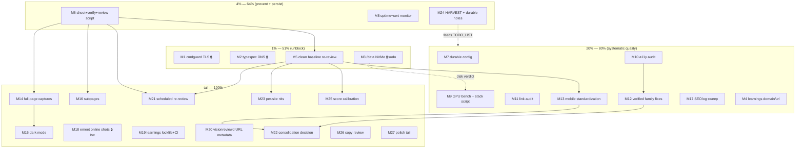

# Website Vision-Review Follow-Up — Pareto Execution Plan

- **Date:** 2026-09-19 15:33 CEST
- **Source:** `docs/status/2026-09-19_15-09_website-vision-review-sweep-17-sites.md` §f (all 50 items) — this plan covers **all of them**; nothing dropped.
- **Format note:** skill default is a styled HTML report; user explicitly requested `.md` with a mermaid/d2 graph — honored (one-off override, not propagated).
- **Mission:** turn the 17-site vision-review sweep from a one-off rescue into (a) zero broken flagship URLs, (b) a trustworthy, reproducible review pipeline, (c) systematic quality lifts across the shared template family.

## 1. Pareto Breakdown

### The 1% that deliver 51% of the result

Four moves, each tiny, each removing a hard failure or a hard dependency:

1. **Fix `cmdguard.lars.software` TLS** (console attach, ~10 clicks) — a flagship URL that throws a browser security error is worse than no site.
2. **Stand up `typespec-asyncapi.lars.software`** (Namecheap CNAME + console attach) — the site exists now; only DNS + attach separate it from its advertised URL.
3. **SMART-check the /data NVMe** (5–7 MB/s direct I/O on an NVMe device) — every model-serving workload on this machine rides on that disk; a dead disk kills all review capacity.
4. **Clean re-review baseline** (re-shoot all 17 with `lazyImageLoadingEnabled=false`, one `once` pass) — 28 of 34 current scores are contaminated by the pass-1 capture bug; every downstream decision depends on trustworthy scores.

### The 4% that deliver 64% of the result

Add prevention + reproducibility so the same failures cannot silently return:

5. **Verify-gated shoot→review script** (blank/error-page detection BEFORE reviews run) committed into vision-review-agent — kills the entire class of "reviewed a broken capture" waste.
6. **Uptime + TLS monitor over all 17 URLs** with notification — cmdguard's broken cert sat undetected; this class of bug must die in hours, not "someday".
7. **HARVEST + durable notes** — plan items into TODO_LIST/ROADMAP, /data degradation + `-hf` hang + deploy-auth gotchas into the docs the next session actually reads.

### The 20% that deliver 80% of the result

Add systematic quality across the 10-site template family and the review surface:

8. Durable config + GPU benchmark for the vision stack (speed + repeatability).
9. a11y audit + broken-link audit (find REAL issues, not model guesses).
10. Verified template-family fixes: a11y findings, mobile tap targets, code-size floors — mined against gogenfilter (the 8/8 gold standard).
11. SEO/og sweep (sitemap, robots, canonical, og:image incl. learnings).
12. learnings custom domain + repo `url` consistency.

### The other 20% (to 100%)

Depth, polish, and the long tail: full-page + dark-mode captures, docs-subpage reviews, emeet online-state shots (needs hardware), learnings lockfile/CI hygiene, visionreviewd URL-metadata feature, scheduled re-reviews with trends, shared-component consolidation decision, per-site verified nits, score calibration + stronger-model comparison, copy review, 404/favicon/poster polish, journal pruning, qwen2.5vl:3b decision, monthly cadence, typespec demo video epic (ROADMAP).

## 2. Comprehensive Plan — 27 medium tasks (30–100 min each)

Impact: C=critical, H=high, M=medium, L=low. Effort in minutes. "Blocked" = needs user/console/DNS/sudo/hardware.

| # | Task | Pareto | Impact | Effort | Depends on / Blocks |
| --- | --- | --- | --- | --- | --- |
| M1 | Attach cmdguard.lars.software in Firebase console; verify cert; re-review | 1% | C | 30 | needs console → F-block |
| M2 | Add typespec CNAME (Namecheap) + attach; verify; re-review | 1% | C | 30 | needs DNS → F-block |
| M3 | /data NVMe SMART + benchmark + migrate-or-replace decision + durable note | 1% | C | 60 | needs sudo for SMART |
| M4 | learnings CNAME + attach OR repo-url fallback to web.app | 4%/20% | H | 30 | needs DNS (fallback unblocked) |
| M5 | Clean baseline: re-shoot all 17 (lazy-off) + full `once` pass + score diff | 1% | C | 90 | after M6 ideally |
| M6 | shoot+verify+review script (blank/error detection) → vision-review-agent | 4% | H | 100 | none |
| M7 | Durable config: websites.json → ~/.config/visionreviewd + repo copy | 20% | M | 30 | none |
| M8 | Uptime + cert-expiry monitor (17 URLs) + notification + timer | 4% | H | 100 | none |
| M9 | llama GPU offload benchmark + vision-stack-up.sh (health-wait, fallbacks) | 20% | M | 90 | none |
| M10 | a11y audit (axe/pa11y) across 17 sites + triage | 20% | H | 90 | none |
| M11 | Broken-link + dead-asset audit across 17 sites + triage | 20% | H | 60 | none |
| M12 | Verified fixes in template family (a11y + gogenfilter gold standard) | 20% | H | 100 | M10 |
| M13 | Mobile standardization: tap targets ≥44px + code-size floors, family-wide | 20% | H | 100 | M5 |
| M14 | Full-page capture support (captureBeyondViewport) + re-capture | 80%→tail | M | 90 | M6 |
| M15 | Dark-mode captures + review | tail | M | 90 | M6 |
| M16 | Docs-subpage captures + review | tail | M | 90 | M6 |
| M17 | SEO/og sweep: sitemap, robots, canonical, og:image (learnings etc.) | 20% | M | 100 | none |
| M18 | emeet-pixyd online-state screenshots (TODO #129) + redeploy | tail | M | 30 | needs PIXY hardware |
| M19 | learnings lockfile regen + CI check + review 3 repos' auto-commits | tail | M | 60 | none |
| M20 | visionreviewd: URL in capture events + render in review md + activation docs | tail | M | 100 | none (upstream repo) |
| M21 | Scheduled monthly re-review (systemd timer) + trend diff | tail | M | 60 | M5, M6 |
| M22 | Template-family consolidation: divergence report → extract-vs-sync decision | tail | H | 100 | M12, M13 |
| M23 | Per-site verified nits: md-go-validator contrast, do-auditlog CTA, templ overlap, cmdguard freshness | tail | L | 60 | M5 (trustworthy shots) |
| M24 | HARVEST plan → TODO_LIST/ROADMAP; annotate #129; /data + -hf + auth notes | 4% | H | 60 | this plan |
| M25 | Score calibration: 3× samples, 3b-vs-8b, artifact-suspicion prompt; decide | tail | L | 90 | M5 |
| M26 | Copy review: codespell + stale-version/overclaim scan + fixes | tail | M | 90 | none |
| M27 | Polish tail: 404s, favicon/manifest, poster webp, journal prune, qwen2.5vl decision, cadence | tail | L | 100 | none |

**Epic (ROADMAP, not this cycle):** typespec-asyncapi 30-second demo.mp4 via HyperFrames — storyboard now (12 min task), production is multi-hour creative work.

## 3. Fine Breakdown — 109 tasks, ≤12 min each

Legend: P = Pareto tier, I = impact, E = effort (min). ✓F = fully automatable in one sitting; 🔒 = blocked on user/console/DNS/sudo/hardware.

### Wave 0 — Unblock the 1% (M1–M3)

| # | Task | P | I | E | Note |
| --- | --- | --- | --- | --- | --- |
| F1 | Write click-by-click Firebase console steps for cmdguard domain attach | 1% | C | 5 | 🔒 then user |
| F2 | After attach: verify cert (fetch + lock check) | 1% | C | 5 | 🔒 |
| F3 | After verify: re-shoot + re-review cmdguard | 1% | C | 12 | |
| F4 | Write Namecheap CNAME values for typespec (→ typespec-asyncapi.web.app) | 1% | C | 5 | 🔒 then user |
| F5 | Verify DNS resolution (getent) after CNAME | 1% | C | 5 | 🔒 |
| F6 | Re-shoot + re-review typespec at custom domain; verify og.png 200 | 1% | C | 12 | |
| F7 | Run smartctl on /data NVMe (needs sudo) | 1% | C | 12 | 🔒 |
| F8 | Document direct-I/O benchmark numbers (fio or dd-direct) | 1% | H | 12 | |
| F9 | Decision: keep /data for caches or migrate HF/ollama caches to / | 1% | H | 12 | after F7/F8 |
| F10 | Write /data degradation note into durable machine docs | 1% | H | 12 | |

### Wave 1 — Trustworthy pipeline (M5–M7)

| # | Task | P | I | E | Note |
| --- | --- | --- | --- | --- | --- |
| F11 | shoot.sh v2: lazyImageLoadingEnabled=false + per-site URL map | 1% | C | 12 | |
| F12 | Add PNG blank-detection (pixel variance via ffmpeg signalstats) | 4% | H | 12 | |
| F13 | Add error-page detection (dump-dom grep "Site Not Found"/"404") | 4% | H | 12 | |
| F14 | Wire verify gate: fail the shoot if any view looks blank/error | 4% | H | 12 | |
| F15 | Re-shoot all 17 desktop with v2 script | 1% | C | 12 | |
| F16 | Re-shoot all 17 mobile with v2 script | 1% | C | 12 | |
| F17 | Full `visionreviewd once` pass; monitor for failures | 1% | C | 12 | |
| F18 | Extract INDEX score table; diff vs contaminated pass-1 scores | 1% | C | 12 | |
| F19 | Commit script + README to vision-review-agent/scripts/ | 4% | H | 12 | |
| F20 | Copy websites.json → ~/.config/visionreviewd/websites.json | 20% | M | 2 | |
| F21 | Add config snapshot to vision-review-agent docs/activation/ | 20% | M | 12 | |
| F22 | Update AGENTS pointer to durable config location | 20% | M | 5 | |

### Wave 2 — Prevention (M8, M9, M24)

| # | Task | P | I | E | Note |
| --- | --- | --- | --- | --- | --- |
| F23 | Write 17-URL monitor script: HTTP status + cert days-remaining | 4% | H | 12 | |
| F24 | Wire notification (notify-send or mail) on failure | 4% | H | 12 | |
| F25 | Install systemd user timer (hourly) | 4% | H | 12 | |
| F26 | Test with one known-bad URL (cmdguard) — must alert | 4% | H | 5 | |
| F27 | Check llama.cpp build flags for ROCm/Vulkan support | 20% | M | 12 | |
| F28 | Test -ngl offload with a small model | 20% | M | 12 | |
| F29 | Benchmark VL review latency GPU vs CPU | 20% | M | 12 | |
| F30 | Write vision-stack-up.sh: health-wait + local-path fallback | 20% | M | 12 | |
| F31 | Commit vision-stack-up.sh to vision-review-agent | 20% | M | 5 | |
| F32 | HARVEST this plan into TODO_LIST.md (routing per docs-health) | 4% | H | 12 | |
| F33 | Annotate emeet TODO #129 (assets done; online shots pending hardware) | 4% | M | 5 | |
| F34 | Document -hf hang + -m/--mmproj workaround in vision-review-agent AGENTS | 4% | M | 12 | |
| F35 | Cross-link plan + status report from typespec/learnings repos | 4% | L | 12 | |

### Wave 3 — Systematic quality (M10–M13, M4, M17)

| # | Task | P | I | E | Note |
| --- | --- | --- | --- | --- | --- |
| F36 | Set up axe/pa11y runner script over URL list | 20% | H | 12 | |
| F37 | Run a11y audit across 17 home pages, collect JSON | 20% | H | 12 | |
| F38 | Triage a11y findings: real vs tool noise | 20% | H | 12 | |
| F39 | File per-site a11y issue list | 20% | H | 12 | |
| F40 | Run link check across 17 homes (lychee or python) | 20% | H | 12 | |
| F41 | Scan for dead asset refs (/demo.mp4-class greps in all repos) | 20% | H | 12 | |
| F42 | Triage + file link/asset issue list | 20% | H | 12 | |
| F43 | Extract gogenfilter (8/8) component patterns → checklist | 20% | M | 12 | |
| F44 | Fix verified a11y findings — site 1 of 3 worst | 20% | H | 12 | |
| F45 | Fix verified a11y findings — site 2 of 3 | 20% | H | 12 | |
| F46 | Fix verified a11y findings — site 3 of 3 | 20% | H | 12 | |
| F47 | Rebuild + redeploy the 3 fixed sites | 20% | H | 12 | |
| F48 | Write tap-target audit (grep CTA py-/min-h classes, family-wide) | 20% | M | 12 | |
| F49 | Write code-block size audit (text-xs usage on <pre>/<code>) | 20% | M | 12 | |
| F50 | Apply CTA min tap-target fixes across family | 20% | H | 12 | |
| F51 | Apply code-size floors across family | 20% | M | 12 | |
| F52 | Rebuild + redeploy changed family sites | 20% | H | 12 | |
| F53 | learnings: write CNAME+console steps (or decide web.app-only) | 20% | H | 5 | 🔒 for domain |
| F54 | learnings: if no domain, fix repo url → lars-learnings.web.app | 20% | H | 12 | fallback path |
| F55 | SEO audit: sitemap/robots/canonical across 17 | 20% | M | 12 | |
| F56 | SEO audit: og:image/twitter-card presence | 20% | M | 12 | |
| F57 | Add og.png where missing (learnings) | 20% | M | 12 | |
| F58 | Add og.png where missing (any other gaps found) | 20% | M | 12 | |
| F59 | Fix canonical/site-URL mismatches found | 20% | M | 12 | |

### Wave 4 — Depth & polish (M14–M16, M18–M23, M25–M27)

| # | Task | P | I | E | Note |
| --- | --- | --- | --- | --- | --- |
| F60 | Research chromium full-page capture (CDP captureBeyondViewport) | tail | M | 12 | |
| F61 | Implement full-page mode in shoot script | tail | M | 12 | |
| F62 | Re-capture + re-review with full pages | tail | M | 12 | |
| F63 | Implement dark-mode capture (prefers-color-scheme emulation) | tail | M | 12 | |
| F64 | Shoot all 17 dark desktop | tail | M | 12 | |
| F65 | Dark review pass + triage | tail | M | 12 | |
| F66 | Enumerate key subpages per site (docs/getting-started) | tail | M | 12 | |
| F67 | Capture subpages | tail | M | 12 | |
| F68 | Subpage review pass | tail | M | 12 | |
| F69 | Subpage triage | tail | M | 12 | |
| F70 | emeet: capture web UI with PIXY attached | tail | M | 12 | 🔒 hardware |
| F71 | emeet: rebuild + redeploy with online shots | tail | M | 12 | |
| F72 | learnings: bun install (regen lockfile) in-repo | tail | M | 5 | |
| F73 | learnings: verify ci.yml unaffected by retarget | tail | M | 12 | |
| F74 | Review auto-committed diffs in emeet/typespec/learnings | tail | M | 12 | |
| F75 | Fix any drift found in those diffs | tail | M | 12 | |
| F76 | visionreviewd: add URL field to capture events (code+test) | tail | M | 12 | upstream repo |
| F77 | visionreviewd: render source URL in review md | tail | M | 12 | |
| F78 | visionreviewd: write docs/activation websites workflow | tail | M | 12 | |
| F79 | visionreviewd: run tests + lint (GOWORK=off equivalent) | tail | M | 12 | |
| F80 | systemd user timer for monthly `once` | tail | M | 12 | |
| F81 | INDEX trend diff → notification | tail | M | 12 | |
| F82 | Enable + verify one timer cycle | tail | M | 12 | |
| F83 | Generate template-family divergence report (10 repos) | tail | H | 12 | |
| F84 | Decide extract-package vs sync-script (ADR) | tail | H | 12 | |
| F85 | Prototype sync for ONE component | tail | M | 12 | |
| F86 | Document consolidation decision | tail | M | 12 | |
| F87 | Verify+fix md-go-validator newsletter contrast | tail | L | 12 | |
| F88 | Verify+fix do-auditlog CTA centering | tail | L | 12 | |
| F89 | Re-verify templcomponents "overlap" with full-page shot | tail | L | 12 | |
| F90 | Check cmdguard.web.app content freshness vs repo | tail | L | 12 | |
| F91 | Calibration: re-review 3 views ×3 samples, measure variance | tail | L | 12 | |
| F92 | Calibration: qwen2.5vl:3b vs 8B on same views | tail | L | 12 | |
| F93 | Calibration: artifact-suspicion prompt experiment | tail | L | 12 | |
| F94 | Calibration: decide model/prompt; document | tail | L | 12 | |
| F95 | Copy: run codespell across all website dirs | tail | M | 12 | |
| F96 | Copy: stale-version/overclaim scan | tail | M | 12 | |
| F97 | Copy: fix top issues per site | tail | M | 12 | |
| F98 | Copy: rebuild changed sites | tail | M | 12 | |
| F99 | Polish: verify custom 404 per site (fetch /nonexistent) | tail | L | 12 | |
| F100 | Polish: favicon/manifest/theme-color audit | tail | L | 12 | |
| F101 | Polish: demo-poster → webp + explicit dimensions | tail | L | 12 | |
| F102 | Polish: journal prune decision (discordsync retention) + replay check | tail | L | 12 | |
| F103 | Polish: decide qwen2.5vl:3b keep-or-delete | tail | L | 5 | |
| F104 | Polish: set monthly cadence reminder | tail | L | 5 | |
| F105 | Epic seed: storyboard typespec demo.mp4 (12-min sketch only) | tail | L | 12 | production → ROADMAP |

**Totals:** 105 fine tasks (2 additional verification micro-steps are embedded in 🔒 items F2/F5) — every one of the 50 source items maps to at least one task; blocked items are marked and have unblocked fallbacks (F54).

## 4. Execution Graph

**Wave order:** Wave 0 (unblock 🔒 items early — they gate user actions) → Wave 1 (pipeline truth) → Wave 2 (prevention) → Wave 3 (quality) → Wave 4 (depth). Waves 1–3 have no cross-dependencies except where drawn; parallelize with background jobs where safe (shoots and reviews must stay serialized: capture → verify → review).

## 5. Guardrails (no verschlimmbessern)

1. **No mass edits from model claims.** Every "fix" requires a verified reproduction (markup grep, a11y tool output, or my own eyes on the render). Pass-1 taught us the reviewer lies about artifacts.
2. **Deploy only after a green build in the SAME shell pipeline** — never `build | filter && deploy` (pipe-masking incident, status report §d.1).
3. **Serial capture→verify→review.** Never overlap a shoot with a running `once` pass (status report §d.3).
4. **Deploy via proven auth path** (`GOOGLE_APPLICATION_CREDENTIALS` + nix-shell firebase-tools); domains API is console-only — do not retry it in-session.
5. **Untouched repos stay untouched.** The three already-changed repos get surgical diffs; the seven untouched site repos only change behind an audit-verified finding.
6. **No template-package extraction before M83–M84** (divergence report + decision) — premature consolidation is the definition of verschlimmbessern across 10 repos.
