# SUPERB Pareto Execution Plan — emeet-pixyd

**Created:** 2026-09-28 23:53 CEST
**Inputs:** `TODO_LIST.md` (rows #129, #138–#141, #148, #150, #154–#156, #166, #172), status report `docs/status/2026-09-28_23-48_multi-device-support-and-marketing-sweep.md` (§f, 50 items), `ROADMAP.md` (themes + design-gated + open questions), `FEATURES.md` partial rows, parallel session's `docs/status/2026-09-28_23-47_art-dupl-deduplication-sweep-status.md` (harvest-only).
**Scope rule:** ALL open work is included — nothing invented, nothing silently decided. Lars-gated items are modeled as explicit decision gates, never as assumed outcomes.
**Guard:** Do not verschlimmbessern. Every task must leave the repo verifiably no worse. No speculative rewrites; hardware claims stay evidence-graded.

---

## 1. Pareto Breakdown

### The 1% that delivers 51%

One wired PIXY session + one sign-off hour + one push. The hardware bundle (#166) closes six TODO rows outright (#129, #138, #139, #140, #141, #150) and un-gates eight more items (speed clamp, Waybar charge classes, `FuzzParseV2Response`, `GET_FUNC_STA` decode, `#172` helper, motor-speed env default). The decision bundle unblocks three parallel streams (hint surfacing, NixOS option, lint policy). The push ships everything already built this week.

→ Tasks: **M01, M02, M03** (hardware A/B/C), **M04** (decisions), **M05** (deploy).

### The 4% that delivers 64%

Cheap trust-and-consistency work that compounds: sync the three stale docs to the new device registry, persist the lint-debt rationale so no session re-triages it, harvest both status reports into the living backlog, land the already-approved multi-word preset fix (~6 lines), and ship the release/community bundle (upstream PR, v0.4.1, branch protection).

→ Add: **M06, M07, M08, M15, M24**.

### The 20% that delivers 80%

The correctness + reach layer: error-chain repair (`%v`→`%w`), error-family adoption at the remaining boundaries, recognition hardening + property/benchmark pins, web/Waybar hint surfacing (post-ADR), screenshot pipeline, and the website polish pack (feedback links, reading time, landing mirror).

→ Add: **M09, M10, M12, M13, M16, M19, M20, M25**.

### The other 80% (to reach 100%)

Deep/deferred work, mostly gated on hardware, decisions, or demand: structured command types, NixOS option, vmTest daemon-start extension, a11y/mobile checklist execution, public STUDIO comparison page (Lars-gated), SSE heartbeat + tracing, Waybar enrichment, tooling cadence, and the long-tail umbrella (koanf, device-disappear semantics, S600L/Wireless watch, etc.).

→ **M11, M14, M17, M18, M21, M22, M23, M26, M27.**

---

## 2. Comprehensive Plan — medium granularity (30–100 min, 27 tasks)

Sorted by importance → impact → customer value (ties broken by effort ascending — cheaper first).

| # | Task | Tier | Impact | Effort | Est | Customer value | Depends on | Closes/unblocks |
|---|------|------|--------|--------|-----|----------------|------------|-----------------|
| M01 | Hardware session A: battery probe + identity heads (`TestIntegration_BatteryProbe`, `device` queries, `GET_FUNC_STA` capture) | 1% | HIGH | M | 90m | Correct battery/capability reporting | PIXY wired | #139, feeds M27 |
| M02 | Hardware session B: speed-query duality verdict, unit + limit pin, clamp + slider max, MotorType/DefaultPosMode pin | 1% | HIGH | M | 90m | Safe speed control, correct enums | M01 (same session) | #138, #150, un-gates M23/M27 |
| M03 | Hardware session C: preset slot sweep, live push→pull round-trip, online screenshots retake + website refresh | 1% | HIGH | M | 90m | Trustworthy presets + honest marketing shots | M01 | #129, #141 |
| M04 | Decision bundle: draft 3 ADRs (hint surfacing web/Waybar; NixOS `extraProductIds`; erraudit debt policy) + Lars sign-off | 1% | HIGH | S | 60m | Unblocks 3 streams; no churn from guessing | — | gates M09/M11/M07b |
| M05 | Deploy & verify: push master, watch go-test/nix/website workflows, live-verify devices page + OG + sitemap | 1% | HIGH | S | 30m | Everything built this week reaches users | — | ships 2026-09-28 work |
| M06 | Docs split-brain sync: comparison-doc matrix, `docs/hid-protocol.md`, `CONTRIBUTING.md` + repo-wide remnant grep | 4% | HIGH | S | 45m | No lying docs; contributor funnel intact | — | status-report b4 |
| M07 | Lint-debt closure: rationale → AGENTS.md gotcha; apply M04-Q3 outcome (nolint sites or documented baseline) | 4% | MED | S | 30m | Future sessions stop re-triaging 29 findings | M04 | buildflow gate clarity |
| M08 | HARVEST both status reports (23-47 dedup + 23-48 session) → TODO_LIST/ROADMAP with evidence, dedupe | 4% | MED | M | 60m | Living backlog stays the source of truth | — | docs-health rule |
| M09 | Web/Waybar unsupported-hint surfacing: `webStatus` field, offline-panel copy, Waybar tooltip + JSON, tests | 20% | MED | M | 90m | C960 owners see why, not just "offline" | M04-Q1 | UX gap b2 |
| M10 | Recognition hardening: hidraw-side fixed-EMEET recognition (or recorded decision), `probe`-hint test, log-branch test | 20% | MED | S | 60m | Edge devices + tested paths | — | status b1/b5 |
| M11 | NixOS `hardware.emeet-pixy.extraProductIds` option + vmTest assert + docs | 80% | MED | S | 60m | Declarative onboarding for new PIXY PIDs | M04-Q2 | status g2 |
| M12 | Error-wrapping audit: all `fmt.Errorf` `%v`-on-err → `%w` where chains matter + classification pin tests | 20% | HIGH | M | 90m | Correct HTTP/exit-code derivation | — | ROADMAP 2026-07-23 §c |
| M13 | go-error-family adoption: `HTTPHandler` at `/api/health`,`/api/snapshot`; `LogError` at state/process/uevent/socket sites; `Assert*` in tests; scope ADR | 20% | MED | M | 90m | Consistent structured errors | M12 (sequencing) | ROADMAP error theme |
| M14 | Structured command types, slice 1: typed registry + query commands + simple mutators behind string shim | 80% | HIGH | L | 100m | Type safety, multi-word args foundation | Lars ADR sign-off (#116 lineage) | multi-word surface |
| M15 | Multi-word preset names via CLI: join-remaining per ADR + pinning tests (~6 lines) | 4% | MED | S | 30m | Names stop silently truncating | ADR approved (awaiting Lars) | #123 lineage |
| M16 | CI guard: fail if go-modules FOD references `/nix/store` paths (poisoned-vendor class) | 20% | MED | S | 45m | Supply-chain regression net | — | ROADMAP build hardening |
| M17 | vmTest extension: fake sysfs tree + actually start daemon in VM, assert socket + health | 80% | MED | L | 100m | Boot-level confidence, exercises recognition | — | ROADMAP build hardening |
| M18 | A11y + mobile checklists actually executed (NVDA/Orca, real device), fix-or-file, flip FEATURES honestly | 80% | MED | L | 100m | The 2 partial rows become real | — | FEATURES debt |
| M19 | Screenshot pipeline: scripted headless-chromium captures (online/offline) wired into website | 20% | MED | M | 90m | #129 stops being manual; fresh marketing | M03 (online shots) | status f31 |
| M20 | Website polish pack: per-page feedback links, reading time, landing "Who is this for / When NOT" mirror | 20% | MED | M | 90m | Conversion + navigation | — | ROADMAP web ideas |
| M21 | Public EMEET-STUDIO comparison page (distill internal doc) | 80% | MED | M | 90m | Positioning win — IF Lars accepts exposure | Lars gate (ROADMAP) | ROADMAP web idea |
| M22 | SSE heartbeat + `LastEventID` replay + OTel PTZ-latency span | 80% | MED | M | 100m | Proxy-safe live UI, first tracing | — | ROADMAP observability |
| M23 | Waybar enrichment: auto-mode + pan/tilt values; confirm charge classes | 80% | LOW | S | 60m | Denser bar module | M02 (ChargeSta pin) | ROADMAP UX |
| M24 | Release/community bundle: #148 upstream PR send, #154 close-out nudge, #155 cut v0.4.1 (CHANGELOG, annotated tag, verify), #156 branch-protection notes for Lars | 4% | HIGH | M | 90m | Users get a versioned release; repo protected | M05 (CI green first) | #148/#154/#155/#156 |
| M25 | Quality pack: `ResolveProductID` order-invariant property test (200 seeds), `probeVideo4linux` benchmark, simulator fixed-profile vendor-byte refusal | 20% | MED | S | 60m | Pins today's invariants forever | — | status f46-48 |
| M26 | Tooling cadence: dprint/prettier for `.mdx`/`.mjs`; Renovate or scheduled `nix flake update` job | 80% | LOW | S | 60m | Ends formatter wars + dep rot | — | ROADMAP web/build |
| M27 | Long-tail umbrella (each ≤100m, individually gated): koanf ADR, device-disappear ADR, `FuzzParseV2Response` (post-M02), `GET_FUNC_STA` decode (post-M01), `EMEET_PIXYD_MOTOR_SPEED` env default (post-M02), `#172` shared V2 helper (post-M02 trigger check), S600L + PIXY-Wireless watch rows, privacy-trigger-time + `hidCmdSend` retry research rows | 80% | LOW | L | 100m | Keeps intel alive without premature builds | mostly M01/M02 | ROADMAP offshoots |

**Total medium effort:** ≈ 2,025 min ≈ 34 h (three of those hours are one wired hardware session).

---

## 3. Detailed Breakdown — fine granularity (≤12 min each, 95 tasks)

Micro-tasks are the executable core of each medium task (medium estimates include run/verify overhead). Sorted within their medium task; global order = the medium table's order. `G:` = gate.

### M01 Hardware session A (1%)
| ID | Task | Est |
|----|------|-----|
| F01 | Wire PIXY; run `TestIntegration_BatteryProbe` (`-tags=integration`), record verdict | 10m |
| F02 | Close #139 residual: battery/charge answer or confirmed absence → TODO_LIST/CHANGELOG | 10m |
| F03 | Run `device` identity queries; record sn/ver/devver/func live shapes | 10m |
| F04 | Capture `GET_FUNC_STA` raw bitfield across camera modes → decode table for M27 | 12m |
| F05 | Update TODO_LIST rows + CHANGELOG with session-A verdicts | 10m |

### M02 Hardware session B (1%)
| ID | Task | Est |
|----|------|-----|
| F06 | Speed GET duality probe: `09 03 01 13` vs `09 63 01 03`+motor byte — record answered form | 12m |
| F07 | Sweep speed values; pin unit + hardware limit | 12m |
| F08 | Implement command-layer clamp + web slider max from pinned limit | 12m |
| F09 | Exercise MotorType/DefaultPosMode SETs; record echo semantics | 12m |
| F10 | Update map doc §3.5a evidence grades ASSUMED → CONFIRMED | 10m |
| F11 | #172 trigger check (4th GET family?) — extract shared V2 query helper if met | 12m |
| F12 | Update TODO_LIST/FEATURES/CHANGELOG with session-B verdicts | 10m |

### M03 Hardware session C (1%)
| ID | Task | Est |
|----|------|-----|
| F13 | Preset slot sweep 1..16; pin real slot count + response shape | 12m |
| F14 | Live round-trip `preset push` → `preset pull` → values match; fix parser if shape differs | 12m |
| F15 | Retake ONLINE screenshots: full UI, panel crop, video poster | 12m |
| F16 | Wire shots into website + update pre-deploy grep sentinel | 12m |
| F17 | Close #129/#141 in TODO_LIST; CHANGELOG entry | 10m |

### M04 Decision bundle (1%)
| ID | Task | Est |
|----|------|-----|
| F18 | Draft ADR: unsupported-hint surfacing (web/Waybar) with recommendation | 12m |
| F19 | Draft ADR: NixOS `extraProductIds` option with recommendation | 12m |
| F20 | Draft ADR: erraudit debt policy (documented baseline vs site nolints) | 12m |
| F21 | G: Lars sign-off session; record decisions in ADRs + TODO updates | 12m |

### M05 Deploy & verify (1%)
| ID | Task | Est |
|----|------|-----|
| F22 | Verify clean tree; push master | 5m |
| F23 | Watch go-test + nix + website workflows to green | 12m |
| F24 | Live-verify `/getting-started/supported-devices/` + OG render + sitemap entry | 10m |

### M06 Docs split-brain sync (4%)
| ID | Task | Est |
|----|------|-----|
| F25 | Update supported-device matrix in `docs/emeet-studio-official-app-comparison.md` | 12m |
| F26 | Update `docs/hid-protocol.md` device-identification to family registry | 12m |
| F27 | Update `CONTRIBUTING.md` device mention + PID-report flow | 12m |
| F28 | Repo-wide grep for stale two-PID claims; fix stragglers | 12m |

### M07 Lint-debt closure (4%)
| ID | Task | Est |
|----|------|-----|
| F29 | Write AGENTS.md gotcha: 29 accepted erraudit findings, per-class rationale | 12m |
| F30 | Apply M04-Q3 outcome (nolint at sites OR baseline entry); re-run buildflow | 12m |

### M08 Harvest (4%)
| ID | Task | Est |
|----|------|-----|
| F31 | Read parallel session's 23-47 dedup report; extract open items | 12m |
| F32 | Harvest 23-48 status report §f → TODO_LIST rows with evidence | 12m |
| F33 | Route long-tail to ROADMAP; dedupe against existing rows | 12m |

### M09 Web/Waybar hint (20%, G: M04-Q1)
| ID | Task | Est |
|----|------|-----|
| F34 | Add `UnsupportedHint` to `webStatus` + handler wiring | 12m |
| F35 | Offline-panel copy + template change + SSE broadcast | 12m |
| F36 | Waybar tooltip + additive JSON field + tests | 12m |
| F37 | `templ generate`, full suite + lint, web smoke | 12m |

### M10 Recognition hardening (20%)
| ID | Task | Est |
|----|------|-----|
| F38 | Hidraw-side fixed-EMEET recognition (or record video-only decision in ROADMAP) | 12m |
| F39 | Test: `probe` command hint branch | 12m |
| F40 | Test: rate-limited hint log branch | 12m |

### M11 NixOS option (80%, G: M04-Q2)
| ID | Task | Est |
|----|------|-----|
| F41 | Add `hardware.emeet-pixy.extraProductIds` option + env passthrough | 12m |
| F42 | vmTest assertion + README/website config rows | 12m |

### M12 Error-chain repair (20%)
| ID | Task | Est |
|----|------|-----|
| F43 | Grep every `fmt.Errorf` with `%v` on an error; classify chain-relevant | 12m |
| F44 | Fix chain-relevant sites to `%w`; run classification tests | 12m |
| F45 | Pin: `errors.Is` chain test for touched sentinels | 12m |

### M13 error-family adoption (20%)
| ID | Task | Est |
|----|------|-----|
| F46 | `errorfamily.HTTPHandler()` at `/api/health`, `/api/snapshot` | 12m |
| F47 | `LogError()` at state.go/process.go/uevent.go/socket.go sites | 12m |
| F48 | Swap classification-test boilerplate → `errorfamilytest.Assert*` | 12m |
| F49 | ADR: scoped adoption (DataStar handlers + breaker stay out) | 12m |

### M14 Structured commands slice 1 (80%, G: Lars ADR #116)
| ID | Task | Est |
|----|------|-----|
| F50 | Typed registry skeleton + query commands (status/device/version/waybar) | 12m |
| F51 | Migrate simple mutators (track/idle/privacy/toggle-privacy) | 12m |
| F52 | String-dispatch shim for socket compat + full test pass | 12m |

### M15 Multi-word presets (4%, G: ADR approved)
| ID | Task | Est |
|----|------|-----|
| F53 | Implement join-remaining for `preset save/load/delete` | 10m |
| F54 | Pinning tests: multi-word round-trip + truncation regression | 10m |

### M16 CI FOD guard (20%)
| ID | Task | Est |
|----|------|-----|
| F55 | Workflow step: assert no `/nix/store` refs in goModules FOD source | 12m |
| F56 | Prove the guard with a locally poisoned dry-run | 12m |

### M17 vmTest daemon-start (80%)
| ID | Task | Est |
|----|------|-----|
| F57 | Fake sysfs tree in VM (video4linux + hidraw entries incl. a C960) | 12m |
| F58 | Start daemon in VM; assert found-device log | 12m |
| F59 | Assert socket + `/api/health` inside VM | 12m |

### M18 A11y + mobile execution (80%)
| ID | Task | Est |
|----|------|-----|
| F60 | Screen-reader pass (NVDA or Orca) over web UI; log findings | 12m |
| F61 | Real-device pass (phone + iPad, breakpoints, touch targets); log | 12m |
| F62 | Fix found issues within budget or file precise rows | 12m |
| F63 | Flip FEATURES partial rows honestly (verified or still partial) | 5m |

### M19 Screenshot pipeline (20%)
| ID | Task | Est |
|----|------|-----|
| F64 | Script headless-chromium captures vs live daemon (online/offline) | 12m |
| F65 | Wire into `website/public/` + optional CI target | 12m |
| F66 | Refresh README screenshot if stale | 10m |

### M20 Website polish (20%)
| ID | Task | Est |
|----|------|-----|
| F67 | Starlight per-page feedback links (prefilled issue titles) | 12m |
| F68 | Enable reading time | 12m |
| F69 | Landing "Who is this for / When NOT to use" section mirroring README | 12m |
| F70 | Build + visual verify + deploy via website.yml | 12m |

### M21 STUDIO comparison page (80%, G: Lars)
| ID | Task | Est |
|----|------|-----|
| F71 | Distill internal comparison doc → public draft page | 12m |
| F72 | G: Lars review (positioning/legal exposure) | 12m |
| F73 | Publish + changelog + sitemap verify | 12m |

### M22 SSE/tracing (80%)
| ID | Task | Est |
|----|------|-----|
| F74 | SSE heartbeat (comment ping) + proxy-idle-kill documentation | 12m |
| F75 | `LastEventID` replay: server support + client reconnect hook | 12m |
| F76 | OTel span around PTZ command path | 12m |

### M23 Waybar enrichment (80%, G: M02)
| ID | Task | Est |
|----|------|-----|
| F77 | Add auto-mode + pan/tilt to Waybar JSON + tooltip | 12m |
| F78 | Confirm/adjust charge classes per hardware verdict + tests | 12m |

### M24 Release/community (4%)
| ID | Task | Est |
|----|------|-----|
| F79 | Send innoextract 6.6.1 upstream PR (#148) | 12m |
| F80 | Nudge @zutto re: PIXY 2K confirmation → close #154 | 10m |
| F81 | Cut v0.4.1: CHANGELOG date, annotated tag, push, verify proxy + pkg.go.dev (#155) | 12m |
| F82 | Branch-protection settings notes/gh for Lars (#156) | 10m |

### M25 Quality pack (20%)
| ID | Task | Est |
|----|------|-----|
| F83 | Property test: `ResolveProductID` order invariants (200 seeds) | 12m |
| F84 | Benchmark `probeVideo4linux` incl. recognition pass | 10m |
| F85 | Simulator fixed-EMEET profile: refuses vendor bytes; pin the guarantee | 12m |

### M26 Tooling cadence (80%)
| ID | Task | Est |
|----|------|-----|
| F86 | dprint/prettier config for `.mdx`/`.mjs`; format run + commit | 12m |
| F87 | Renovate config OR scheduled `nix flake update` workflow | 12m |

### M27 Long-tail umbrella (80%, mostly G: M01/M02)
| ID | Task | Est |
|----|------|-----|
| F88 | koanf layered-config evaluation ADR | 12m |
| F89 | Device-disappear reconcile semantics ADR | 12m |
| F90 | `FuzzParseV2Response` (post framing pin) | 12m |
| F91 | `GET_FUNC_STA` bitfield decode → capability gating (uses F04 capture) | 12m |
| F92 | `EMEET_PIXYD_MOTOR_SPEED` env default (post unit pin) | 12m |
| F93 | Refresh S600L + PIXY-Wireless watch rows in ROADMAP | 10m |
| F94 | Privacy-trigger-time semantics research row | 10m |
| F95 | `hidCmdSend` bounded-retry evaluation row | 12m |

**Fine-task effort core:** ≈ 1,010 min (medium totals add run/verify overhead on top).

---

## 4. Execution Graph

```mermaid
flowchart TD
    subgraph T1["TIER 1% — delivers 51%"]
        HW["Wired PIXY session<br/>M01 → M02 → M03"]
        DEC["Decision bundle M04<br/>(3 ADRs + Lars)"]
        PUSH["M05 push + CI + live verify"]
    end

    subgraph T4["TIER 4% — delivers 64%"]
        DOCS["M06 docs split-brain sync"]
        LINT["M07 lint-debt closure"]
        HARV["M08 harvest reports"]
        PRESET["M15 multi-word presets"]
        REL["M24 release bundle<br/>#148 #154 #155 #156"]
    end

    subgraph T20["TIER 20% — delivers 80%"]
        HINT["M09 web/Waybar hint"]
        RECOG["M10 recognition hardening"]
        ERRW["M12 %w audit"]
        ERRF["M13 error-family adoption"]
        GUARD["M16 CI FOD guard"]
        SHOTS["M19 screenshot pipeline"]
        POLISH["M20 website polish"]
        QUAL["M25 quality pack"]
    end

    subgraph T80["TIER other 80% — to 100%"]
        NIX["M11 NixOS option"]
        CMD["M14 structured commands"]
        VM["M17 vmTest daemon start"]
        A11Y["M18 a11y + mobile"]
        STUDIO["M21 public comparison page"]
        SSE["M22 SSE heartbeat + tracing"]
        WAY["M23 Waybar enrichment"]
        TOOL["M26 tooling cadence"]
        TAIL["M27 long-tail umbrella"]
    end

    HW -->|"speed/enum pins"| WAY
    HW -->|"framing + shapes"| TAIL
    HW -->|"online shots"| SHOTS
    DEC -->|Q1| HINT
    DEC -->|Q2| NIX
    DEC -->|Q3| LINT
    PUSH -->|"CI green"| REL
    DOCS --> POLISH
    ERRW --> ERRF
    HARV --> DOCS
    M15A["ADR already approved"] --> PRESET
    HW -.->|"#166 closes 6 TODOs"| T4
```

**Verification gates (every task):** `GOWORK=off go test -race -count=1 ./...` green · `GOWORK=off golangci-lint run --timeout 2m ./...` = 0 issues · `templ generate` after `.templ` edits · website: `pnpm run build` + sentinel grep · nix-touching: `nix build` + vmTest.

**Verschlimmbessern guards:** no formatter churn on untouched files; hardware claims only upgrade evidence grades with captured bytes; Lars-gated items ship as ADRs, never as assumed decisions; nothing gets "modernized" without a test pinning the old behavior first.

---

## 5. What this plan deliberately does NOT do

- Does not decide Q1/Q2/Q3 from the 2026-09-28 status report (M04 exists precisely because they are Lars's calls).
- Does not schedule ROADMAP "open questions" (push cadence, buildflow daemon) — they need a human answer, not a task.
- Does not touch the parallel dedup session's artifacts beyond harvesting its report (F31).
