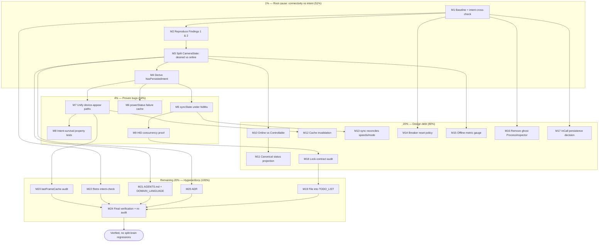

# SUPERB Plan — State / Split-Brain Remediation (2026-10-01)

**Written:** 2026-10-01 04:24 CEST
**Source:** This session's audit — `docs/status/2026-10-01_04-21_state-bug-split-brain-audit.md` (11 findings).
**Scope:** Verify, then fix, the state bugs and split-brains found in the emeet-pixyd daemon. **No speculative rewrites** — reproduce first, fix only what is proven, keep every change no worse than found.
**Guiding rule:** *Do not verschlimmbessern.* A change that is not backed by a failing test does not ship.

---

## 0. Assumptions (my 3 questions were not answered)

| # | Assumption | If wrong |
|---|------------|----------|
| A1 | `syncState` running without `hidMu` is an **oversight**, not a documented safe read. | Finding 3 degrades from "bug" to "documented assumption"; M5 becomes a doc task. |
| A2 | Unplugging the camera must **never** modify persisted user intent. `CameraState` will be split so connectivity is separate. | If intent-clobber is intentional, M3/M4 shrink to doc + guard. |
| A3 | The 4 real bugs (Findings 1–4) are worth fixing now; the rest are filed as debt. | If only filing is wanted, execute M19 + M24 and stop. |

*Findings 5, 6, 7, 8, 9, 10, 11 are treated as **design debt** — planned, lower tier.*

---

## 1. Pareto Breakdown

### The 1% that delivers 51% — **one root cause, one change**
> **Finding 1 + 2 together.** `CameraState` conflates *desired mode* (user intent) with *connectivity* (offline/online), and `hadPersistedState` is a stale in-memory copy of disk truth. Decoupling the two and deriving persistence at use-time is the single highest-leverage move: it dissolves findings **1, 2, 5, 6, and 11** at once.
>
> **1% = F1–F5 (baseline + intent cross-check) → M2 (reproduce) → M3 (decouple) → M4 (derive `hadPersistedState`).** This alone recovers the "privacy/manual choice must survive reboots" guarantee the project explicitly promises.

### The 4% that delivers 64% — **the four proven bugs**
> The 1% **plus** Finding 3 (`sync` HID I/O without `hidMu` — the only data-corruption risk) and Finding 4 (`powerStatus` HID-read storm).
> **4% = 1% + M5 + M6 + M7 + M8 + M9.** After this, no known state-corruption or intent-loss bug remains.

### The 20% that delivers 80% — **+ the design debt**
> The 4% **plus** the medium design-debt fixes: Online semantics (5), projection alignment (6), cache invalidation (7), sync coverage (8), breaker policy (9), metrics (11), ghost removal (10), InCall decision, lock-contract audit.
> **20% = 4% + M10–M18.**

### The remaining 20% to reach 100% — **hygiene, docs, process**
> TODO filing, ADR, AGENTS.md/DOMAIN_LANGUAGE, retro intent-check, lastFrame audit, final verification
> **= M19–M24.**

---

## 2. Comprehensive Plan (medium granularity, 30–100 min/task, 24 tasks)

Sorted by impact × value first, then effort. Tiers: **P0** = 1% (51%), **P1** = 4% (64%), **P2** = 20% (80%), **P3** = remainder.

| ID | Task | Tier | Impact | Effort | Customer value | Depends on |
|----|------|------|--------|--------|----------------|-----------|
| M1 | Baseline & intent cross-check: green test/lint snapshot; grep TODO_LIST/CHANGELOG/ADRs for every finding keyword to separate intent from defect | P0 | High | 30m | High | — |
| M2 | Reproduce Findings 1 & 2 with failing tests (probe-miss clobbers intent; persisted mode lost across replug) | P0 | Critical | 60m | High | M1 |
| M3 | Decouple connectivity/online from `CameraState` intent in `internal/pixy` (data-model change + schema bump) | P0 | Critical | 100m | High | M2 |
| M4 | Make persistence truth-derived: replace stale `hadPersistedState` flag with a derived "has persisted intent" helper | P0 | Critical | 60m | High | M3 |
| M5 | Serialize `syncState` HID I/O under `hidMu` (avoid the reconcile double-lock deadlock) | P1 | High | 60m | High | M1 |
| M6 | Fix `powerStatus` failure caching (cache authoritative failures per its doc, or correct the doc) | P1 | High | 30m | Medium | M1 |
| M7 | Unify the three device-appear paths (startup / uevent / autoManage re-probe) behind one reconcile entry | P1 | High | 60m | High | M3,M4 |
| M8 | Regression + property tests: persisted intent survives any probe/sync/replug sequence | P1 | High | 60m | High | M3,M4,M7 |
| M9 | HID concurrency proof: simulator asserts no two in-flight requests; `sync`+`autoManage` race test | P1 | High | 60m | High | M5 |
| M10 | Define Online vs Controllable; thread through probe → status → web template | P2 | Medium | 100m | Medium | M3 |
| M11 | Align status projections: one canonical `projectStatus()` for `getStatus`/`waybar`/`getWebStatus`/health | P2 | Medium | 60m | Medium | M10 |
| M12 | Invalidate `ptzCache`/`powerCache` on device appear/removal | P2 | Medium | 30m | Medium | M7 |
| M13 | `sync` reconciles `Speeds`/`TrackMode`, or documents why it must not | P2 | Medium | 60m | Low | M5 |
| M14 | Circuit-breaker reset policy: unrelated probe success must not erase commit-failure strikes | P2 | Medium | 45m | Medium | M1 |
| M15 | Metrics: add an `offline` gauge; stop deriving camera gauges from the overloaded field | P2 | Low | 30m | Low | M3 |
| M16 | Retire the ghost `ProcessInspector`/`procInspector` (dead abstraction) | P2 | Low | 30m | Low | M1 |
| M17 | Decide & document whether `InCall` belongs in persisted state | P2 | Low | 30m | Low | M1 |
| M18 | Lock-contract audit: inventory every HID and v4l2 caller; rectify missing locks; document the table | P2 | Medium | 60m | Medium | M5,M9 |
| M19 | File all findings + this plan's tasks into `TODO_LIST.md` with IDs | P3 | Medium | 30m | Low | M1–M18 |
| M20 | ADR for the connectivity/intent decoupling | P3 | Medium | 45m | Low | M3 |
| M21 | Update `AGENTS.md` state section + `docs/DOMAIN_LANGUAGE.md` for the new model | P3 | Medium | 30m | Low | M3,M19 |
| M22 | Retro intent-check: for each finding, confirm intent vs bug; prune any non-bug from the plan | P3 | Medium | 30m | Low | M1 |
| M23 | Audit `lastFrameCache` invalidation on stream stop / device change | P3 | Low | 30m | Low | M7 |
| M24 | Final verification: `nix build`, full `go test -race`, lint, `templ generate`, re-run the split-brain audit | P3 | Critical | 60m | High | all |

---

## 3. Detailed Breakdown (fine granularity, ≤12 min/task)

Sorted by execution order within tiers. Parent column links to the medium task.

| ID | Task (≤12 min) | Parent | Tier |
|----|----------------|--------|------|
| F1 | `git status`; confirm clean tree | M1 | P0 |
| F2 | `GOWORK=off go test -race -count=1 ./...` baseline, record result | M1 | P0 |
| F3 | `GOWORK=off golangci-lint run --timeout 2m ./...` baseline, record | M1 | P0 |
| F4 | Write baseline snapshot into this plan's notes | M1 | P0 |
| F5 | Grep `TODO_LIST.md`/`CHANGELOG.md`/`docs/adr/` for `hadPersistedState`,`syncState`,`powerStatus`,`hidFailCount`, `state.Camera` | M1 | P0 |
| F6 | Summarize intent-vs-defect for each finding | M1/M22 | P0 |
| F7 | Re-read `probe.go` `applyProbeResultLocked` + `probe_hidraw_test.go` | M2 | P0 |
| F8 | Add failing test: probe-miss sets `d.state.Camera = Offline`, clobbering belief | M2 | P0 |
| F9 | Add failing test: user mode lost across probe-miss → reappear | M2 | P0 |
| F10 | Add failing test: `Offline` persisted → shutdown → reload | M2 | P0 |
| F11 | Run new tests; confirm red | M2 | P0 |
| F12 | Record reproductions | M2 | P0 |
| F13 | Draft new `internal/pixy` shape: `DesiredCamera` vs `Online`/`Controllable` | M3 | P0 |
| F14 | Implement struct change + bump `CurrentSchemaVersion` | M3 | P0 |
| F15 | Update `loadState` validation for new fields | M3 | P0 |
| F16 | Update `applyProbeResultLocked` to never clobber `DesiredCamera` | M3 | P0 |
| F17 | Update `getStatus`/`waybar`/`getWebStatus` to read connectivity separately | M3 | P0 |
| F18 | Update `reconcileOnDeviceAppear` to reconcile `DesiredCamera` | M3 | P0 |
| F19 | Compile + fix fallout (`templ` fields referencing camera) | M3 | P0 |
| F20 | Add round-trip test for new state fields | M3 | P0 |
| F21 | Replace `hadPersistedState` bool with derived helper `hasPersistedIntent()` | M4 | P0 |
| F22 | Update `NewDaemon` wiring | M4 | P0 |
| F23 | Update `reconcileOnDeviceAppear` branch | M4 | P0 |
| F24 | Update `reconcile_test.go` | M4 | P0 |
| F25 | Run tests green | M4 | P0 |
| F26 | Add `hidMu` acquisition to `syncState` | M5 | P1 |
| F27 | Guard against reconcile→syncState double-lock (call `*Locked` variant) | M5 | P1 |
| F28 | Verify `handleCommand` routing still correct | M5 | P1 |
| F29 | Add concurrency test (sync + autoManage) | M5 | P1 |
| F30 | `go test -race` on touched packages | M5 | P1 |
| F31 | Add failure-sentinel TTL entry to power cache | M6 | P1 |
| F32 | Update `powerStatus` to cache authoritative failures | M6 | P1 |
| F33 | Update `power_test.go` | M6 | P1 |
| F34 | Run tests | M6 | P1 |
| F35 | Extract `handleDeviceAppear(ctx, probe)` reconcile entry | M7 | P1 |
| F36 | Call it from startup goroutine | M7 | P1 |
| F37 | Call it from uevent path | M7 | P1 |
| F38 | Call it from autoManage re-probe path | M7 | P1 |
| F39 | Add test: autoManage-appear performs reconcile | M7 | P1 |
| F40 | Run tests | M7 | P1 |
| F41 | Property test: intent survives probe/sync/replug sequences | M8 | P1 |
| F42 | Golden matrix test: disconnect→replug→status | M8 | P1 |
| F43 | Run tests | M8 | P1 |
| F44 | Simulator assertion: no overlapping HID requests | M9 | P1 |
| F45 | Race test: two goroutines (sync, autoManage) | M9 | P1 |
| F46 | `go test -race` | M9 | P1 |
| F47 | Define `Connectivity`/`Controllable` types | M10 | P2 |
| F48 | Thread through `probeResult` | M10 | P2 |
| F49 | Update `webStatus` fields | M10 | P2 |
| F50 | Update `health` handler | M10 | P2 |
| F51 | Update `templates.templ` (regenerate) | M10 | P2 |
| F52 | Tests | M10 | P2 |
| F53 | Add single `projectStatus()` helper | M11 | P2 |
| F54 | Refactor `getStatus` onto it | M11 | P2 |
| F55 | Refactor `waybarOutput` onto it | M11 | P2 |
| F56 | Refactor `getWebStatus` onto it | M11 | P2 |
| F57 | Golden tests | M11 | P2 |
| F58 | Invalidate `ptzCache` in `applyProbeResultLocked` | M12 | P2 |
| F59 | Invalidate `powerCache` on device change | M12 | P2 |
| F60 | Tests | M12 | P2 |
| F61 | Decide sync coverage for speeds/trackmode | M13 | P2 |
| F62 | Implement or document | M13 | P2 |
| F63 | Tests | M13 | P2 |
| F64 | Choose breaker reset policy | M14 | P2 |
| F65 | Implement (`applyProbeResultLocked` reset guard) | M14 | P2 |
| F66 | Tests | M14 | P2 |
| F67 | Add `offline` camera gauge | M15 | P2 |
| F68 | Update `updateMetrics` | M15 | P2 |
| F69 | Tests | M15 | P2 |
| F70 | Grep all `procInspector`/`ProcessInspector` uses | M16 | P2 |
| F71 | Remove field+interface (or wire it) | M16 | P2 |
| F72 | Update tests/wiring | M16 | P2 |
| F73 | Build + tests | M16 | P2 |
| F74 | Decide `InCall` persistence | M17 | P2 |
| F75 | Implement/document | M17 | P2 |
| F76 | Tests | M17 | P2 |
| F77 | Inventory HID callers & locks held | M18 | P2 |
| F78 | Inventory v4l2 callers & locks held | M18 | P2 |
| F79 | Document lock table in `AGENTS.md` | M18 | P2 |
| F80 | Add any missing locks found | M18 | P2 |
| F81 | Add findings to `TODO_LIST.md` with IDs | M19 | P3 |
| F82 | Add this plan's open tasks to `TODO_LIST.md` | M19 | P3 |
| F83 | Draft ADR (connectivity/intent) | M20 | P3 |
| F84 | Commit ADR | M20 | P3 |
| F85 | Update `AGENTS.md` state/architecture bullets | M21 | P3 |
| F86 | Update `docs/DOMAIN_LANGUAGE.md` | M21 | P3 |
| F87 | Map each finding → intent/bug | M22 | P3 |
| F88 | Prune non-bugs from plan; annotate | M22 | P3 |
| F89 | Inspect `lastFrameCache` invalidation call sites | M23 | P3 |
| F90 | Fix + test if needed | M23 | P3 |
| F91 | `nix build` | M24 | P3 |
| F92 | Full `GOWORK=off go test -race -count=1 ./...` | M24 | P3 |
| F93 | `golangci-lint run` | M24 | P3 |
| F94 | `templ generate` diff check | M24 | P3 |
| F95 | Re-run the split-brain audit against the new code | M24 | P3 |
| F96 | Write final status report | M24 | P3 |
| F97 | `git status` + detailed commit(s) | M24 | P3 |

---

## 4. Execution Graph

---

## 5. Risk / Anti-Verschlimmbessern Guard

1. **Reproduce before fixing.** M2 produces red tests first; no fix lands without a failing test.
2. **M3 is a data-model change** — the highest-risk item. It must be introduced behind a schema-version bump (F14) and covered by round-trip + property tests (F20, F41) before touching UI.
3. **M5 double-lock trap:** `reconcileOnDeviceAppear` calls `syncState` while already holding `hidMu`. Unifying must use a `syncStateLocked` variant, or it deadlocks against the documented `v4l2Mu → hidMu` order.
4. **M7 touches three call sites** — verify each with its own test (F39) rather than assuming.
5. **Every medium task ends with tests green**; M24 is the backstop (`nix build` + full race suite + lint + re-audit).
6. **Findings 8, 9, 17 may be intentional** — F5/F87 confirm intent before any change; if intentional, only documentation changes.

## 6. Verification Checklist (Definition of Done)

- [ ] All original findings either fixed-with-test or documented-as-intentional.
- [ ] `GOWORK=off go test -race -count=1 ./...` green.
- [ ] `golangci-lint run` 0 issues.
- [ ] `nix build` green (vendorHash unchanged unless deps changed).
- [ ] `templ generate` produces no diff.
- [ ] Re-run split-brain audit → no regressions.
- [ ] `TODO_LIST.md`, ADR, `AGENTS.md`, `DOMAIN_LANGUAGE.md` updated.
