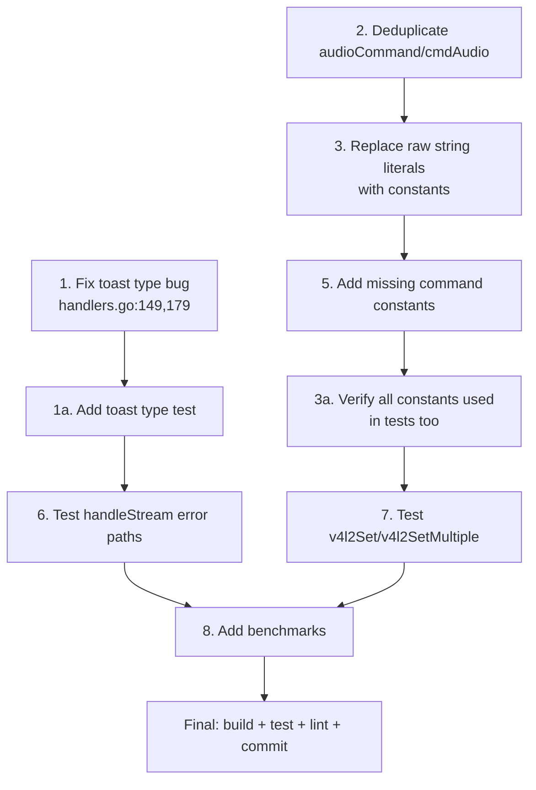

# Comprehensive Code Review & Fix Plan — emeet-pixyd

**Date:** 2026-05-07\
**Scope:** Full code review + frontend design review + brutal self-review\
**Source:** 28 source files (8185 LOC), all tests, all documentation

---

## Pareto Breakdown

### 1% → 51% Impact (Critical)

| # | Task                                                | Why                                                                                                                                                                                             |
| - | --------------------------------------------------- | ----------------------------------------------------------------------------------------------------------------------------------------------------------------------------------------------- |
| 1 | **Fix toast type bug** in `applyResponseToStatus()` | Real user-facing bug: all success toasts render as "info" instead of "success". `actionToast()` returns a type that `action()` discards with `_`. The `toastTypeSuccess` constant is dead code. |

### 4% → 64% Impact (High)

| # | Task                                                                                         | Why                                                                                                            |
| - | -------------------------------------------------------------------------------------------- | -------------------------------------------------------------------------------------------------------------- |
| 2 | **Deduplicate `audioCommand`/`cmdAudio`**                                                    | Same string `"audio"` defined twice in same package. Remove `audioCommand`, use `cmdAudio` everywhere.         |
| 3 | **Replace raw string literals with constants** in `newWebMux()` and `handleGestureCommand()` | 8+ places use `"track"`, `"privacy"`, `"center"`, etc. where matching constants exist. Split-brain risk.       |
| 4 | **Add test for toast type propagation**                                                      | Would have caught bug #1. Test that `applyResponseToStatus` sets the correct `ToastType` for success vs error. |

### 20% → 80% Impact (Medium)

| # | Task                                                  | Why                                                                                                                       |
| - | ----------------------------------------------------- | ------------------------------------------------------------------------------------------------------------------------- |
| 5 | **Add missing command constants**                     | `"status"`, `"toggle-privacy"`, `"waybar"`, `"device"` have no constants.                                                 |
| 6 | **Test `handleStream` error paths**                   | 12% coverage. No ffmpeg, stream semaphore full, context cancel, device gone mid-stream.                                   |
| 7 | **Test `v4l2Set`/`v4l2SetMultiple` via command mock** | 0% coverage. Already injectable via `v4l2SetFn` — just need a test that exercises the real function with a mock v4l2-ctl. |
| 8 | **Add benchmarks for hot paths**                      | `isCameraInUse` runs every 2s scanning all of `/proc`. `parseHIDResponse` runs on every HID query.                        |

### Remaining (Nice-to-have)

| # | Task                                                                                             | Why                                                                          |
| - | ------------------------------------------------------------------------------------------------ | ---------------------------------------------------------------------------- |
| 9 | **Extract `webServer` dependencies** — inject read-only state interface instead of raw `*Daemon` | Architectural improvement, reduces coupling. Large effort (60min). Deferred. |

---

## Execution Graph

---

## Detailed Task Breakdown (max 15min each)

### Phase 1: P0 — Toast Type Bug (51% impact)

| ID  | Task                                                                                       | File(s)            | Est  |
| --- | ------------------------------------------------------------------------------------------ | ------------------ | ---- |
| 1.1 | Change `applyResponseToStatus` signature to accept `toastType string` parameter            | `handlers.go`      | 3min |
| 1.2 | Fix `action()` to propagate toast type: `toast, toastType := actionToast(command)`         | `handlers.go`      | 2min |
| 1.3 | Fix `handleAudio` to pass `toastTypeSuccess`                                               | `handlers.go`      | 2min |
| 1.4 | Fix `handleGestureToggle` to pass `toastTypeInfo`                                          | `handlers.go`      | 2min |
| 1.5 | Fix `handleAutoToggle` to pass `toastTypeInfo`                                             | `handlers.go`      | 2min |
| 1.6 | Update tests: `TestApplyResponseToStatus_Success` to verify `ToastType` is set correctly   | `commands_test.go` | 5min |
| 1.7 | Add new test: `TestApplyResponseToStatus_SetsToastType` verifying success vs info vs error | `commands_test.go` | 5min |
| 1.8 | Run tests to verify fix                                                                    | —                  | 1min |

### Phase 2: P1 — Deduplicate Constants (64% impact)

| ID   | Task                                                                                              | File(s)       | Est  |
| ---- | ------------------------------------------------------------------------------------------------- | ------------- | ---- |
| 2.1  | Remove `audioCommand` constant from `handlers.go`, replace all uses with `cmdAudio`               | `handlers.go` | 3min |
| 2.2  | Add missing constants: `cmdStatus`, `cmdTogglePrivacy`, `cmdWaybar`, `cmdDevice` in `commands.go` | `commands.go` | 3min |
| 2.3  | Replace raw `"track"` in `newWebMux` with `cmdTrack`                                              | `handlers.go` | 1min |
| 2.4  | Replace raw `"privacy"` in `newWebMux` with `cmdPrivacy`                                          | `handlers.go` | 1min |
| 2.5  | Replace raw `"toggle-privacy"` in `newWebMux` with `cmdTogglePrivacy`                             | `handlers.go` | 1min |
| 2.6  | Replace raw `"center"` in `newWebMux` with `cmdCenter`                                            | `handlers.go` | 1min |
| 2.7  | Replace raw `"sync"` in `newWebMux` with `cmdSync`                                                | `handlers.go` | 1min |
| 2.8  | Replace raw `"probe"` in `newWebMux` with `cmdProbe`                                              | `handlers.go` | 1min |
| 2.9  | Replace raw `"gesture-off"` in `handleGestureCommand` with `cmdGestureOff`                        | `commands.go` | 1min |
| 2.10 | Replace raw `"toggle-gesture"` in `handleGestureCommand` with `cmdToggleGesture`                  | `commands.go` | 1min |
| 2.11 | Replace raw `"status"` in `handleCommand` switch with `cmdStatus`                                 | `commands.go` | 1min |
| 2.12 | Replace raw `"waybar"` in `handleCommand` switch with `cmdWaybar`                                 | `commands.go` | 1min |
| 2.13 | Replace raw `"device"` in `handleCommand` switch with `cmdDevice`                                 | `commands.go` | 1min |
| 2.14 | Replace raw `"center"` in `handleCenterCommand` error with `cmdCenter`                            | `commands.go` | 1min |
| 2.15 | Run tests to verify no regressions                                                                | —             | 1min |

### Phase 3: P2 — Test Coverage (80% impact)

| ID  | Task                                                   | File(s)                                    | Est  |
| --- | ------------------------------------------------------ | ------------------------------------------ | ---- |
| 3.1 | Test `handleStream`: no device → 503                   | `handlers_test.go` or new `stream_test.go` | 5min |
| 3.2 | Test `handleStream`: ffmpeg not found → 503            | `stream_test.go`                           | 5min |
| 3.3 | Test `handleStream`: semaphore full → 503              | `stream_test.go`                           | 5min |
| 3.4 | Test `v4l2Set` with mock command: success path         | `v4l2_test.go`                             | 5min |
| 3.5 | Test `v4l2SetMultiple` with mock command: success path | `v4l2_test.go`                             | 5min |
| 3.6 | Run full test suite                                    | —                                          | 1min |

### Phase 4: P3 — Benchmarks (nice-to-have)

| ID  | Task                                 | File(s)                         | Est  |
| --- | ------------------------------------ | ------------------------------- | ---- |
| 4.1 | Add `BenchmarkParseHIDResponse`      | `hid_test.go` or `main_test.go` | 5min |
| 4.2 | Add `BenchmarkExtractJPEGFrame`      | `handlers_test.go`              | 5min |
| 4.3 | Add `BenchmarkParseUevent`           | `uevent_test.go`                | 5min |
| 4.4 | Run benchmarks to establish baseline | —                               | 2min |

### Phase 5: Final Verification

| ID  | Task                                                  | File(s) | Est  |
| --- | ----------------------------------------------------- | ------- | ---- |
| 5.1 | Run `GOWORK=off go test -race -count=1 ./...`         | —       | 2min |
| 5.2 | Run `GOWORK=off golangci-lint run --timeout 2m ./...` | —       | 2min |
| 5.3 | Run `GOWORK=off go vet ./...`                         | —       | 1min |
| 5.4 | Check test coverage hasn't regressed                  | —       | 2min |
| 5.5 | Git commit with detailed message                      | —       | 3min |

---

## Total: 33 tasks, ~2.5 hours estimated

All tasks are independently verifiable. No task depends on another within the same phase.
Phase 1 must complete before Phase 2 (constant changes may affect toast fix).
Phase 3+ are independent and can run in parallel.
